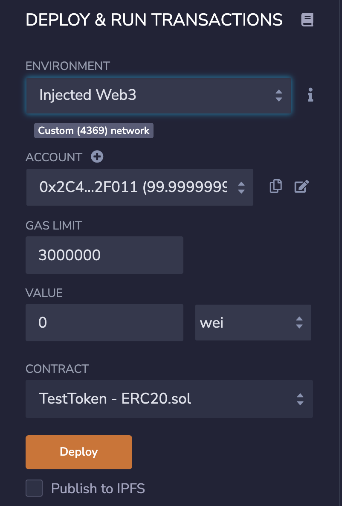

# Deploy Contract on Local Network

Finally, it's time to deploy your first smart contract on Astar/Shiden local network! In this tutorial, you can deploy your basic ERC20 token via Remix.

## Preparation of Solidity contract on Remix

Go to [Remix](https://remix.ethereum.org/) and create new file. Then copy and paste the following solidity contract code to your Remix editor.

```sol
pragma solidity ^0.8.0;

import "github.com/OpenZeppelin/openzeppelin-contracts/blob/master/contracts/token/ERC20/ERC20.sol";

contract TestToken is ERC20 {
    constructor() ERC20("TestToken", "TST") {
        _mint(msg.sender, 1000 * 10 ** 18);
    }
}
```

This contract issues an ERC20 token whose name is TestToken, the ticker is TST, and total supply is 1000 with 18 decimals. You can compile this contract from Solidity Compiler tab on Remix and get ready to deploy this contract.

Go to Deploy and Run Transactions tab. You should switch the environment to Injected Web3. Please make sure that you can see the Custom (4369) network under the environment field. If you cannot see that, please switch the network on Metamask. Now your screen should be like as follows:



## Deploy Contract on Local Network

Now press the Deploy button on Remix! You can see the popup window of Metamask and press Confirm button.

...Congratulations🎉 Your contract has successfully been deployed on your Shiden local network now! As evidence, you can see EVM events on the explorer.


## See your token on Metamask

This token can be added to Metamask because this contract is fully compatible with ERC20. You can find the ERC20 contract address on Remix or Explorer. In my case, the contract address is `0x666E76D2d8A0A97D79E1570dd87Cc983464d575e`. Now open Metamask, click Add Token button and input your contract address on Token Contract Address field. You can see that the Token Symbol and Token Decimal fields are automatically filled. At last, click the Next and Add Tokens button.

Now you can see your ERC20 token, which is deployed on Shiden local network, on your Metamask. You can, of course, send this token to the Ethereum addresses


