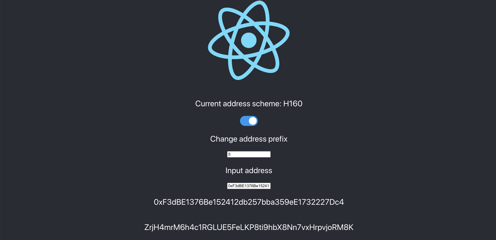
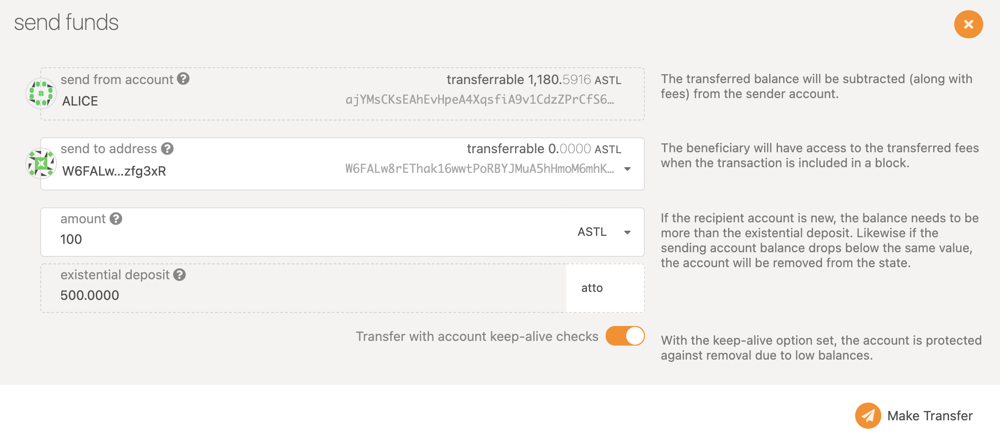

# Configure Metamask

## Add Network to your Metamask

It's easy to configure your Metamask to interact with Astar/Shiden network family. Open Metamask, click network tab, and click the Custom RPC. In the screen shown, please enter the necessary information as follows:

| Properties                    | Network Details                |
| ----------------------------- | ------------------------------ |
| Network Name                  | My Network (anything you want) |
| New RPC URL                   | http://127.0.0.1:9933          |
| Chain ID                      | 4369                           |
| Currency Symbol               | ASTL                           |
| Block Explorer URL (Optional) |                                |

## Get your local token on Metamask
Since Astar Network is building a multi-VM smart contract hub, we support both EVM and WASM with two different account systems, H160 and SS58 respectively.

In order to send the asset to an H160 address (address B) from the Substrate-native SS58 address (address A), we need to convert the H160 address to its mapped Substrate-native SS58 address (address B) and send the asset directly from address A to address B via [Polkadot.js](https://polkadot.js.org/apps/).

Convert the destination H160 address to its mapped Substrate-native SS58 address by using our [address converter](https://hoonsubin.github.io/evm-substrate-address-converter/).
    

OK, now you are ready to receive some local tokens on your Metamask! Go to account page on the explorer and click the send button of Alice. In the screen shown, you can input your SS58 address in `send to address` field and designate the amount to send. Then click the `Make Transfer` button.

Congratulations!  Now you see your local token on Metamask. And you are almost ready to deploy your first smart contract on Shiden local network now!

