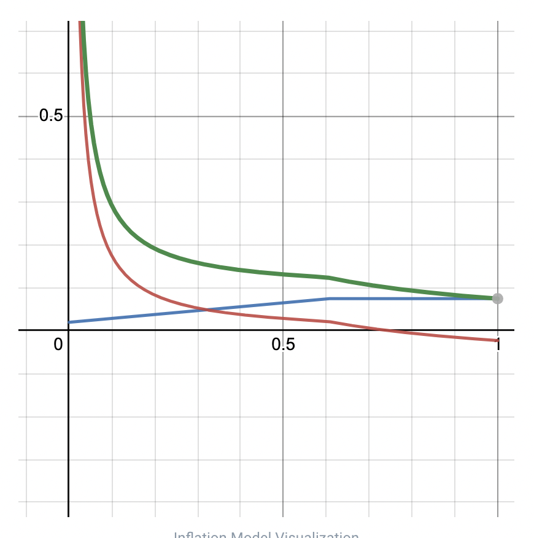

# Tokenomics & Inflation Model

This includes advanced content.

[Astar Network]: https://astar.network/

[Astar Network]'s token ecosystem is built into Polkadot. Therefore, this document includes the same formula and values as Polkadot.

Astar tokens have multiple core roles:

1. Payment for transaction fees
2. Staking dApps
3. dApps staking rewards & collator rewards

## Inflation Model

### Overview

In the previous chapters, we defined the algorithm that determines the issue amount and distribution method when issuing new Astar Network tokens. The Astar Network is structured that the new token issuance fee is shared with dApps Rewards and a reward for securing the chain.

For each produced block, both Astar and Shiden issue a certain amount of tokens. The numbers were picked to achieve 10% inflation for the first year.

- Astar issues 266.4 ASTR tokens per block
- Shiden issues 2.664 SDN tokens per block

The difference is due to Astar having 100x more issuance at the genesis block than Shiden.

The block reward is distributed between different actors

Block Reward Beneficiaries
​

- Collator responsible for authoring the block
- On-chain treasury
- dApps Staking - staker rewards
- dApps Staking - dApp rewards

Collators also get a portion of the fees paid by users for execution while the rest is burned to provide some deflationary force into the system.

### Model Overview

Although the inflation per block is fixed, the way in which we distribute the reward differs.

The main variable in the system is total value locked achieved by dApps staking.

Depending on the TVL, the portion of rewards going to stakers either increases or decreases.

As more tokens are staked and TVL increases, the portion of staker rewards will increase to compensate for the fact that otherwise staking would be a zero-sum-game. Opposite is also true - as TVL decreases, so does the portion of rewards going to stakers.

This variable part of rewards, influenced by TVL, moves between stakers and treasury. This was inspired by Polkadot's inflation model. But unlike Polkadot's model, where after reaching an so called ideal TVL, the reward start going down exponentially, in our model they just become saturated instead, making it a zero-sum-game.

Rewards for collators and dapps are fixed and don't change.

### Model Visualization

To better understand the model visualization, let's first explain all the model parameters:

With the understanding of these parameters, the following picture clearly visualizes how reward portions change as TVL changes.

