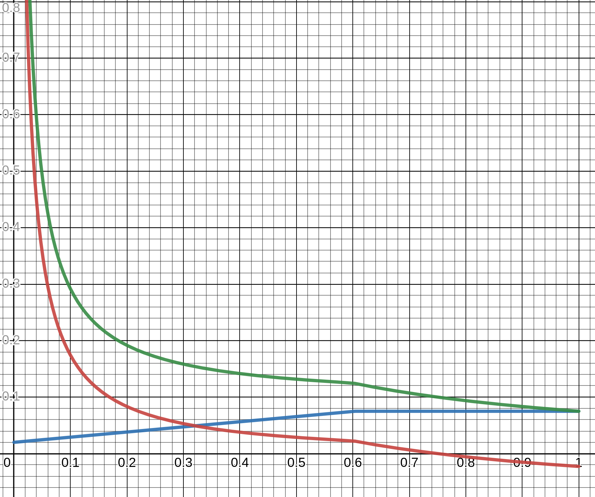

# Tokenomics & Modello di inflazione

:::note
Include contenuti avanzati.
:::

:::tip
I modelli di Astar & Shiden sono gli stessi ma è possibile avere alcune configurazioni differenti. Nei seguenti capitoli, menzioneremo solo il token Astar e ASTR, ma lo stesso vale per Shiden e il suo token SDN.
:::

[Il modello di tokenomics Astar Network][] è costruito con lo scopo di supportare gli sviluppatori tramite dApps staking. Alla base, i token ASTR hanno diversi ruoli:

1. Pagamento per le commissioni delle transazioni
2. Staking dApps
3. Ricompense dApps staking & Collator

## Indice di inflazione

### Panoramica

Nei capitoli precedenti è stata definita la distribuzione iniziale di ASTR. Tuttavia, Astar utilizza un modello di tokenomics inflazionistico (fornitura non vincolata) in cui i token vengono emessi ogni volta che viene prodotto un nuovo blocco. Questi token fanno funzionare il sistema di dApps staking e sono utilizzati per ricompensare gli staker e i collator.

Per ogni blocco prodotto, Astar emetterà un numero fisso di token. Questo numero è stato scelto per raggiungere circa il 10% d' inflazione per il primo anno, supponendo che un nuovo blocco venga prodotto ogni **12** secondi.

| Network | Emissione per blocco |
| ------- | -------------------- |
| Astar   | 266.4 ASTR           |
| Shiden  | 2.664 SDN            |

Potete notare che Astar emette 100 volte più token per blocco di Shiden. Ciò è dovuto al fatto che Astar ha una fornitura iniziale 100 volte superiore a Shiden.

### Beneficiari

Ogni ricompensa per blocchi è distribuita a una serie di beneficiari. ​
#### > Collator

Il Collator responsabile della costruzione del blocco riceverà una parte delle ricompense per la produzione del blocco. Questo è il principale incentivo finanziario per i collator. La porzione è definita come percentuale della ricompensa del blocco on-chain ed è costante per ogni blocco, a meno che non venga modificata manualmente.

Inoltre, il Collator riceverà le commissioni pagate dagli utenti per le transazioni incluse nel blocco prodotto. Per Shiden, il **20%** delle commissioni viene bruciato per fornire forza deflazionistica al modello. Lo stesso potrebbe essere presto adottato da Astar.

#### > Tesoreria On-chain

La Treasury riceve una porzione variabile della ricompensa dei blocchi. La Treasury viene utilizzata principalmente come riserva per l'asta parachain e per sostenere vari progetti e attività in tutto l'ecosistema Astar.

#### > dApps Staking

`dApps staking`, l'innovativo meccanismo di incentivazione per gli sviluppatori di Astar, riceve una parte variabile delle ricompense dei blocchi a seconda del **valore totale bloccato** (in inglese "total value locked", denominato **TVL** di seguito) sul dApps staking.

Parte di esso è dedicata per supportare gli sviluppatori di dApp mentre un'altra parte viene data agli staker che hanno bloccato il loro ASTR per *lo staking* o per *votare* una dApp.

### Panoramica Del Modello

I capitoli precedenti hanno descritto come viene fissata l'inflazione per singolo blocco, tuttavia il modo in cui abbiamo distribuito queste ricompense ad alcuni beneficiari è dinamico e dipende da determinati parametri. È importante sottolineare che tutti i parametri correlati del modello sono dati letti on-chain - **niente** è fornito off-chain. Questo lo rende sicuro e facilmente verificabile.

Ci sono due cose principali da capire prima di entrare più in profondità nel modello: **TVL** e **parametri di configurazione per la ricompensa per blocchi **.

#### TVL

La variabile principale del sistema che oscilla da blocco a blocco, determinata dalle azioni dell'utente, è il **TVL** da dApps staking. :::note  
Il TVL in questo contesto non considera i token diversi da ASTR bloccati da altri protocolli costruiti su Astar (es. protocolli DeFi), che come tali non hanno effetto sullo schema di distribuzione delle ricompense.
:::

Siamo particolarmente interessati alla **percentuale di TVL**
- $total\_issuance$ - importo totale di **token ASTR** emessi
- $TVL$ - quantità totale di token bloccati nel dApps-staking
- $TVL_{\%} = {totale \over TVL}$

Nel caso in cui la **total_issuance** equivalga a 1000 e il **TVL** a 242, il **TVL percentuale** sarà del `24,2%`.

#### Parametri Configurabili

I seguenti parametri influenzano la distribuzione delle ricompense di ogni blocco.

| Nome                      | Descrizione                                                                            | Valore di esempio |
| ------------------------- | -------------------------------------------------------------------------------------- | ----------------- |
| Percentuale Collator      | Percentuale fissa che va ai collator                                                   | 10%               |
| Percentuale Base Treasury | Percentuale minima che va sempre alla Treasury                                         | 10 %              |
| Percentuale Base Staker   | Percentuale minima che va sempre al pool di ricompense per gli staker di dApps-staking | 20 %              |
| Percentuale dApps         | Percentuale fissa che va sempre al pool di ricompense per gli staker di dApps-staking  | 15 %              |
| Percentuale Regolabile    | Percentuale divisa tra Treasury e Staker, a seconda del TVL                            | 45%               |
| TVL ideale dApps-staking  | Percentuale di TVL che è considerata ideale                                            | 60%               |

L'importo ricevuto dagli staker e dalla treasury è variabile e dipende dal TVL. Tuttavia, vi è un limite più basso su quanto possono ricevere. Questi sono i *parametri base*. I Collator e le dApps ricevono sempre una percentuale fissa della ricompensa.

##### Percentuale Regolabile

A seconda del TVL, la **percentuale regolabile** delle ricompense del blocco è divisa tra gli staker e la treasury. $$ \begin{aligned} a&djustable_{staker} = min(1, {TVL_{\%} \over TVL_{ideal}}) * adjustable_{\%} \newline\newline t&otal_{staker} = base_{staker} + adjustable_{staker} \newline\newline t&otal_{treasury} = base_{treasury} + (adjustable_{\%} - adjustable_{staker}) \end{aligned} $$

All'aumentare dei token messi in stake e del TVL, la porzione di ricompense dello staker aumenterà per compensare il fatto che altrimenti lo staking sarebbe un gioco *a somma zero*. Questo aumento è lineare fino a una certa soglia, $TVL_{ideal}$, dopo la quale si satura. Qualsiasi ulteriore aumento di TVL non comporterà un aumento delle ricompense per gli staker.

Nota che nel modello di Polkadot, quando viene raggiunto il TVL ideale, le ricompense dello staker si riducono esponenzialmente. Nel nostro caso, diventano solo sature, rendendolo un gioco *a somma zero*. La motivazione dietro al nostro approccio è la semplicità.

##### Tasso di interesse

Usando i parametri dei capitoli precedenti, possiamo esprimere il tasso di interesse annuo per gli staker: $$ i = {inflation_{anual} * total_{staker} \over TVL_{\%}} $$

Ad esempio, nel caso in cui $total_{staker} = 55\%$ e $TVL_{\%} = 40\%$, finiamo con ${0. * 0.55 \over 0.4}$ che è un tasso di interesse annuo del `13.75%`

Tuttavia, l'inflazione diluisce il tasso di interesse quindi è più preciso considerare *il tasso di interesse annuo corretto con l'inflazione*.

$$ i_{adjusted} = {i + 1 \over inflation_{anual} + 1} - 1 $$

Per proseguire con l'esempio di cui sopra, il valore dell'*inflazione aggiustata* sarebbe ${0. 375 + 1 \over 0.1 + 1} - 1 $ che è pari al `3,4%`.

### Visualizzazione Del Modello

Il seguente grafico è una rappresentazione del modello descritto.

* la linea verde è tasso di interesse $i$
* la linea blu è l'inflazione totale dello staker $total_{staker}$
* la linea rossa è il tasso di interesse aggiustato con l’inflazione $i_{adjusted}$

Puoi dare uno sguardo al modello e configurarlo [qui](https://www.desmos.com/calculator/cjjkt6smk5).

[Il modello di tokenomics Astar Network]: https://astar. network/