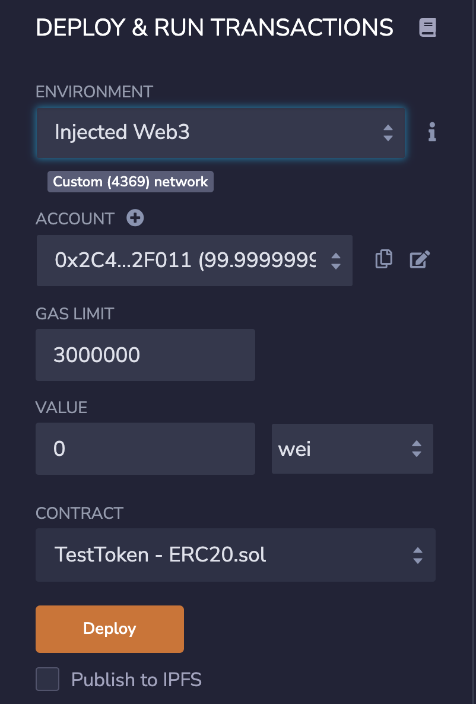
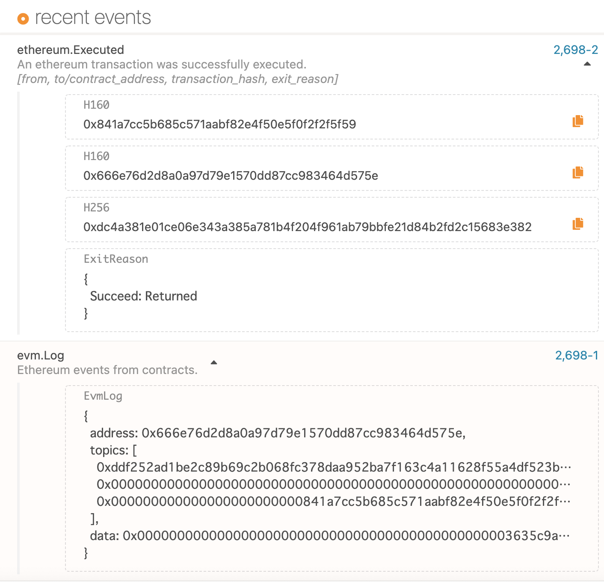
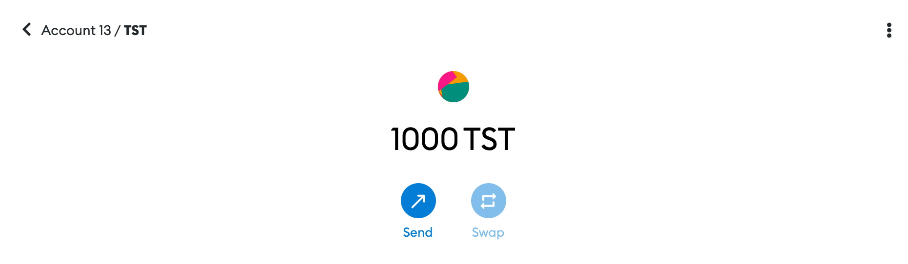

# Deploy Smart Contract on Local Network

Finally, it's time to deploy your first smart contract on Astar/Shiden local network! In this tutorial, you will deploy a basic ERC20 token using Remix.

## Preparation of Solidity Smart Contract on Remix

Visit [Remix](https://remix.ethereum.org/) and create a new file. Within the new file, copy and paste the following Solidity code into the Remix editor.

```sol
pragma solidity ^0.8.0;

import "github.com/OpenZeppelin/openzeppelin-contracts/blob/master/contracts/token/ERC20/ERC20.sol";

contract TestToken is ERC20 {
    constructor() ERC20("TestToken", "TST") {
        _mint(msg.sender, 1000 * 10 ** 18);
    }
}
```

This contract will issue an ERC20 token called 'TestToken', with ticker TST, and a total supply of 1000 using 18 decimals of precision. You will be able to compile this contract on the Solidity Compiler tab in Remix, in preparation to deploy it.

Click on the Deploy and Run Transactions tab, and change the environment to Injected Web3. Ensure that you can see the Custom (4369) network under the environment field. If you cannot, open and change your network on MetaMask. Now your screen should be similar to the following:



## Deploy Contract on Local Network

Now press the Deploy button. You will see a popup window from MetaMask, where you should click the Confirm button.

...Congratulations🎉 Your first smart contract has been successfully deployed on Shiden local network! As evidence of that, you will see the EVM events in the explorer.



## View your New Token within MetaMask

This token can be added to MetaMask because the contract is fully ERC20 compatible, and you will find the ERC20 contract address on Remix or Explorer. In this case, the contract address is `0x666E76D2d8A0A97D79E1570dd87Cc983464d575e`. With that, you can open MetaMask, click the Add Token button, and input your contract address in the Token Contract Address field. You will see that the Token Symbol and Token Decimal fields are filled in automatically, and at last, click Next, and then Add Tokens buttons.

You should now see your newly minted ERC20 tokens that are deployed on Shiden local network, right within your MetaMask, and be able to transfer them to any other EVM account.


