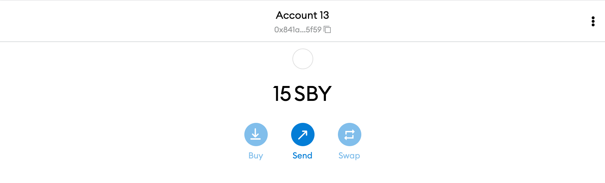

# Deploy Contract on Shibuya and Shiden

Your journey is almost finished. At last, you will deploy a smart contract on Shibuya and Shiden respectively.

## Obtain SBY token from the Faucet

To deploy a contract on Shibuya, you will need to obtain some SBY tokens from the Faucet, which is explained on [the faucet page](/docs/build/environment/faucet.md).

Once successful, you will see some SBY tokens available within MetaMask, if not, double-check to ensure Shibuya is selected as your current network.

## Deploy Contract on Shibuya

Now it's time to deploy a smart contract on Shibuya, and we'll be following the exact same process as for a local network deployment. Open Remix, compile your code, and deploy your contract. Do ensure that you see the Custom (81) network under the environment field when you deploy.

After a few seconds, you will see that the contract has been successfully deployed on Shibuya 🎉 and you will also be able to add the newly deployed ERC20 token to MetaMask.

## Deploy Contract on Shiden

The last step will be to deploy a smart contract on Shiden, again using the same process as the local and Shibuya network deployments. Do note, though, that there is no faucet for Shiden due to SDN token having real economic value, so the easiest way to obtain SDN tokens is to purchase them from crypto exchanges.

## Next Step

Congratulations! You are now a dApp developer on Astar/Shiden network 😎 To better make use of and expand on your new skills as a smart contract developer, we recommend diving further into our official documentation and builders guides, and joining our Discord to share ideas with other developers, or to receive technical support.
