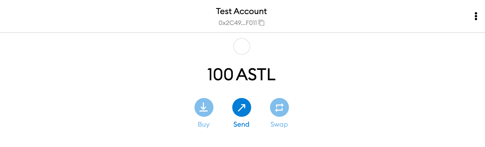

# Configure MetaMask

## Add Network to MetaMask

It's easy to configure MetaMask to interact with the Astar/Shiden network family. To do so, open MetaMask, click the Network tab, and click Custom RPC. In the screen shown, please enter the information shown below:

| Properties                    | Network Details                |
| ----------------------------- | ------------------------------ |
| Network Name                  | My Network (anything you want) |
| New RPC URL                   | http://127.0.0.1:9933          |
| Chain ID                      | 4369                           |
| Currency Symbol               | ASTL                           |
| Block Explorer URL (Optional) |                                |

## Transfer Native Tokens to MetaMask

Since Astar Network has built a smart contract hub that supports both EVM and Wasm virtual machines, we need to support two different account types, H160 and SS58 respectively.

In order to send an asset to an H160 account (address B) from a Substrate-native ss58 account (address A), we will need to convert the H160 account address to its mapped Substrate-native ss58 account address (address B), before we can send the asset directly from address A to address B using [Polkadot.js](https://polkadot.js.org/apps/).

You can convert the destination H160 address to its mapped Substrate-native ss58 address by using our [address converter](https://hoonsubin.github.io/evm-substrate-address-converter/).
    

Now, you are ready to receive some native tokens within MetaMask! Visit the Account page on the explorer and click the send button beside Alice. In the screen shown, you can input your ss58 address in the `send to address` field, choose an amount to send, and then click the `Make Transfer` button.

Congratulations!  You should now see some native tokens within MetaMask, and are one step closer to being able to deploy your first smart contract on Shiden local network!

