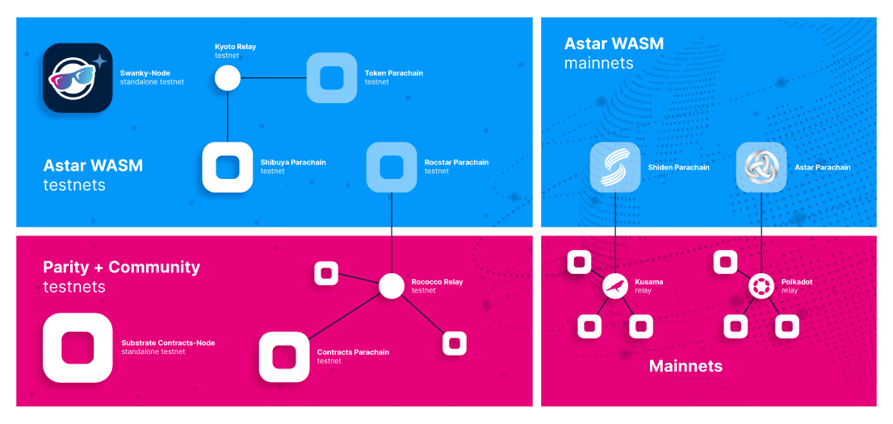

# Astar Network Family
There are couple of mainnets and testnets that you need to know about. You might not need to use them all, but you need to know what is the difference and when to use them.

## Local Networks
### Local node
You can clone Astar repository and run provided local version of the node or you can download binary and run it locally. Both ways are described in the [Build Environment](../environment) chapter. 

### Swanky Node
Swanky Node is a Substrate based blockchain configured to enable  smart contract module `pallet-contracts` and other features that assist local development of Wasm smart contracts.
More about Swanky Node in the [Swanky Suite](../wasm/swanky) chapter.

### Zombienet 
With Zombienet users can download arbitrary relay-chain and parachain binaries (or use images) to setup a configurable local test network. Users will have access to all privileged actions on the relay-chain and on the parachains which makes testing much easier. To learn more about Zombienet check the [Build Environment](../environment/zombienet-testing) chapter.

## Testnets
### Shibuya
Shibuya has almost the exact same chain specifications as Shiden & Astar mainnet and is the best test environment for developers who want to launch their dApp on the mainnet.
Shibuya is running as a parachain on Tokio Relay chain. Tokio relay is managed internally by Astar team and it is there only to support Shibuya as test parachain. 

To get the test tokens via faucet, please visit Astar Portal and connect to Shibuya. If the faucet is empty contact Astar team on Discord.

Token name is SBY.

### Rocstar
Rococo is the test Relay chain used but the Dotsama community. Astar team has deployed a parachain called Rocstar and it is mainly used for cross-chain integrations with other teams in the Dotsama ecosystem. To get tokens contact Astar team on Discord.

Token name is ROC.
## Mainnets
Astar has two mainnets, like the most of the parachains in Dotsama ecosystem. One on Kusama Relay chain and the other on Polkadot Relay chain.
### Shiden
Shiden is a Parachain on Kusama Relay chain and it is used to deploy and live test new releases of Astar runtime. It is not considered as testnet since it has it's own tokenomics and monetary value but it is used to validate and stabilize releases for Astar Network.

Token name is SDN.
### Astar
By now you already figured out that Astar is the parachain on Polkadot Relay chain. 

Token name is ASTR.

## Questions and assignments:
1. Using the account you created in previous chapters, go to Astar portal, connect to Shibuya testnet and claim faucet tokens. You will later need these tokens to deploy contracts on Shibuya.
2. Can you figure out how to send SDN tokens to Astar and swap them for ASTR tokens?
3. Can you sell SBY tokens?