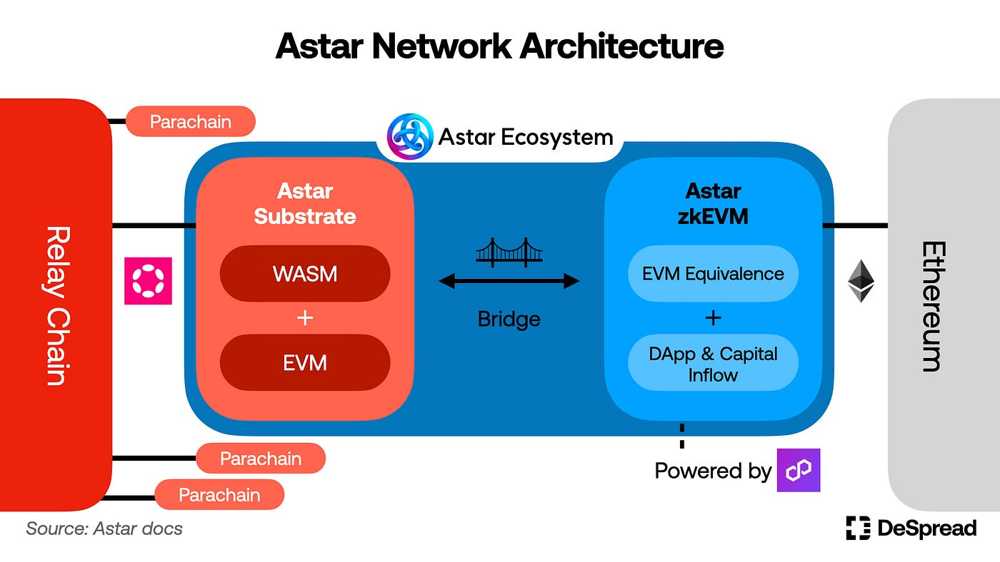

# Astar Network Family

Prior to commencing development, it's important to understand the Astar Network family, and choose an appropriate network based on what you would like to do. Currently, there are a number of networks available, including the Local network which runs exclusively within your development environment. All networks support Substrate and EVM RPCs.

## Local Networks

### Substrate Node
You can clone the Astar repository and run the local node provided, or download the precompiled binary and run it, instead. Both methods are described in the [Build](/docs/build) section.

### Swanky Node

Swanky Node is a Substrate based blockchain configured to enable the smart contract module `pallet-contracts`, and other features that assist local development of Wasm smart contracts.
For more information about Swanky Node, check out the [Swanky Suite](https://docs.astar.network/docs/build/wasm/swanky-suite/) section.

### Zombienet

With Zombienet users can download arbitrary Relay Chain and parachain binaries (or use images) to setup a configurable local test network. Users will have access to all privileged actions on the Relay Chain and parachains, which simplifies testing. For more information about Zombienet, check out the [Build Environment](https://docs.astar.network/docs/build/environment/zombienet-testing) chapter.

## Testnets

### Shibuya (Substrate)

Shibuya has nearly the same chain specifications as Shiden & Astar, and provides an ideal environment for developers to test and debug, prior to launching their dApp on mainnet.
Shibuya is running as a parachain of the Tokio Relay Chain, which is managed internally by the Astar team, and supports Shibuya, only, as test parachain.

The Shibuya native token symbol is SBY.

To obtain test tokens from the faucet, please visit the Astar Portal and connect to Shibuya. If for any reason the faucet is empty, please contact the Astar team on Discord.

### zKatana (Sepolia)

An early iteration of the zkEVM testnet that used zk rollup architecture. Now deprecated.

### zKyoto (Sepolia)

zKyoto is a Validium-based network connected to the Ethereum Sepolia testnet and Polygon AggLayer. It is the testing and proving ground for dApps deployed on the Astar zkEVM.

## Mainnets

Astar has three mainnets:

1. Astar zkEVM 
2. Astar Parachain 
3. Shiden Parachain

### Shiden Parachain (Substrate)

Shiden is a parachain connected to the Kusama Relay Chain, and used to deploy and test new releases of Astar runtime in a live production (canary) environment. Shiden is not considered a testnet since SDN has its own tokenomics and value, but is used to validate and stabilize new software releases and upgrades for Astar Network.

The Shiden native token symbol is SDN.

### Astar Parachain (Substrate)

By now you may have guessed that Astar parachain is connected to Polkadot Relay chain.

The Astar native token symbol is ASTR.

### Astar zkEVM

Astar zkEVM is a Layer 2 scaling solution for Ethereum, powered by Polygon AggLayer. Technically referred to as a Validium, the zkEVM combines zk rollups with modular data availability, synthesizing the best features of each.

## Questions and Assignments:

1. Using the account you created in previous chapters, visit to Astar portal, connect to Shibuya testnet and claim some tokens from the faucet. You will need them later to deploy contracts on Shibuya.
2. Are you able to deduce how to transfer SDN tokens to Astar, and swap them for ASTR tokens?
3. Is there a market for buying and selling SBY tokens?
