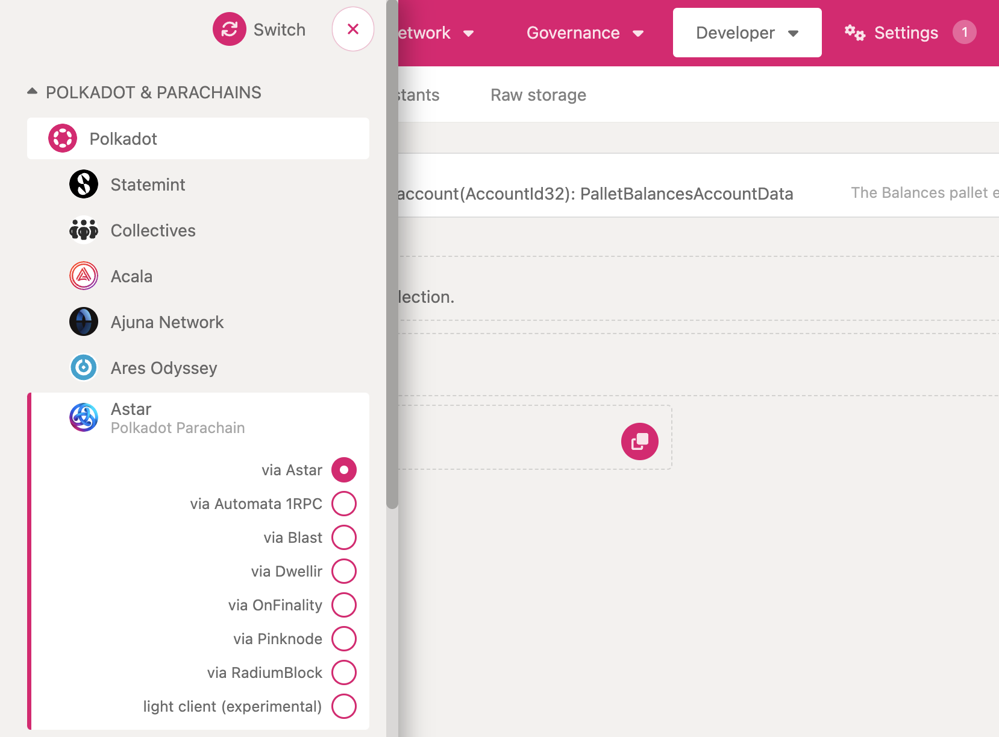

# Interact with Node
The most user-friendly way to interact with Polkadot and any parachain is through the [Polkadot{.js}](https://polkadot.js.org) UI. 
Let's run a few simple tasks to get you accustomed with the interface. Understanding items in this chapter will help you later to faster debug your issues.
First navigate to apps and then to Astar node by selecting Astar under **Polkadot & Parachains** and press Switch.

## Check your Accounts 
Under **Accounts** tab check your accounts.
If you are using Polkadot.js UI for the first time you will not have any account. In the next section you will learn how to create your first account

## Explore block production
Notice how long it takes to produce a block.

## Explore latest block
Select **Explore** under **Network tab**.

Click on the latest block.
Examine all calls that were inputs to the state change for this block. These calls are called extrinsics.
Browse all events that were emitted during this block production. Almost certainly among many you will notice events like `balances.Deposit` and `balances.Withdrawal`. These events are emitted when a fund transfer happened for this block.

## Storage query
Select **Chain State** under **Developer** tab.

Here you will find a drop down menu with all pallets used in Astar. You can query state of any storage item in these pallets.
Let's check which assets are defined in the Astar Network.
Select `assets` pallet and read storage item called. `asset`. Disable `include option` to list all available values and press `+` button. The output will be the list of all available assets. This is a raw data and for some of more common information you will find more user friendly presentation. In this case you could see same asset information ba selecting **Assets** under **Network** tab.
