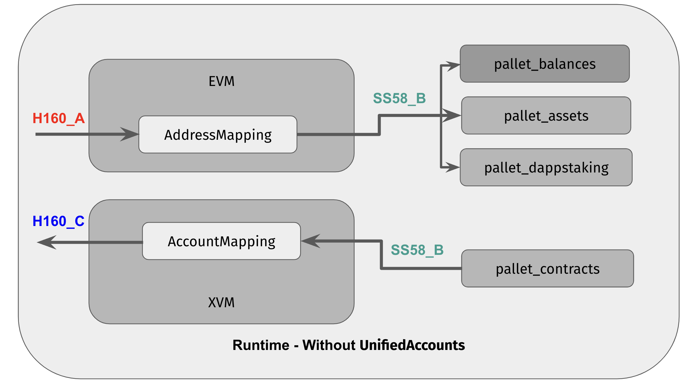
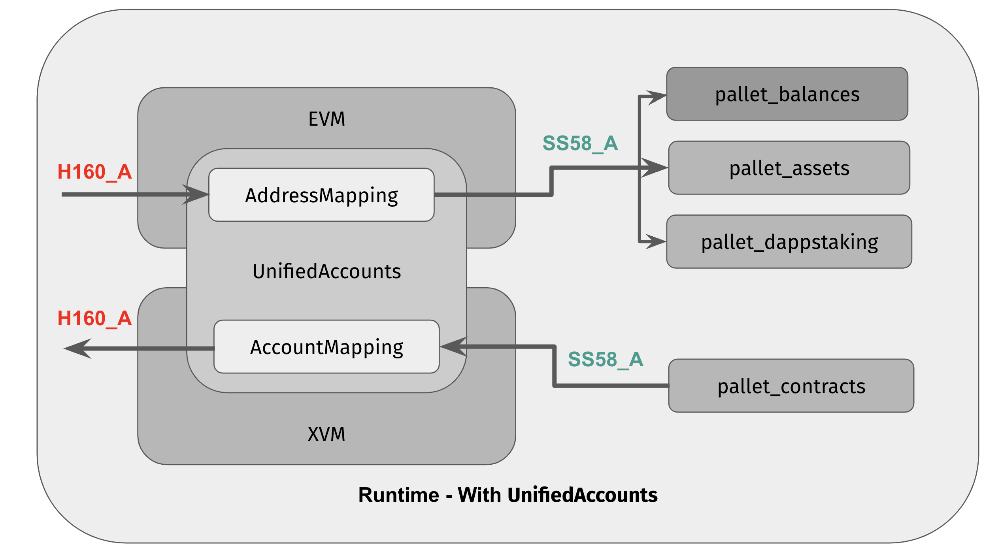
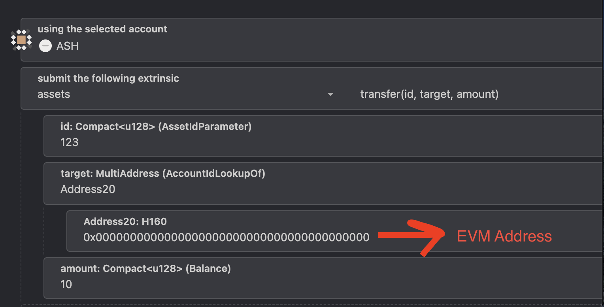

# Account Unification

## Overview

Astar Substrate is a Multi-VM chain that consists of Astar EVM and Astar Native (Wasm) smart contract environments that are interoperable in nature. This allows developers to create impactful and innovative solutions for end users on top of Astar Substrate, however, it comes at the expense of what is considered good UX.

Astar EVM is powered by Frontier (a combination of pallets and client for emulating EVM networks) which enables Astar Substrate to run a highly ETH equivilent L1 chain on top of a Substrate-based chain. Since both EVM and Native Substrate chains have independent address and signature schemes that are distinct from one another, interoperability between them becomes a challenge.

The Astar Substrate chain consists of:

- Astar Substrate EVM: This is powered by [`frontier`](https://github.com/paritytech/frontier) and uses ETH address schemes where user address is `H160`
- Astar Substrate Native (Wasm): The address scheme is `AccountId32` where user address is described in `SS58` format.

All the solutions that require performing actions on other VMs, i.e interoperability between VMs like `XVM` and `frontier`, require a deterministic way of converting their addresses to the other VM’s address scheme.

:::caution
Throughout this doc we will use words “address” and “account” interchangeably, although they are different in literal sense, in the context of this doc they are treated the same.
:::

### How does `frontier` handle accounts?

Put simply, there are a set of Native Substrate accounts existing in parallel to the EVM accounts managed by the `frontier` pallet, and one-to-one mappings from the Substrate accounts to EVM accounts are defined by a conversion trait called `AddressMapping` in the `frontier` pallet’s config.

For each H160 address, the EVM pallet uses `AddressMapping` to generate a corresponding SS58 address, which is the account that's *actually* used to interact with the native side of chain, including by holding its balance in `pallet-balances`. So, the native balance is *actually* stored in `pallet-balances` via the SS58 address generated by the mapping.

In short, every EVM address used on the Astar Substrate EVM has an SS58 counterpart existing on the Native side, so, in a sense, the generated SS58 account acts as the backend for all the operations of the H160 native account.


$$
AddressMapping(H160_A) => SS58_A

$$


This architecture makes it easier for the EVM side chain to interact seamlessly with the native chain. For example we can wrap the pallet’s interfaces via precompiles for EVM users to consume, and all the pallet’s calls will originate from the SS58 address.

Problems associated with this,

- Since the SS58 address is generated using hashed derivation formula, there is no known private key attached to it. Thus, a user can’t control it directly; actually, no one can.
- The mapping happens in one direction only, i.e from H160 → SS58. We can obtain an SS58 address that's associated with an H160 but it doesn't go the other way around in order to derive an H160 address from a given SS58.

### How does `XVM` handle accounts?

Since XVM allows smart contracts from either VM to call each other, we require a way to convert addresses both ways.

Before Account Unification, the XVM pallet used the same `AddressMapping` trait from the `frontier` pallet for conversions from H160 → SS58 and `AccountMapping` (a new trait) for conversions from SS58 → H160.

Since the conversions are one way only, this is not a complete solution. That means there is no way to derive the original address from a generated address, if wanting to go in the other direction.

## What is Account Unification?

AU is designed to solve the core problems described above:

- **No double mapping**: This has the most impact since without it we can’t go back on a generated address. For example, if we have a SS58 corresponding to H160, we can’t know which H160 it belonged to.
- **Users can’t control the generated address:** This is more on UX side, since Astar is a Cross-VM, users are encouraged to engage with both EVM and native Wasm ecosystems equally, but managing two different accounts for two VMs that are not interchangeable with one another is bad UX, from user’s perspective.

Account Unification (AU) provides users the ability to bind their H160 and SS58 addresses together and create double mappings, which can then be used by low-level solutions that require address conversions, such as EVM (i.e `frontier`) and XVM.





## How does AU work?

We introduced a new pallet called [`pallet-unified-accounts`](https://github.com/AstarNetwork/Astar/tree/master/pallets/unified-accounts) responsible for managing double mappings between address schemes (H160 and SS58).

### `pallet-unified-accounts`

The Unified Accounts pallet provides functionality for native account holders to connect their EVM address and have a unified experience across the different VMs by providing an ETH signature to prove their ownership over their EVM Address.

The pallet has two dispatch-able calls,

- `claim_evm_address` : Users can submit a signature to prove their ownership over the EVM address and therefore claim it, thus creating a double mapping between these accounts, SS58 and H160.
- `claim_default_evm_address`: If a user is not interested in controlling the generated account and only wants to have a double mapping, this is used. It creates a double mapping based on the (existing) default generated EVM address.

The Unified Accounts pallet provides implementations of various address conversion traits that can consumed by other solutions, such as `AddressMapping` for `frontier` and `AccountMapping` for `XVM`.

**Signature Scheme**

Users need to provide a valid [EIP712 signed payload](https://eips.ethereum.org/EIPS/eip-712) of their SS58 address. The payload for EIP712 signatures consists of two parts, domain hash and type hash with the actual payload.

Below is a very simple snippet to produce the signed payload and claim accounts using `ethers.js`,

```jsx
async function buildSignature(signer, substrateAddress, api, chainId) {
  return await signer.signTypedData(
    {
      chainId: chainId, // evm chain id
      name: "Astar EVM Claim", // app name
      version: "1", // version
      salt: await api.query.system.blockHash(0), // genesis hash
    },
    {
      Claim: [{ name: "substrateAddress", type: "bytes" }],
    },
    {
      substrateAddress,
    }
  );
}
```

## New Possibilities

After AU there are a lot of new possibilities enabled by the double mappings between account schemes. Some of the impactful ones are below,

### Unified Balance

After the accounts are unifed, they’ll share the same balances across EVM and Substrate Native. This is true for native assets like XC20 (`pallet-assets`), as well as native balances (`pallet-balances`).

### Transfer XC20 to Native Addresses

Previously there was no proper way to transfer XC20 Assets to a native account. AU changes this, and if the recipient user has AU enabled then the user/dapp can fetch the connected EVM address and send the tokens to that address, as both accounts (native and EVM) are unified.

### Transfer funds directly to EVM Address

Users can now transfer funds directly to their EVM address without the need to calculate a derived SS58 address (i.e selecting `Address20` in Lookup values.)

This is valid for all EVM addresses and *does not require AU to be enabled.*



## Things to consider

If it's too good to be true then it probably is!

### Mappings are immutable

Under the current design, once mappings are in place they cannot be modified. This is a precautionary measure to prevent loss of funds and other potential mishaps since the act of modifying the underlying SS58 address of an EVM account is very sensitive.

Since accounts are dispensable, if a user wishes to change mappings he/she can simply create a new set of accounts to be connected.

### Manually transfer the native state (including funds)

Since before unifying the accounts any interaction from the EVM to the Native side is performed via the default derived account, including all the holdings
of native funds like XC20, dAppStaking rewards (if interacted with staking precompiles), etc, thus they need to be transferred to the new SS58 account before accounts are unified otherwise the funds will be lost. The pallet only handles the transfer of native balances, and all other native assets need to be transferred manually.

Also for EVM smart contract developers, if a contract is XVM enabled and it calls into a Wasm contract, there should be a mechanism in place to migrate the state to a new SS58 account so that users can do that before unifying accounts.

:::caution
It is strongly advised to use only the Astar Portal for unifying accounts as it is designed to handle the asset transfer process properly. **If the pallet’s extrinsics are used directly then native funds will be lost forever.**
:::

### Problems with EVM Indexers & Explorers

Once accounts are unified they share balances (XC20, native balance) and both accounts can control them.

When balances are updated on the native side there are no logs or events emitted on the EVM side, thus indexers and block explorers face problems displaying accurate balances for native assets.
