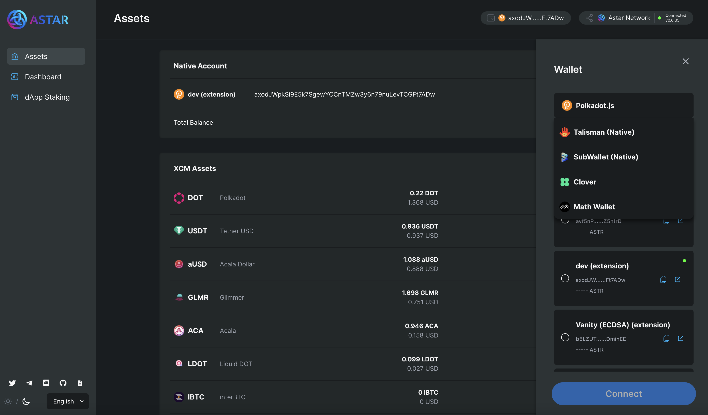

# Add wallets into Astar Portal

## Overview

Users can connect to Astar portal using both EVM and Substrate based wallets. Below are the basic steps and important links needed to integrate a new wallet into the [Astar portal](https://portal.astar.network/#/astar/assets).



## How to integrate

Developers can create a PR to [our portal](https://github.com/AstarNetwork/astar-apps) for adding wallets to our portal. We'll walk you through the steps below.

### Define the wallet variables

The extension name `enum` value comes from:

```js
const extensions = await getInjectedExtensions();
console.log('extensions', extensions); -> extensions[index] -> name
```

1. Add the `extension name` at the [SupportWallet](https://github.com/AstarNetwork/astar-apps/blob/ecb067e9683eb5224fac96c5bf9fa9ce4c123a7d/src/config/wallets.ts#L8) enum.
2. Add the `SupportWallet.[new_value]` to the [WalletModalOption](https://github.com/AstarNetwork/astar-apps/blob/ecb067e9683eb5224fac96c5bf9fa9ce4c123a7d/src/config/wallets.ts#L23) array.
3. Add the `SupportWallet.[new_value]` to the [SubstrateWallets](https://github.com/AstarNetwork/astar-apps/blob/ecb067e9683eb5224fac96c5bf9fa9ce4c123a7d/src/config/wallets.ts#L48) array only if it is a Substrate wallet.

### Add wallet information

For Substrate wallets, add information to the [supportWalletObj](https://github.com/AstarNetwork/astar-apps/blob/ecb067e9683eb5224fac96c5bf9fa9ce4c123a7d/src/config/wallets.ts#L64) object variable.

e.g.

```js
export const supportWalletObj = {
  [SupportWallet.TalismanNative]: {
    img: require('/src/assets/img/logo-talisman.svg'),
    name: 'Talisman (Native)',
    source: SupportWallet.TalismanNative,
    walletUrl: 'https://app.talisman.xyz/',
    guideUrl: 'https://app.talisman.xyz/',
    isSupportBrowserExtension: true,
    isSupportMobileApp: false,
  },
};
```

For Ethereum wallets, add information to the [supportEvmWalletObj](https://github.com/AstarNetwork/astar-apps/blob/ecb067e9683eb5224fac96c5bf9fa9ce4c123a7d/src/config/wallets.ts#L130) object variable.

e.g.

```js
export const supportEvmWalletObj = {
  [SupportWallet.TalismanEvm]: {
    img: require('/src/assets/img/logo-talisman.svg'),
    name: 'Talisman (EVM)',
    source: SupportWallet.TalismanEvm,
    walletUrl: 'https://app.talisman.xyz/',
    guideUrl: 'https://app.talisman.xyz/',
    isSupportBrowserExtension: true,
    isSupportMobileApp: false,
    ethExtension: 'talismanEth',
  },
};
```

### Add a visual asset representing your wallet

Add a small `.svg` or `.png` to the [assets](https://github.com/AstarNetwork/astar-apps/tree/main/src/assets/img) directory.

## Requirements for creating a PR

1. Developers must test sending transactions from our portal. Perform basic tests using the guide below:

   1. Substrate wallets (such as [Polkadot.js](https://polkadot.js.org/))
      1. Native token transfer
      2. XCM assets transfer
      3. XCM transfer
         1. Deposit
         2. Withdrawal
      4. dApp staking transfer
         1. Stake
         2. Withdrawal
         3. Nomination transfer
   2. EVM wallets (such as [MetaMask](https://metamask.io/))
      1. Native token transfer
      2. ERC20 token transfer
      3. XC20(XCM assets) token transfer
      4. XCM transfer
         1. Withdrawal

2. Submit the [Subscan](https://astar.subscan.io/) or [Blockscout](https://blockscout.com/astar/) links (both Astar and Shiden networks) for transaction details of the items listed above.
3. Submit screen recordings of connect, a transaction, and account switch visual interactions.
4. Deploy the forked app and submit the staging URL ([ref](../integration_toolings/deploy-astar-portal.md)).
