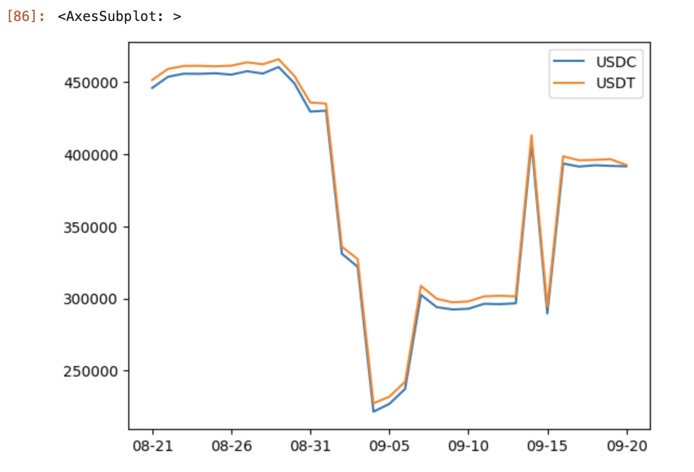

# Analyzing on-chain data using Covalent API + Python

## TL;DR

This cookbook will go through how to extract and analyze on-chain data of Astar Network using Python and Covalent API. This cookbook is especially useful for non-devs who are not familiar with setting up indexers to query on-chain data. All steps can be done totally free without having to use a terminal or setting up a local development environment. 

## What is Covalent?

Covalent leverages big-data technologies to create meaning from hundreds of billions of data points, delivering actionable insights to investors and allowing developers to allocate resources to higher-utility goals within their organization. Instead of pain-stakingly sourcing data from a small handful of chains, Covalent aggregates information from across dozens of sources including nodes, chains, and data feeds. The Covalent API then sources end users with individualized data by wallet, including current and historical investment performance across all types of digital assets. Most importantly, Covalent returns this data in a rapid and consistent manner, incorporating all relevant data within one API interface.

## Analyzing ArthSwap pool balance

As an example in this cookbook, we will analyze the change in the balance of ceUSDC/ceUSDT pool on ArthSwap. We will be using Python in this cookbook. For non-devs who are not familiar to setting up local environment to run Python, we recommend using Jupyter Notebook.

Make sure to sign up for Covalent to get the API key needed to run the code. (You can register [here](https://www.covalenthq.com/))

### Step 1: Extract data

Before we do any data transformation and analytics, we need a list of historical portfolio data of ceUSDC/ceUSDT pool contract as our first step. To get the information, we need to send the following request (see the reference section in this cookbook for more info on API format):

```python
GET /v1/{chain_id}/address/{address}/portfolio_v2/
```

In this request, parameter chain_id is the chain ID of the Blockchain being queried. In this cookbook, we will use chain_id = 593 (Astar Network) and contract address of ceUSDC/ceUSDT pool = 0xD72A602C714ae36D990dc835eA5F96Ef87657D5e as example. The following code uses Python to extract the data.

```python
import requests

API_KEY = [YOUR_API_KEY]
base_url = 'https://api.covalenthq.com/v1'
blockchain_chain_id = '592'
address = "0xD72A602C714ae36D990dc835eA5F96Ef87657D5e"

def get_wallet_portfolio(chain_id, address):
    endpoint = f'/{chain_id}/address/{address}/portfolio_v2/?key={API_KEY}'
    url = base_url + endpoint
    result = requests.get(url).json()
    return(result)

portfolio_data = get_wallet_portfolio(blockchain_chain_id, address)
print(portfolio_data)
```

Below is a sample output:

`{'data': {'address': '0xd72a602c714ae36d990dc835ea5f96ef87657d5e', 'updated_at': '2022-09-20T07:17:27.930341337Z', 'next_update_at': '2022-09-20T07:22:27.930341567Z', 'quote_currency': 'USD', 'chain_id': 592, 'items': [{'contract_decimals': 6, 'contract_name': 'USD Coin', 'contract_ticker_symbol': 'USDC', 'contract_address': '0x6a2d262d56735dba19dd70682b39f6be9a931d98', 'supports_erc': None, 'logo_url': '[https://logos.covalenthq.com/tokens/592/0x6a2d262d56735dba19dd70682b39f6be9a931d98.png](https://logos.covalenthq.com/tokens/592/0x6a2d262d56735dba19dd70682b39f6be9a931d98.png)', 'holdings': [{'timestamp': '2022-09-20T00:00:00Z', 'quote_rate': 0.9932833, 'open': {'balance': '391683183282', 'quote': 389052.34}, 'high': {'balance': '392123445379', 'quote': 389489.66}, 'low': {'balance': '316424219770', 'quote': 314298.88}, 'close': {'balance': '317469504720', 'quote': 315337.16}}, {'timestamp': '2022-09-19T00:00:00Z', 'quote_rate': 1.0022721, 'open': {'balance': '391991979278', 'quote': 392882.62}, 'high': {'balance': '392739045673', 'quote': 393631.4}, 'low': {'balance': '389667428685', 'quote': 390552.8}, 'close': {'balance': '391683183282', 'quote': 392573.16}},` ...

### Step 2: Transform the data into lists

After data extraction is done in step 1, we will transform that data into three lists so it can be easily handled using Pandas, a data analytics library for Python. The code below creates a few functions that transform our data into lists.

```python
import requests
import json

API_KEY = 'ckey_76799bb987a14e179ea6031d15c'
base_url = 'https://api.covalenthq.com/v1'
blockchain_chain_id = '592'
address = "0xD72A602C714ae36D990dc835eA5F96Ef87657D5e"

def get_wallet_portfolio(chain_id, address):
    endpoint = f'/{chain_id}/address/{address}/portfolio_v2/?key={API_KEY}'
    url = base_url + endpoint
    result = requests.get(url).json()
    return(result)

def get_timestamp_list(sample_data):
    timestamp = []
    for tmp in reversed(sample_data):
        timestamp.append(tmp["timestamp"][5:10])
    return (timestamp)

def get_token_balance_list(data):
    token_balance_list = []
    for tmp_data in reversed(data):
        balance = tmp_data["open"]["balance"]
        token_balance_list.append(int(balance) // 1000000)
    return (token_balance_list)
    
portfolio_data = get_wallet_portfolio(blockchain_chain_id, address)
timestamp_list = get_timestamp_list(portfolio_data["data"]["items"][0]["holdings"])
usdc_token_balance_list = get_token_balance_list(portfolio_data["data"]["items"][0]["holdings"])
usdt_token_balance_list = get_token_balance_list(portfolio_data["data"]["items"][1]["holdings"])
print(timestamp_list)
print(usdc_token_balance_list)
print(usdt_token_balance_list)
```

The output will look as follows. The first list is a series of timestamps, the second is liquidity of USDC (in USD), and the third is liquidity of USDT (in USD) on each day.

```python
['08-21', '08-22', '08-23', '08-24', '08-25', '08-26', '08-27', '08-28', '08-29', '08-30', '08-31', '09-01', '09-02', '09-03', '09-04', '09-05', '09-06', '09-07', '09-08', '09-09', '09-10', '09-11', '09-12', '09-13', '09-14', '09-15', '09-16', '09-17', '09-18', '09-19', '09-20']
[317469, 317469, 317469, 317469, 317469, 317469, 317469, 317469, 317469, 317469, 317469, 317469, 317469, 317469, 317469, 317469, 317469, 317469, 317469, 317469, 317469, 317469, 317469, 317469, 317469, 317469, 317469, 317469, 317469, 317469, 317469]
[317368, 317368, 317368, 317368, 317368, 317368, 317368, 317368, 317368, 317368, 317368, 317368, 317368, 317368, 317368, 317368, 317368, 317368, 317368, 317368, 317368, 317368, 317368, 317368, 317368, 317368, 317368, 317368, 317368, 317368, 317368]
```

### Step 3: Transform the data to Pandas Dataframe

Now, let's transform the lists created in Step 2 into Pandas Dataframe so that they can be turned into a graph in next step.

```python
import pandas as pd
import requests
import json

API_KEY = 'ckey_76799bb987a14e179ea6031d15c'
base_url = 'https://api.covalenthq.com/v1'
blockchain_chain_id = '592'
address = "0xD72A602C714ae36D990dc835eA5F96Ef87657D5e"

def get_wallet_portfolio(chain_id, address):
    endpoint = f'/{chain_id}/address/{address}/portfolio_v2/?key={API_KEY}'
    url = base_url + endpoint
    result = requests.get(url).json()
    return(result)

def get_timestamp_list(sample_data):
    timestamp = []
    for tmp in reversed(sample_data):
        timestamp.append(tmp["timestamp"][5:10])
    return (timestamp)

def get_token_balance_list(data):
    token_balance_list = []
    for tmp_data in reversed(data):
        balance = tmp_data["open"]["balance"]
        token_balance_list.append(int(balance) // 1000000)
    return (token_balance_list)
    
portfolio_data = get_wallet_portfolio(blockchain_chain_id, address)
timestamp_list = get_timestamp_list(portfolio_data["data"]["items"][0]["holdings"])
usdc_token_balance_list = get_token_balance_list(portfolio_data["data"]["items"][0]["holdings"])
usdt_token_balance_list = get_token_balance_list(portfolio_data["data"]["items"][1]["holdings"])

lp_df = pd.DataFrame(data = [usdc_token_balance_list, usdt_token_balance_list], index = ["USDC", "USDT"], columns = timestamp_list)
print(lp_df.T)
```

The output will look as follows. You can see that the lists have turned into a dataframe.

```python
       USDC    USDT
08-21  446081  451625
08-22  453840  459288
08-23  455964  461331
08-24  455846  461451
08-25  456262  461089
08-26  455285  461550
08-27  457687  463863
08-28  456071  462506
08-29  460596  465996
08-30  449226  454343
08-31  429668  435999
09-01  430336  435230
09-02  331040  335945
09-03  321951  327345
09-04  221460  227266
09-05  226810  231804
09-06  237230  242222
09-07  302571  308771
09-08  293992  299795
09-09  292354  297289
09-10  292838  297973
09-11  296315  301463
09-12  296068  301855
09-13  296641  301435
09-14  408155  413254
09-15  289567  294152
09-16  393641  398622
09-17  391511  395897
09-18  392412  396156
09-19  391991  396653
09-20  391683  392573
```

### Step 4: Visualizing the data

In this final step, we will use our dataframe to visualize the liquidity of USDC and USDT in the pool for each day.

```python
%matplotlib inline
import pandas as pd
import matplotlib as mpl
import matplotlib.pyplot as plt
import requests
import json

API_KEY = 'ckey_76799bb987a14e179ea6031d15c'
base_url = 'https://api.covalenthq.com/v1'
blockchain_chain_id = '592'
address = "0xD72A602C714ae36D990dc835eA5F96Ef87657D5e"

def get_wallet_portfolio(chain_id, address):
    endpoint = f'/{chain_id}/address/{address}/portfolio_v2/?key={API_KEY}'
    url = base_url + endpoint
    result = requests.get(url).json()
    return(result)

def get_timestamp_list(sample_data):
    timestamp = []
    for tmp in reversed(sample_data):
        timestamp.append(tmp["timestamp"][5:10])
    return (timestamp)

def get_token_balance_list(data):
    token_balance_list = []
    for tmp_data in reversed(data):
        balance = tmp_data["open"]["balance"]
        token_balance_list.append(int(balance) // 1000000)
    return (token_balance_list)
    
portfolio_data = get_wallet_portfolio(blockchain_chain_id, address)
timestamp_list = get_timestamp_list(portfolio_data["data"]["items"][0]["holdings"])
usdc_token_balance_list = get_token_balance_list(portfolio_data["data"]["items"][0]["holdings"])
usdt_token_balance_list = get_token_balance_list(portfolio_data["data"]["items"][1]["holdings"])

lp_df = pd.DataFrame(data = [usdc_token_balance_list, usdt_token_balance_list], index = ["USDC", "USDT"], columns = timestamp_list)
lp_df.T.plot()
```

The output will look as follows:



That's it!

This guide demonstrated how we can easily visualize the historical balance of ceUSDC/ceUSDT pool on ArthSwap using Covalent and Python. Creating a graph like this can be a useful reference tool for your project. For example, anyone can use the graph in this eample to see the liquidity for both USDT and USDC on 9/20 was $400K. No need to go digging for specific on-chain data.

This is just a simple example. There is a lot of API opened by Covalent and endless ways to use those data to create insightful graphs, and other reference resources.

## Reference

- Covalent API resource
    - [https://www.covalenthq.com/docs/api/#/0/0/USD/1](https://www.covalenthq.com/docs/api/#/0/0/USD/1)
- Covalent docs
    - [https://www.covalenthq.com/docs/](https://www.covalenthq.com/docs/)