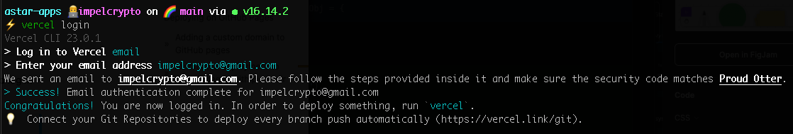
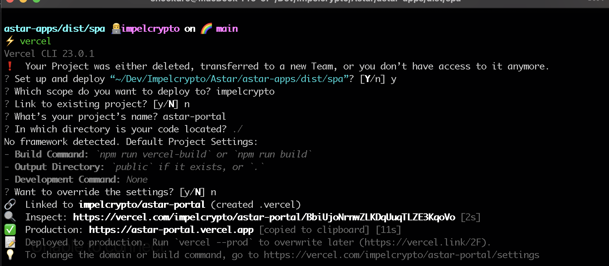
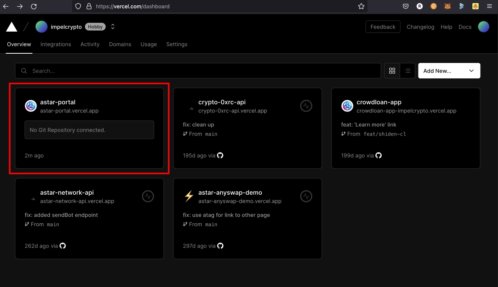
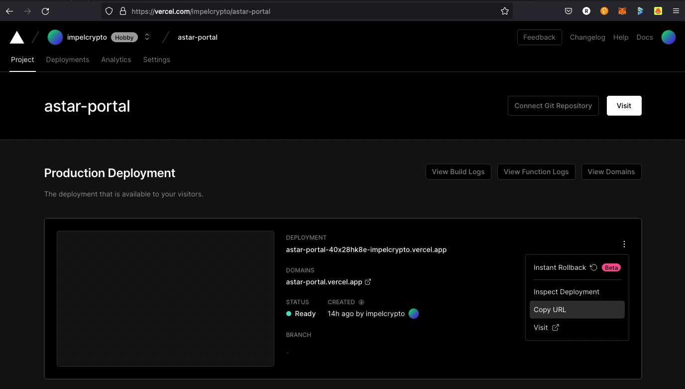

# Deploy Astar Portal on Vercel

## Overview

Submitting a staging URL whenever making a PR to [Astar Portal](https://github.com/AstarNetwork/astar-apps) from the forked repo is recommended. Here's what you need to know about deploying the forked Astar Portal repo on Vercel.

## Deploying with Vercel

Deploying Astar Portal (built with [Quasar Framework](https://quasar.dev/)) with [Vercel](https://vercel.com) is super easy. All you have to do is to download the [Vercel CLI](https://vercel.com/docs/cli) and log in by running:

```
$ vercel login
```



Then proceed to build Astar Portal by running `$ yarn build`.
After the build is finished, change the directory into your deploy root (example: /dist/spa) and run:

```
$ cd dist/spa
# from /dist/spa (or your distDir)
$ vercel
```

The Vercel CLI should now display a list of information about your deployment, such as the staging url.

That’s it! You’re done!



## Obtain the deployed URL

After you've finished deployment (see steps above), you can open your [Vercel dashboard](https://vercel.com/dashboard) to obtain the deployed URL.





## References

- [Deploying Quasar application with Vercel](https://quasar.dev/quasar-cli-vite/developing-spa/deploying#deploying-with-vercel)
