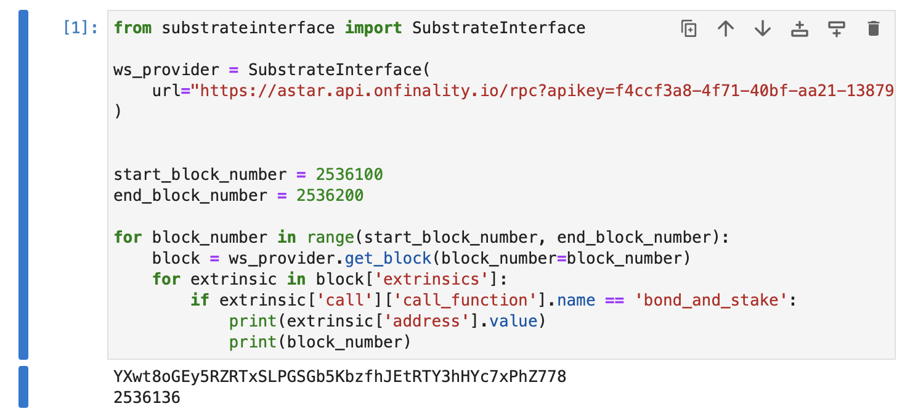

# Query dApp Staking extrinsics and participating addresses with Python

## TL;DR

As a Substrate-based multi-VM blockchain, Astar nodes have all Polkadot or Substrate features. [Python Substrate Interface](https://github.com/polkascan/py-substrate-interface) library allows developers to query Substrate-runtime-level metadata from an Astar node and interact with the node's Polkadot or Substrate features, including querying and composing extrinsics using a native Python interface.

In this guide, we will cover:

- How to install Python Substrate Interface
- How to create an API provider instance
- How to query blocks and extrinsics, using an example of querying dApp staking participants’ addresses.

---

## What is Substrate?

[Substrate](https://substrate.io/) is an open-source software development kit (SDK) that allows teams to quickly build highly customized blockchains. It comes with native support for connecting to Polkadot and Kusama right out of the box.

All Polkadot and Kusama parachains and relay chains are built with Substrate, this include Astar and Shiden networks. Thus, Astar nodes have all the major Polkadot or Substrate features.

## What is Substrate Python Interface?

[Substrate Python Interface](https://github.com/polkascan/py-substrate-interface) is a Python library that specializes in interfacing with a Substrate node; querying storage, composing extrinsics, SCALE encoding/decoding, and providing additional convenience methods to deal with the features and metadata of the Substrate runtime.

For interface function reference, please read [https://polkascan.github.io/py-substrate-interface/](https://polkascan.github.io/py-substrate-interface/).

---

## Instructions
### 1. Install Substrate Python Interface

- Before installing Substrate Python Interface, please run the following command to check if you have Python package installer [`pip`](https://pypi.org/project/pip/) installed:
    
    ```jsx
    pip --version
    ```
    
- If not, please follow the guide at [https://pip.pypa.io/en/stable/installation/](https://pip.pypa.io/en/stable/installation/) to install `pip`.
- After making sure `pip` is installed, you can install Python Substrate Interface library by running the following command in your project directory:
    
    ```jsx
    pip install substrate-interface
    ```
    

---

### 2. Construct an API provider Instance

In order to query and interact with an Astar node, you need to first construct a `WsProvider` API provider using the WebSocket endpoint of Astar Network that you wish to interact with.

You can find the list of supported endpoints from our [network RPC endpoint list](/docs/build/environment/endpoints.md).

```jsx
# Import Python Substrate Interface
from substrateinterface import SubstrateInterface

# Construct the API provider
ws_provider = SubstrateInterface(
    url="wss://rpc.astar.network",
)
```

---

### 3. Retrieve blocks and extrinsics using py-substrate-interface

- For demonstration purposes, we will use JupyterLab in the guide. Please feel free to download and install JupyterLab following the tutorial [here](https://docs.jupyter.org/en/latest/install.html).
- To retrieve blocks and extrinsics in the blocks, you can use `get_block` method defined in the `py-substrate-interface`, which returns a Python dictionary containing extrinsics and metadata in a Substrate block.
    
    ```python
    # Import Python Substrate Interface
    from substrateinterface import SubstrateInterface
    
    # Construct the API provider
    ws_provider = SubstrateInterface(
        url="wss://rpc.astar.network",
    )   
    
    # Retrieve the latest block
    block = ws_provider.get_block()
    
    # Retrieve the latest finalized block
    block = ws_provider.get_block_header(finalized_only = True)
    
    # Retrieve a block given its Substrate block hash
    block_hash = "0xdd5d76dbea4cab627be320f363c6362adb1e3a5ed9bbe1b0ba4a0ac0bb028399"
    block = ws_provider.get_block(block_hash=block_hash)
    
    # Retrieve a block given its Substrate block number
    block_number = 2700136
    block = ws_provider.get_block(block_number=block_number)
    ```
    
- Below is an output example of querying the extrinsics and metadata of block #0 on Astar Network.
    
    ```jsx
    {'header': {'parentHash': '0x0000000000000000000000000000000000000000000000000000000000000000', 'number': 0, 'stateRoot': '0xc9451593261d67c47e14c5cbefeeffff5b5a1707cf81800becfc79e6df354da9', 'extrinsicsRoot': '0x03170a2e7597b7b7e3d84c05391d139a62b157e78786d8c082f29dcf4c111314', 'digest': {'logs': []}, 'hash': '0x9eb76c5184c4ab8679d2d5d819fdf90b9c001403e9e17da2e14b6d8aec4029c6'}, 'extrinsics': []}
    ```
    
- You can find the reference to more methods in the Substrate Python Interface [here](https://polkascan.github.io/py-substrate-interface/#substrateinterface.SubstrateInterface.get_block).

---

### 4. Collect the addresses participating in dApp staking

In order to collect the addresses that participated in dApp staking during a certain period of time, we need to iterate through the Substrate blocks of Astar Network and iterate through the extrinsics inside each block to filter out the `bond_and_stake` calls of `dapp-staking-pallet`.

- An example code:
    
    ```python
    # Import Python Substrate Interface
    from substrateinterface import SubstrateInterface
    
    # Construct the API provider
    ws_provider = SubstrateInterface(
        url="https://astar.api.onfinality.io/rpc?apikey=f4ccf3a8-4f71-40bf-aa21-1387919a2144"
    )
    
    # Define the starting and ending block
    start_block_number = 2536100
    end_block_number = 2536200
    
    # Iterate through the block and extrisics
    for block_number in range(start_block_number, end_block_number):
        block = ws_provider.get_block(block_number=block_number)
        for extrinsic in block['extrinsics']:
    				# Filter out the bond_and_stake calls
            if extrinsic['call']['call_function'].name == 'bond_and_stake':
                print(extrinsic['address'].value)
                print(block_number)
    ```
    
- Below is the example output of the addresses participated in dApp staking during block #2536100 and block #2536200 and the corresponding block number containing the extrinsic.



---

## FAQ

For technical support, please contact our team of ambassadors and developers on [Discord](https://discord.gg/AstarNetwork). We're happy to help.

## Reference
- [Python Substrate Interface Github](https://github.com/polkascan/py-substrate-interface)
- [Python Substrate Interface Docs](https://polkascan.github.io/py-substrate-interface)
- [Python Substrate Metadate Docs](https://polkascan.github.io/py-substrate-metadata-docs/)
