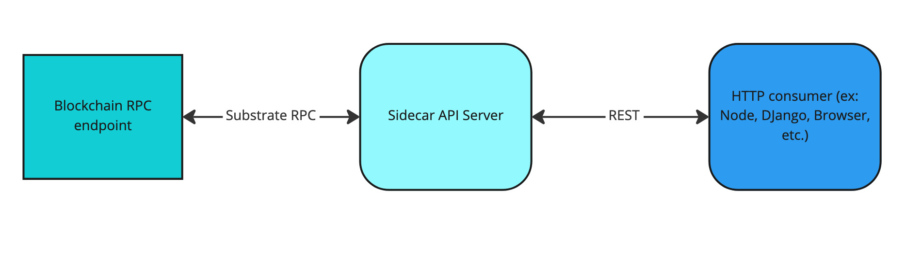

# Deploying Astar Blockchain HTTP Server using API Sidecar

## Overview

The Substrate API Sidecar is a REST service that makes it easy to interact with Astar and Shiden.



Instead of having to use the Substrate RPC directly and rely on libraries like `Astar.js` or `Polkadot.js`, you can set up a Substrate API server and interact with the blockchain. For example, you can read block history, listen to events, or submit a transaction, all through a REST API server.

The source code for the Substrate Sidecar API can be found here: <https://github.com/paritytech/substrate-api-sidecar>.
Please refer to the README of the repository for more information. 

Below we will quickly walk through setting up a Substrate API Sidecar.

## Quick Start

Install the Sidecar API globally:

```bash
npm install -g @substrate/api-sidecar
# OR
yarn global add @substrate/api-sidecar
```

Make sure that you are running a local Astar collator for the service can connect to.

Run the service from any directory on your machine:

```bash
substrate-api-sidecar
```

If everything works well, the terminal should display something like this:

```bash
SAS:
  📦 LOG:
     ✅ LEVEL: "info"
     ✅ JSON: false
     ✅ FILTER_RPC: false
     ✅ STRIP_ANSI: false
  📦 SUBSTRATE:
     ✅ URL: "ws://127.0.0.1:9944"
     ✅ TYPES_BUNDLE: undefined
     ✅ TYPES_CHAIN: undefined
     ✅ TYPES_SPEC: undefined
     ✅ TYPES: undefined
  📦 EXPRESS:
     ✅ BIND_HOST: "127.0.0.1"
     ✅ PORT: 8080
2023-01-03 16:17:59 info: Version: 14.2.2
2023-01-03 16:17:59 warn: API/INIT: RPC methods not decorated: transaction_unstable_submitAndWatch, transaction_unstable_unwatch
2023-01-03 16:17:59 info: Connected to chain Development on the astar-local client at ws://127.0.0.1:9944
2023-01-03 16:17:59 info: Listening on http://127.0.0.1:8080/
2023-01-03 16:17:59 info: Check the root endpoint (http://127.0.0.1:8080/) to see the available endpoints for the current node
```

Now, you can interact with the blockchain by sending requests to `http://127.0.0.1:8080/` followed by the endpoint.

For example, `http://127.0.0.1:8080/blocks/1?finalized=true&eventDocs=true&extrinsicDocs=true` will send a request to get the first block's information with full documentation.
The result will look something like the following:

```json
{
    "number": "1",
    "hash": "0xef26181b1317e8fb4263ba071190dcdb17698087aab478a7afd2539b737058eb",
    "parentHash": "0xd27d60bd31570f15f00fc58ed59c9435845b53a6187e1862a9b1b22cc5991f81",
    "stateRoot": "0x5597ff6dab02e2a1b2d85fae095d2ee18f6b3a50006f56281c48b1efc881bf1d",
    "extrinsicsRoot": "0x4dfbaf7d7c5c43417d15c257078d4ad0032ce1fc5d0fc9d34b30b5028a803abc",
    "logs": [
        {
            "type": "PreRuntime",
            "index": "6",
            "value": [
                "0x61757261",
                "0x6a23da3100000000"
            ]
        },
        {
            "type": "Consensus",
            "index": "4",
            "value": [
                "0x66726f6e",
                "0x01661a8c628cd7872ca3477e0f59ef0e0db29fb97f659b7fafb8f394cb9cf1c6ba00"
            ]
        },
        {
            "type": "Seal",
            "index": "5",
            "value": [
                "0x61757261",
                "0x4e7ecec532276495c0f31e06c7fde96e5e3f4e38fab5a3bd7a6a4762b06c234ea18c1f10cf5357106be6f32087f354de417ab90779b331f3bd26dfa043976589"
            ]
        }
    ],
    "onInitialize": {
        "events": [
            {
                "method": {
                    "pallet": "dappsStaking",
                    "method": "NewDappStakingEra"
                },
                "data": [
                    "1"
                ],
                "docs": "New dapps staking era. Distribute era rewards to contracts."
            }
        ]
    },
    "extrinsics": [
        {
            "method": {
                "pallet": "timestamp",
                "method": "set"
            },
            "signature": null,
            "nonce": null,
            "args": {
                "now": "1672758996005"
            },
            "tip": null,
            "hash": "0x87a5b2129c9e1ea472fa3115a0f760a4f49c53f758445860c372e07c8e216fbf",
            "info": {},
            "era": {
                "immortalEra": "0x00"
            },
            "events": [
                {
                    "method": {
                        "pallet": "balances",
                        "method": "Deposit"
                    },
                    "data": [
                        "YQnbw3oWxBnCUarnbePrjFcrSgVPP2jqTZYzWcccmN8fXhd",
                        "1332000000000000000"
                    ],
                    "docs": "Some amount was deposited (e.g. for transaction fees)."
                },
                {
                    "method": {
                        "pallet": "balances",
                        "method": "Deposit"
                    },
                    "data": [
                        "YQnbw3oWxBk2zTouRxQyxnD2dDCFsGrRGQRaCeDLy7KKMdJ",
                        "1332000000000000000"
                    ],
                    "docs": "Some amount was deposited (e.g. for transaction fees)."
                },
                {
                    "method": {
                        "pallet": "system",
                        "method": "NewAccount"
                    },
                    "data": [
                        "YQnbw3oWxBk2zTouRxQyxnD2dDCFsGrRGQRaCeDLy7KKMdJ"
                    ],
                    "docs": "A new account was created."
                },
                {
                    "method": {
                        "pallet": "balances",
                        "method": "Endowed"
                    },
                    "data": [
                        "YQnbw3oWxBk2zTouRxQyxnD2dDCFsGrRGQRaCeDLy7KKMdJ",
                        "1332000000000000000"
                    ],
                    "docs": "An account was created with some free balance."
                },
                {
                    "method": {
                        "pallet": "system",
                        "method": "ExtrinsicSuccess"
                    },
                    "data": [
                        {
                            "weight": {
                                "refTime": "260558000",
                                "proofSize": "0"
                            },
                            "class": "Mandatory",
                            "paysFee": "Yes"
                        }
                    ],
                    "docs": "An extrinsic completed successfully."
                }
            ],
            "success": true,
            "paysFee": false,
            "docs": "Set the current time.\n\nThis call should be invoked exactly once per block. It will panic at the finalization\nphase, if this call hasn't been invoked by that time.\n\nThe timestamp should be greater than the previous one by the amount specified by\n`MinimumPeriod`.\n\nThe dispatch origin for this call must be `Inherent`.\n\n# <weight>\n- `O(1)` (Note that implementations of `OnTimestampSet` must also be `O(1)`)\n- 1 storage read and 1 storage mutation (codec `O(1)`). (because of `DidUpdate::take` in\n  `on_finalize`)\n- 1 event handler `on_timestamp_set`. Must be `O(1)`.\n# </weight>"
        }
    ],
    "onFinalize": {
        "events": []
    },
    "finalized": true
}
```

You can find the full endpoint documentation from [this link](https://paritytech.github.io/substrate-api-sidecar/dist/).

For transaction signing for the `/transaction` endpoint, please refer to the Polkadot documentation regarding [transaction construction](https://wiki.polkadot.network/docs/build-transaction-construction).

## Connecting to a Remote Node

By default, the Sidecar API will connect to the local node (`ws://127.0.0.1:9944`).
But you can configure the service to connect to a remote node endpoint.

First, start by cloning the [Sidecar API repository](https://github.com/paritytech/substrate-api-sidecar) to your system.

Move to the root of the project folder and use the following command to create the configuration file:

```bash
touch .env.astar
```

Open the created `.env.astar` file with your text editor of choice, and add the following information:

```env
SAS_SUBSTRATE_URL=[RPC Endpoint]
```

Now run the following commands:

```bash
# Install the project dependencies
yarn

# Build the project
yarn build

# Start the API server locally
NODE_ENV=astar yarn start
```

If it worked well, you should see the following console output:

```bash
SAS:
  📦 LOG:
     ✅ LEVEL: "info"
     ✅ JSON: false
     ✅ FILTER_RPC: false
     ✅ STRIP_ANSI: false
  📦 SUBSTRATE:
     ✅ URL: "wss://astar.public.blastapi.io"
     ✅ TYPES_BUNDLE: undefined
     ✅ TYPES_CHAIN: undefined
     ✅ TYPES_SPEC: undefined
     ✅ TYPES: undefined
  📦 EXPRESS:
     ✅ BIND_HOST: "127.0.0.1"
     ✅ PORT: 8080
2023-01-03 17:57:35 info: Version: 14.2.2
2023-01-03 17:57:36 info: Connected to chain Astar on the astar client at wss://astar.public.blastapi.io
2023-01-03 17:57:36 info: Listening on http://127.0.0.1:8080/
2023-01-03 17:57:36 info: Check the root endpoint (http://127.0.0.1:8080/) to see the available endpoints for the current node
```

Of course, you can also configure the Express server (Sidecar API) or explicitly define the chain type bundles or specs.
For more information, please refer to the README of the Substrate Sidecar API repository.
