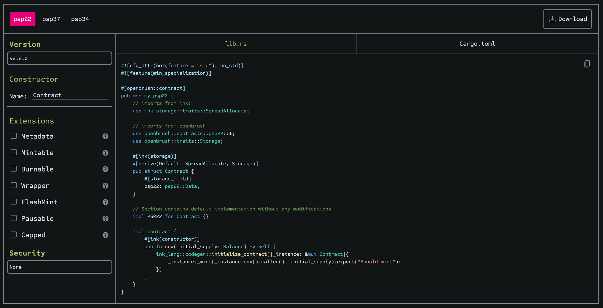
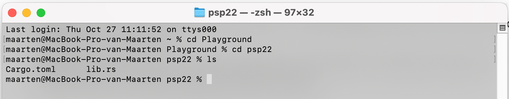
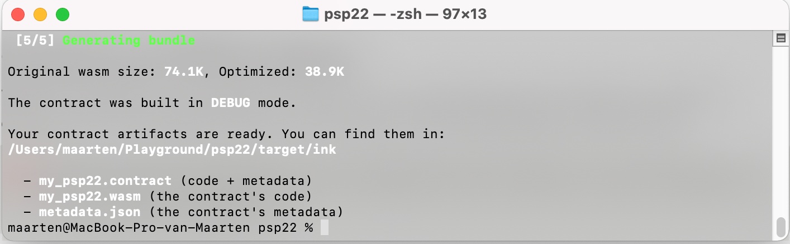
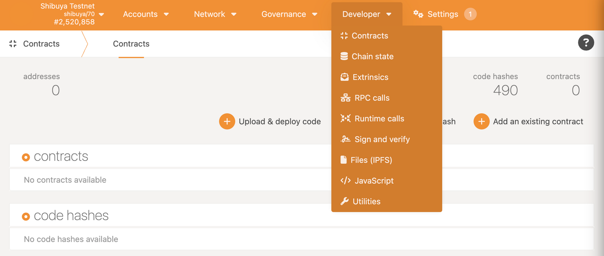
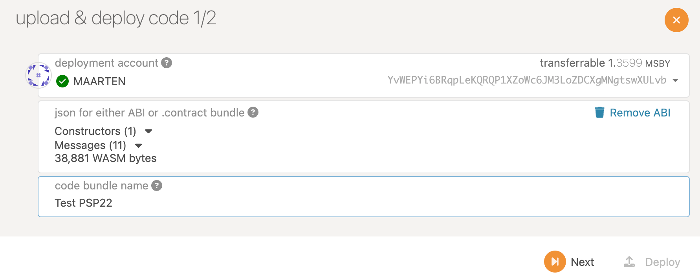
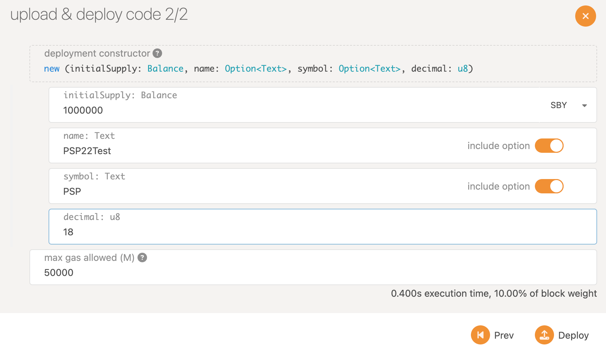
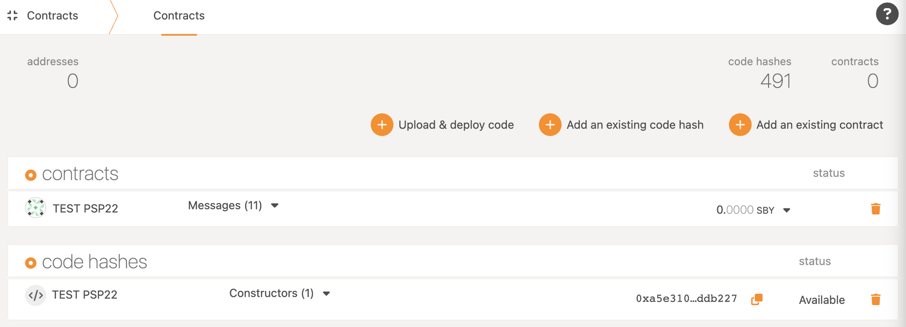

# Create and manage a PSP22 assets on Shibuya
## TL;DR
This guide will be help you in create and manage your PSP22 assets.

---

## What is a PSP22 asset?
The PSP22 Fungible Token standard was inspired by ERC20. It targets every parachain that integrates with pallet contracts to enable WASM smart contracts. Defined at an ABI level, any language that compiles to WASM (and isn’t explicitly restricted to ink!) can use it. What PSP22 is on Polkadot is what ERC20 is on Ethereum.

## Create a PSP22 contract
In this guide, we will use [OpenBrush](https://openbrush.io/) and their contract studio to build our PSP22 contract. OpenBrush contract studio is the fastest and easiest way to create your smart contract. It allows you to add extensions that will fit your needs for your asset.



### Extensions:

- **Metadata**: this allows you to enter the metadata of your asset during deployment.
- **Mintable**: allows you to create an `amount` of tokens and assign them to the `account`, increasing the total supply.
- **Burnable**: allows token holders to destroy both their own tokens and those they have an allowance for.
- **Wrapper**: allows you to wrap your PSP22 token in a PSP22Wrapper token which can be used, for example, in governance.
- **FlashMint**: allows the user to perform a flash loan on the token by minting the borrowed amount and then burning it along with fees for the loan.
- **Pausable**: allows you to pause all token operations.
- **Capped**: allows you to implement with a supply cap, analog to ERC20Capped.

Not available in the contract studio, but another utility is the [TokenTimelock](https://docs.openbrush.io/smart-contracts/psp22/utils/token-timelock): a utility for locking PSP22 tokens for a specified time. [This contract](https://docs.openbrush.io/smart-contracts/psp22/utils/token-timelock) will lock user's `PSP22` tokens until the time specified when they can withdraw them.

---

## Compile your PSP22 contract
When you decide on your PSP22 contract, you can download all files needed to compile by clicking on the ‘Download’ button on the top right. After downloading, unzip the files.
:::caution
Make sure your environment is set to compile ink! smart contract. If your environment is not set, follow the guide [here](https://docs.astar.network/docs/builder-guides/xvm_wasm/setup_your_ink_environment).
:::
### Step 1
You can now open your Terminal and navigate to the folder with the downloaded files.



### Step 2
Next is to compile your smart contract by using this line:

```rust
cargo +nightly contract build
```
When compiling is finished, you should see the following screen where 3 files are created. The contract, wasm, and JSON file.


You can find the files in your folder under `target > ink`.

---

### Deploy your PSP22 contract on Shibuya
Astar ecosystem has 3 networks: Astar, our mainnet, connected to Polkadot; Shiden, our canary network; and Shibuya, our testnet. Deploying and using your contract is the same on all our networks. 

### Step 1
Go to our testnet [Shibuya](https://polkadot.js.org/apps/?rpc=wss%3A%2F%2Frpc.shibuya.astar.network#/accounts). In this guide, we will use [Polkadot.JS](https://polkadot.js.org/apps/?rpc=wss%3A%2F%2Frpc.shibuya.astar.network#/accounts), but you can also use the contract UI or our Swanky all-in-one tool.

:::caution
Make sure you have an account on Shibuya with testnet tokens. You can get your testnet tokens through our faucet.
:::
Navigate to the contract dashboard `Developer > Contracts`:



### Step 2
We will now upload our contract and set the initial state. The PSP22 contract used in this guide has the metadata extension added to the contract. If you didn’t add this, you will not have the same screen.



By adding the metadata extension, we can now set all the information for my asset. To finish, click on ‘Deploy’ and ‘Sign’ your message.



When deployed, your new contract will be visible with your other contracts.



---

## Reference

- [Ink! official documentation](https://use.ink/)
- [OpenBrush](https://openbrush.io/)