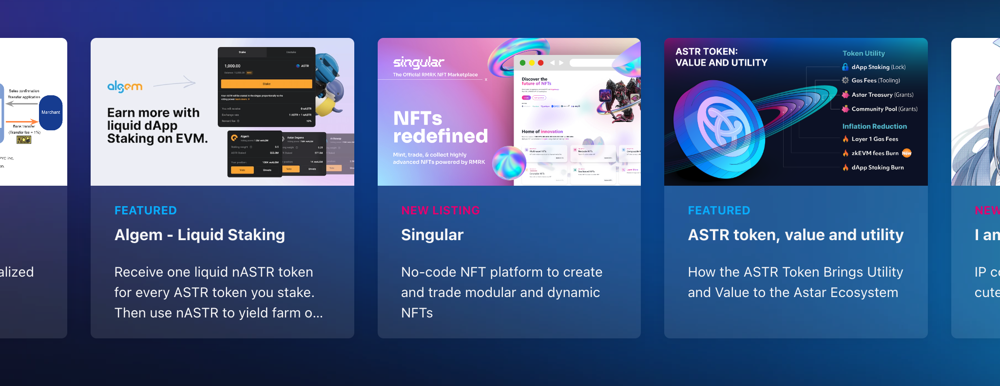

# Create a promotion card on top page

If you have a campaign or new product you would like to share in the community, this will help you to spread the news. It will create a card which will be shown on dApp Staking top page as well as Portal asset page.

You can create a PR reguraly but once evry month at most.

# Steps on creating a PR for the promotion card

- Find a file [dapp_promotion.json](https://github.com/AstarNetwork/astar-apps/blob/bd689c35347c47e9287039b74ae60ca4035378fa/src/data/dapp_promotions.json).

- Create a PR to <code>release-hotfix</code> branch in [astar-apps](https://github.com/AstarNetwork/astar-apps).

:::info
- **Image must be 16:9 and recommended size is less than 1MG**.
- **Description has to be within 65 characters**.
- Your PR will be merged after being reviewed by dApp Staking operation team.
- Card will be removed at anytime when the operation team decided to do so.
- Multiple PRs or more than one PR with in a month from the same team will not be approved.
:::

