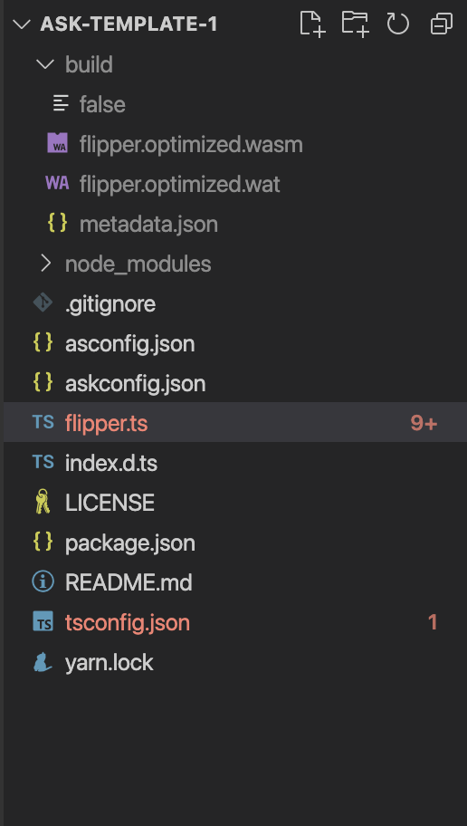
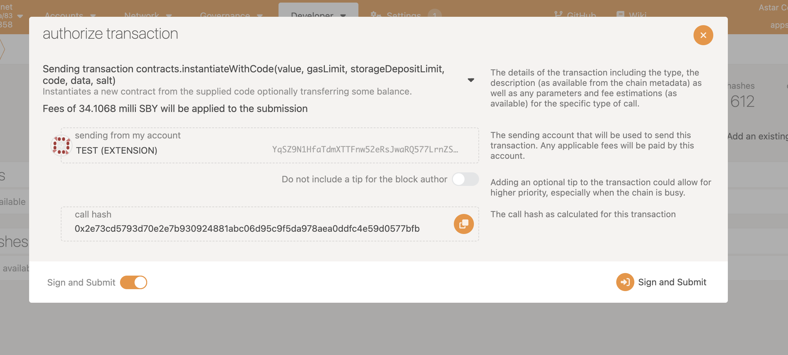

# Ask! Environment

## TL;DR

This guide will suppot you to set up your local environment and deploy a simple Ask! contract on our testnet.

---

## What is Ask!?

Ask! is a framework for AssemblyScript developers to write WASM smart contracts for `pallet-contracts`. Its syntax is similar to TypeScript. [Current project](https://polkadot.polkassembly.io/post/949) is funded by Polkadot treasury. Please keep in mind that Ask! is still under development and no release is available at the moment.

## Ask! Environment Setup

Start with executing the following command: 

```bash
git clone https://github.com/ask-lang/ask-template.git
cd ask-template
```

The command above sets you a simple Ask! contract in `flipper.ts`.

```ts
/* eslint-disable @typescript-eslint/no-inferrable-types */
import { env, Pack } from "ask-lang";

@event({ id: 1 })
export class FlipEvent {
    flag: bool;

    constructor(flag: bool) {
        this.flag = flag;
    }
}

@spreadLayout
@packedLayout
export class Flipper {
    flag: bool;
    constructor(flag: bool = false) {
        this.flag = flag;
    }
}

@contract
export class Contract {
    _data: Pack<Flipper>;

    constructor() {
        this._data = instantiate<Pack<Flipper>>(new Flipper(false));
    }

    get data(): Flipper {
        return this._data.unwrap();
    }

    set data(data: Flipper) {
        this._data = new Pack(data);
    }

    @constructor()
    default(flag: bool): void {
        this.data.flag = flag;
    }

    @message({ mutates: true })
    flip(): void {
        this.data.flag = !this.data.flag;
        let event = new FlipEvent(this.data.flag);
        // @ts-ignore
        env().emitEvent(event);
    }

    @message()
    get(): bool {
        return this.data.flag;
    }
}
```

We run the command below which build the template contract.

```bash
# Install dependencies and Build the template contract
yarn && yarn build flipper.ts
```

The above command will generate WASM code and the metadata file of the contract in `metadata.json` and `flipper.opstimized.wasm` resepectively.



Now we will deploy this smart contract on our testnet.

We will access [polkadot.js](https://polkadot.js.org/apps/) and deploy the smart contract. Select Shibuya testnet and pick `metadata.json` for “json for either ABI or .contract bundle” section and pick `flipper.opstimized.wasm` for “compiled contract WASM” section.





After following the steps above. We can confirm that the contract is deployed on Shibuya testnet.


That’s a wrap!
If you have any questions, please feel free to ask us in our [official discord channel](https://discord.gg/GhTvWxsF6S).

---

## Reference

- [Official document for Ask!](https://github.com/ask-lang/ask)