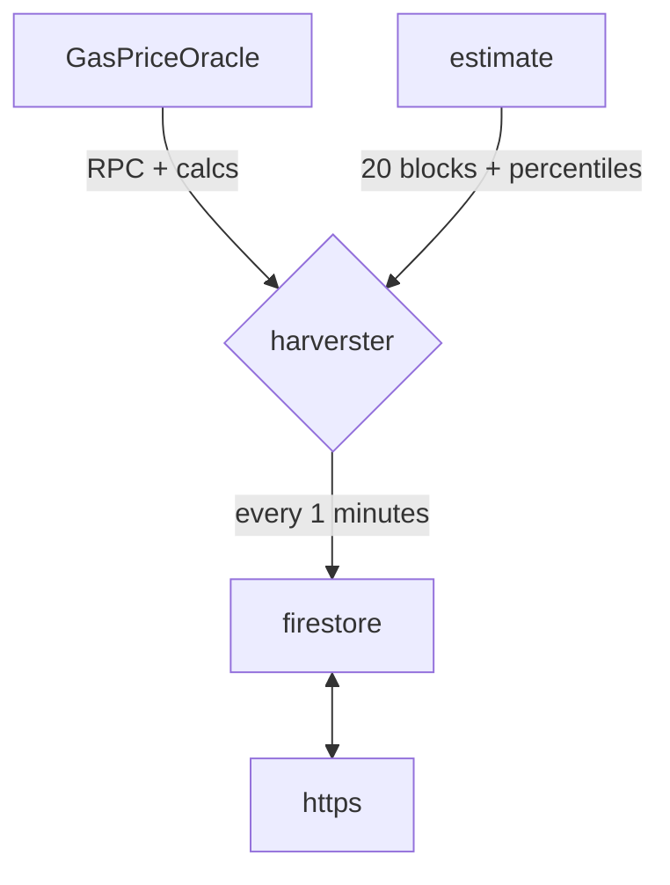

# The Astar Gas Station

:::note
Integrate with the Astar Networks Gas Station for optimal priority fee.
:::

## Documentation of the calculations



### `GasPriceOracle`

- Each EVM RPC is queried using the [GasPriceOracle](https://github.com/peppersec/gas-price-oracle) module

```ts
    const oracle = new GasPriceOracle({
      defaultRpc: 'https://evm.shibuya.astar.network',
      blocksCount: 200,
      chainId: 81,
    });
    
    /*
    {
      estimate: {
        baseFee: 779.371350051,
        maxFeePerGas: 782.371350051,
        maxPriorityFeePerGas: 3
      },
      gasPrices: {
        instant: 1013.182755066,
        fast: 935.245620061,
        standard: 857.308485056,
        low: 779.371350051
      }
    }
    */
```

- The GasPriceOracle Github repo does not mention how it does it’s calculations but from the results I could infer and confirm these results:
    1. **Low Gas Price**: is the base fee.
    2. **Standard Gas Price**: 110% of the base fee.
    3. **Fast Gas Price**: 120% of the base fee.
    4. **Instant Gas Price**: 130% of the base fee.

### Estimates

- 8 months ago (October 30, 2022), a change was implemented to gather the `gasPrices` from the last 20 blocks and use percentiles of the results.

```ts
for (let i = latest.number; i > latest.number - 20; i--) {
      block = await web3[network].eth.getBlock(i);
      for (let j = 0; j < block.transactions.length; j++) {
        txn = await web3[network].eth.getTransaction(block.transactions[j]);
        gasPrices.push(Number(txn.gasPrice));
      }
    }

const percentiles = percentile([35, 60, 90, 99], gasPrices);
```

### GasPriceOracle

- As of November 1st, 2023, the `GasPriceOracle`, is bein used as fall back values if an error occurred and the percentiles were undefined.

## Substrate Tip Calculation

- The substrate tip is exactly the EVM price calculations multiplied:  
$Tip Value=Gas Price×1000$

## Using the gas station

- Shibuya API: GET [https://gas.astar.network/api/gasnow?network=shibuya&type=tip](https://gas.astar.network/api/gasnow?network=shibuya&type=tip)
- Shiden API: GET [https://gas.astar.network/api/gasnow?network=shiden&type=tip](https://gas.astar.network/api/gasnow?network=shiden&type=tip)
- Astar API: GET [https://gas.astar.network/api/gasnow?network=astar&type=tip](https://gas.astar.network/api/gasnow?network=astar&type=tip)

### Example output

```json
{
   "code":200,
   "data":{
      "average":"857308485056",
      "fast":"935245620061",
      "slow":"779371350051",
      "fastest":"1013182755066",
      "eip1559":{
         "priorityFeePerGas":{
            "average":"857308485056",
            "fast":"935245620061",
            "slow":"779371350051",
            "fastest":"1013182755066"
         },
         "maxPriorityFeePerGas":"3000000000",
         "baseFeePerGas":"779000000000",
         "maxFeePerGas":"782000000000"
      },
      "tip":{
         "average":"857308485056000",
         "fast":"935245620061000",
         "slow":"779371350051000",
         "fastest":"1013182755066000"
      },
      "timestamp":1699544357434
   }
}
```


## Related Documents

Include any links to relevant external documents.

- Repo: https://github.com/AstarNetwork/gas-station
- website: [https://gas.astar.network/](https://gas.astar.network/)
