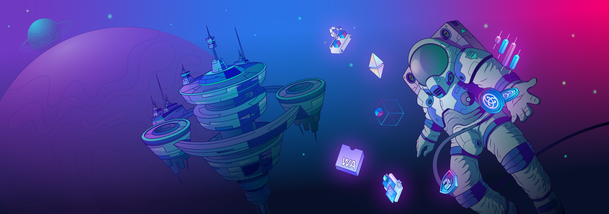

# Build on Astar



## Why build on Astar?

Astar Network is the most flexible smart contract platform in the Polkadot ecosystem, featuring both Wasm and EVM environments, and multichain-native interoperability powered by Polkadot XCM and our unique Cross-Virtual Machine (XVM). Astar provides access to the Polkadot ecosystem through its parachain slot, and asset bridges and general message passing protocols provide routes to other major blockchains, including [Ethereum](https://cbridge.celer.network/#/transfer), [BSC](https://cbridge.celer.network/#/transfer), Cosmos, Polygon, and more. 

The shared security of Polkadot, coupled with Astar XVM, allows developers to design smart contracts in ways they never have before, and by building on a platform conducive to interoperability and fostering cooperation across multiple blockchains, complex synergies can be formed, leading to realization of truly innovative solutions that can't be replicated in other environments.

## Wasm smart contracts
Wasm smart contracts empower developers, and bridge the gap between blockchain and traditional software development, allowing them to build complex dApps with tools and languages they already know. Wasm provides direct access to the runtime in a number of ways, so developers can build dApps that aren't possible on the Ethereum Virtual Machine. Any programming language that compiles to Wasm may eventually be supported, making Astar network a secure and versatile environment for deployment of highly-optimized smart contracts. See the [Wasm chapter](/docs/build/wasm) for more information.

## EVM smart contracts
Solidity developers will feel right at home building on Astar EVM, as it provides an equivalent environment, and simultaneously allows them to fragment smart contracts and offload logic selectively to the Wasm Virtual Machine for applications that have different operating requirements. See the [EVM chapter.](/docs/build/evm) for more information.

## Build2Earn
Astar network's innovative Build2Earn program allows developers to earn a basic income while they build out their products and communities. Users are able to support projects by staking on them, which adds to the passive income developers earn. Build2Earn encourages projects to stand out, and provide value directly to the end-users. See the [dApp staking](/docs/dapp-staking/#dapp-staking--web3) section for more information.

## XVM - The cross virtual machine
The Cross Virtual Machine allows developers to call smart contracts from one VM to another (e.g. Wasm to EVM), and `XVM`, the innovative protocol that makes creation of these hybrid cross-VM dApps possible, is *only* available on Astar network.

## Secured by Polkadot
The Polkadot Relay Chain provides the best security for Layer 1 blockchains in the industry, and facilitates creation of true multi-chain smart contracts able to communicate trustlessly with one another across chains.

## Cross chain connectivity
Astar network is connected to the Relay Chain and a variety of other parachains in the Polkadot ecosystem through the message transport system, XCMP, using vertical channels (VMP + DMP) to the Relay Chain, and parachain-parachain communication operating horizontally, referred to as HRMP channels.

## Powered by Substrate
Astar is built with Substrate, a framework for building custom blockchain solutions more intuitively using the Rust programming language. Substrate's modular architecture makes it easy for developers to utilize only the components they need to support their networks and decentralized applications such as consensus, smart contracts, and storage, and reduces the need to focus on low-level implementation details. 

Some benefits of using Subtrate to build blockchain networks include: forkless upgrades, cross-language compatibility using WebAssemby, deterministic finality that is light client-friendly, and seamless integration with other blockchains.

Polkadot itself is reliant on the Substrate framework, and use of which is similarly fundamental for blockchains such as Astar network that wish to easily interface with the Polkadot network directly, without the need for intermediaries.

```mdx-code-block
import DocCardList from '@theme/DocCardList';
import {useCurrentSidebarCategory} from '@docusaurus/theme-common';

<DocCardList items={useCurrentSidebarCategory().items}/>
```
