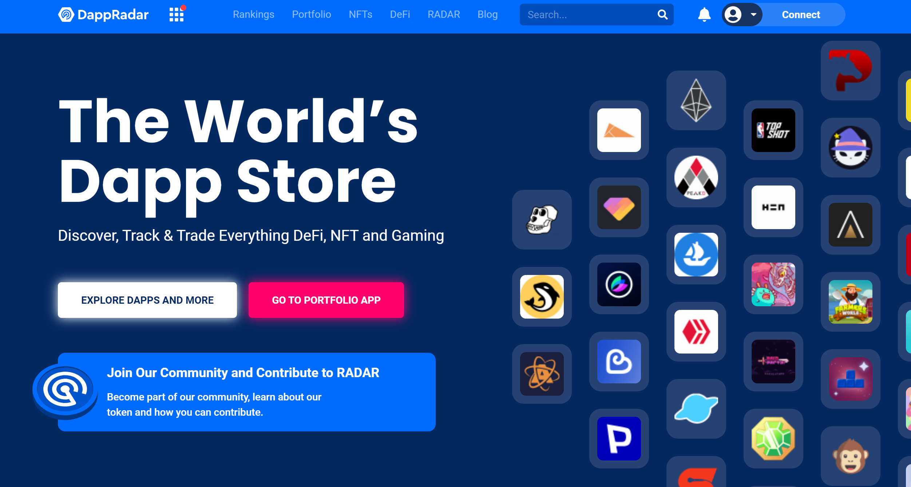
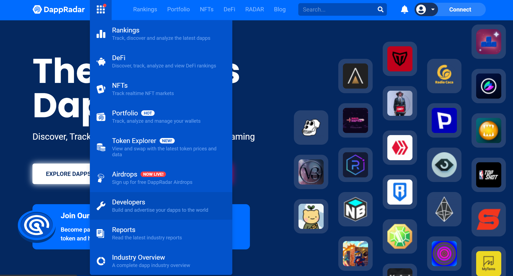
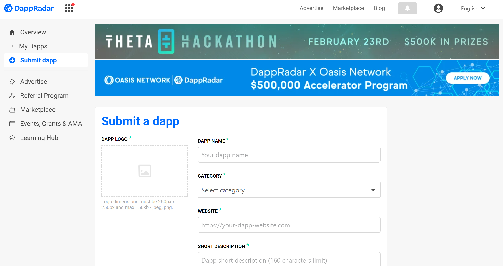
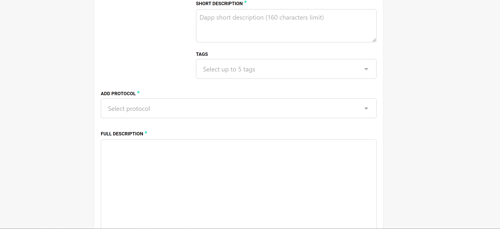
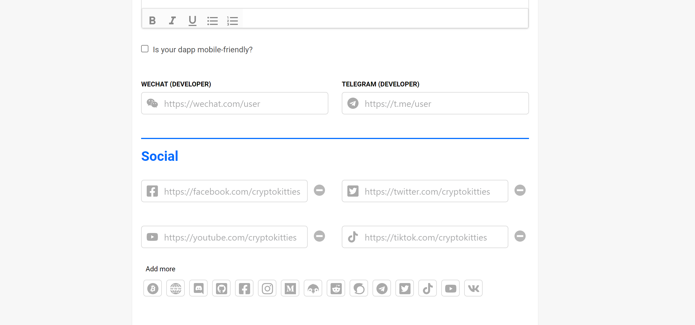
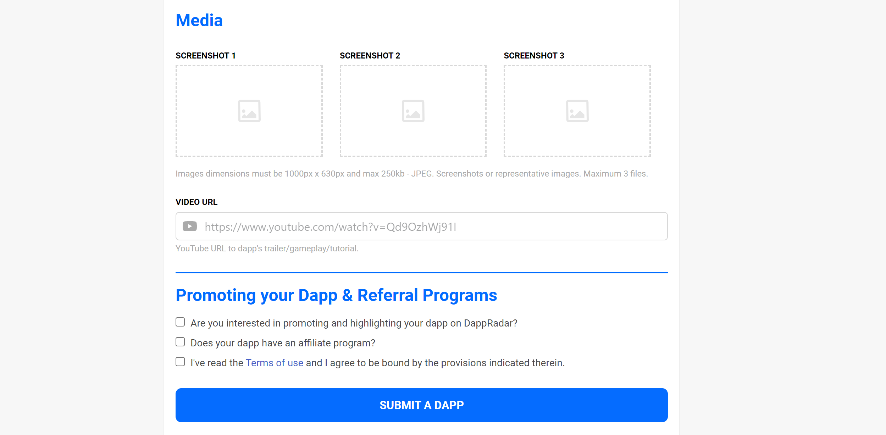

# DappRadar {#dappradar-en-page-id}

## Introduction to DappRadar

[DappRadar] was started in 2018 with the goal of delivering high quality, accurate insights about decentralized applications to a global audience, and rapidly became the go-to, trusted industry source. Since then, DappRadar has become a defacto standard for dApp discovery with more than ten thousand applications listed over twenty protocols. In their own words, *“Across the globe consumers are discovering dapps and managing their NFT/DeFi portfolios with  . We’re visited by over 500,000 users every month, our data powers leading industry partners and our quarterly reports are the trusted authority on multichain dapp market insight*.”
Astar and Shiden are live on DappRadar, where you will find them under [Astar dApps](https://dappradar.com/rankings/protocol/astar) and [Shiden dApps](https://dappradar.com/rankings/protocol/shiden).

You can [submit your project](https://dappradar.com/dashboard/submit-dapp) to DappRadar by providing background on your project including a short and a full description, website URL, and logo. Only a subset of the fields are required, but you are encouraged to complete as many as possible.

:::caution
DappRadar contains user-generated content. You should verify any information with your own research. Astar/Shiden is a permissionless network. Any project can deploy its contracts to Astar/Shiden.
:::

## Required Content

At a minimum, you must include the following information to submit your project/dApp to DappRadar:

- dApp Name
- Logo (250 x 250 pixel png or jpg)
- Category
- Website URL
- Short Description (160 characters or less)
- Full Description

## How to Submit your dApp

First, you'll need to [create a DappRadar account](https://auth.dappradar.com/email-register) and verify your email. Once ready with the required content, you can head to the  where you can take the following steps:

- Enter your project’s name
- Upload your dApp's logo (250 by 250 pixel PNG or JPG, 150KB max)
- Select the relevant category for your dApp
- Include the URL for your dApp

- Write a short description (160 characters or less)
- Specify the protocols your dApp is deployed on. You can select multiple protocols here, such as Astar and Shiden
- After selecting at least one protocol, you'll be prompted to enter your dApp's contract address(es) for each protocol. Please try to fill all the contract address(es) on your dApp for better accuracy of the data.
- Write a full description for your dApp

- Optionally, provide social / media links. (These will be shown on the dApp page, so we highly recommend you do so.)
- It is also optional but recommended that you provide screenshots of your dApp. You also have the option of providing a YouTube link to a demo of your dApp.
- Review the terms and conditions, and press **Submit a dApp**

Submissions are reviewed by the DappRadar team and will be published if the dApp is deemed suitable for listing. For any Astar/Shiden-related questions you can reach out to us in [Discord](https://discord.gg/astarnetwork). For DappRadar questions, support is available in the [DappRadar Discord](https://discord.com/invite/4ybbssrHkm) or you can contact [developers@dappradar.com](mailto:developers@dappradar.com).

[DappRadar]: https://dappradar.com/
