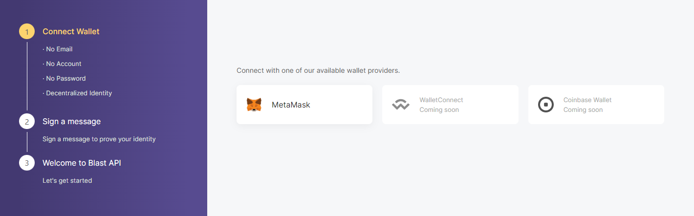
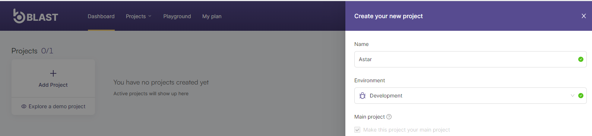
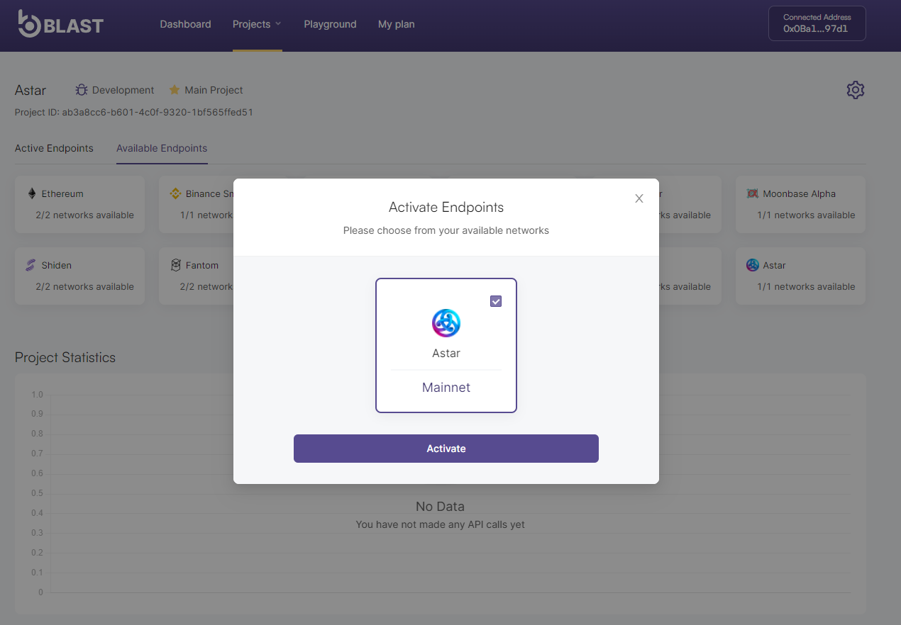

# Blast

## Overview

Blast is Bware Labs' API provider platform that aims to solve Web3 infrastructure issues related to reliability and latency, by employing geographically distributed third-party nodes.

Blast offers a multi-region architecture that, along with a series of clustering and geo-location mechanisms, ensures optimal routing of user requests to the closest point of presence relative to where a call is generated from. Moreover, using third party-nodes scattered all over the world, Blast ensures the decentralization of the underlying blockchain infrastructures thus reducing down-time and increasing reliability.

## API Usage

Blast offers a standardized Blockchain API service that covers all infrastructure aspects of Web 3 development. For each supported blockchain, users are able to generate a dedicated endpoint that will allow them access to the majority of RPC methods required for dApp development and/or blockchain interaction. In the following sections, you will find detailed instructions for connecting and generating your endpoints, as well as RPC and WSS usage examples, together with platform limitations and payment conditions.

Users joining the platform will be able to use the APIs for free within certain limitations and will have the option to upgrade to a standard paid subscription plan or to contact us to create a customized plan suitable to their needs.

## Public Endpoints

Here are two Public APIs, that include Astar / Shiden and Shibuya (+ one-click add network to MetaMask):

[https://blastapi.io/public-api/astar](https://blastapi.io/public-api/astar)

[https://blastapi.io/public-api/shiden](https://blastapi.io/public-api/shiden)

### Public RPC Endpoints

[https://astar.public.blastapi.io](https://astar.public.blastapi.io)

[https://shiden.public.blastapi.io](https://shiden.public.blastapi.io)

[https://shibuya.public.blastapi.io](https://shibuya.public.blastapi.io)

### Public WSS Endpoints

[wss://astar.public.blastapi.io](wss://astar.public.blastapi.io)

[wss://shiden.public.blastapi.io](wss://shiden.public.blastapi.io)

[wss://shibuya.public.blastapi.io](wss://shibuya.public.blastapi.io)

## Instructions

1. Launch the app on: [https://blastapi.io/login](https://blastapi.io/login)
2. Connect the app to MetaMask. This is to prevent users from spamming the network. You will only need to connect MetaMask to create an account, and sign in to their app.

3. Now you can create an API endpoint. Click on '**Add project**' to create the environment.

4. Select the desired network and activate the endpoints:

After the endpoint is created, you will be able to use the RPC Endpoint to connect to Astar mainnet through MetaMask, or the WSS Endpoint through other applications. These endpoints are only for you to use, and will count towards your account limits.

How to add an endpoint to MetaMask:

1. Open MetaMask
2. Click on Custom RPC
3. Add the information
