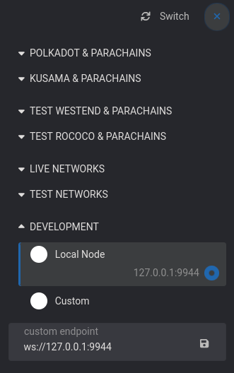

import Tabs from '@theme/Tabs';
import TabItem from '@theme/TabItem';

# Binary

In this guide, we will use the binary provided in [Astar release](https://github.com/AstarNetwork/Astar).

If you have experience with Rust compilation, you can also build the binary from [here](https://github.com/astarnetwork/astar).

## Let's get started

Let's start with updating our server. Connect to your server and update:

```sh
sudo apt-get update
sudo apt-get upgrade
sudo apt install -y adduser libfontconfig1
```

## Create dedicated user and directory

Download the [latest release](https://github.com/AstarNetwork/Astar/releases/latest) from Github:

```sh
wget $(curl -s https://api.github.com/repos/AstarNetwork/Astar/releases/latest | grep "tag_name" | awk '{print "https://github.com/AstarNetwork/Astar/releases/download/" substr($2, 2, length($2)-3) "/astar-collator-v" substr($2, 3, length($2)-4) "-ubuntu-x86_64.tar.gz"}')
tar -xvf astar-collator*.tar.gz
```

Create a dedicated user for the node and move the **node binary**:

```sh
sudo useradd --no-create-home --shell /usr/sbin/nologin astar
sudo mv ./astar-collator /usr/local/bin
sudo chmod +x /usr/local/bin/astar-collator
```

Create a dedicated directory for the **chain storage data**:

```sh
sudo mkdir /var/lib/astar
sudo chown astar:astar /var/lib/astar
```

## Set systemd service

To run a stable collator node, a **systemd service** has to be set and activated. This will ensure that the node is restarting even after a server reboot.

Create a service file

```sh
sudo nano /etc/systemd/system/astar.service
```

## Service parameters

:::tip
Please make sure to change **\{NODE_NAME\}**
:::

<Tabs>
<TabItem value="astar" label="Astar" default>

```sh
[Unit]
Description=Astar Archive node

[Service]
User=astar
Group=astar
  
ExecStart=/usr/local/bin/astar-collator \
  --pruning archive \
  --rpc-cors all \
  --name {NODE_NAME} \
  --chain astar \
  --base-path /var/lib/astar \
  --rpc-external \
  --rpc-methods Safe \
  --rpc-max-request-size 1 \
  --rpc-max-response-size 1 \
  --telemetry-url 'wss://telemetry.polkadot.io/submit/ 0'

Restart=always
RestartSec=10

[Install]
WantedBy=multi-user.target
```

</TabItem>
<TabItem value="shiden" label="Shiden" default>

```sh
[Unit]
Description=Shiden Archive node

[Service]
User=astar
Group=astar
  
ExecStart=/usr/local/bin/astar-collator \
  --pruning archive \
  --rpc-cors all \
  --name {NODE_NAME} \
  --chain shiden \
  --base-path /var/lib/astar \
  --rpc-external \
  --rpc-methods Safe \
  --rpc-max-request-size 1 \
  --rpc-max-response-size 1 \
  --telemetry-url 'wss://telemetry.polkadot.io/submit/ 0'

Restart=always
RestartSec=10

[Install]
WantedBy=multi-user.target
```

</TabItem>
<TabItem value="shibuya" label="Shibuya" default>

```sh
[Unit]
Description=Shibuya Archive node

[Service]
User=astar
Group=astar
  
ExecStart=/usr/local/bin/astar-collator \
  --pruning archive \
  --rpc-cors all \
  --name {NODE_NAME} \
  --chain shibuya \
  --base-path /var/lib/astar \
  --rpc-external \
  --rpc-methods Safe \
  --rpc-max-request-size 1 \
  --rpc-max-response-size 1 \
  --telemetry-url 'wss://telemetry.polkadot.io/submit/ 0'

Restart=always
RestartSec=10

[Install]
WantedBy=multi-user.target
```

</TabItem>
</Tabs>

:::important
EVM RPC calls are disabled by default, and require additional flag to be enabled. Please refer to this page (INSERT_LINK) for more info.
:::

Start the service:

```sh
sudo systemctl start astar.service
```

Check the node log to ensure proper syncing:

```sh
journalctl -f -u astar.service -n100
```

Enable the service:

```sh
sudo systemctl enable astar.service
```

You can test the node health through the RPC port with this command:

```sh
curl -H "Content-Type: application/json" --data '{ "jsonrpc":"2.0", "method":"system_health", "params":[],"id":1 }' localhost:9944
```

## Next steps

For any usage, wait for the chain to be fully sync by checking the [node log](/docs/build/nodes/archive-node/binary#get-node-logs).

It all depends on what you plan to do with your archive node.

- In most cases, you will want to access node from outside. In this case, [nginx server](/docs/build/nodes/archive-node/nginx) is the recommended option.
- If you run your dApp on the same server as the node, then you can access it directly with the `localhost` address. This setup is recommended for testing purpose only.
- If you run the node locally for testing purpose, you can switch the network in [Polkadot.js portal](https://polkadot.js.org/apps) and explore the chain:



---

## Extra operations

### Get node logs

To get the last 100 lines from the node logs, use the following command:

```sh
journalctl -fu astar-collator -n100
```

### Indexers and oracles

To access data from indexers (e.g. The Graph) or Oracles (e.g. Chainlink), you need to add the debug flags below to the node launch command, after the `astar-collator` line:

`--ethapi=debug`

### Upgrade node

When an upgrade is necessary, node operators are be notified in our Discord and Element group.

Download the [latest release](https://github.com/AstarNetwork/Astar/releases/latest) from Github

```sh
wget $(curl -s https://api.github.com/repos/AstarNetwork/Astar/releases/latest | grep "tag_name" | awk '{print "https://github.com/AstarNetwork/Astar/releases/download/" substr($2, 2, length($2)-3) "/astar-collator-" substr($2, 3, length($2)-4) "-ubuntu-x86_64.tar.gz"}')
tar -xvf astar-collator*.tar.gz
```

Move the new release binary and restart the service:

```sh
sudo mv ./astar-collator /usr/local/bin
sudo chmod +x /usr/local/bin/astar-collator
sudo systemctl restart astar.service
```

### Purge node

To start a node from scratch without any chain data, just wipe the chain data directory:

```sh
sudo systemctl stop astar.service
sudo rm -R /var/lib/astar/chains/astar/db*
sudo systemctl start astar.service
```

### Snapshot

Please refer to the [**snapshot page**](/docs/build/nodes/snapshots).
:::
