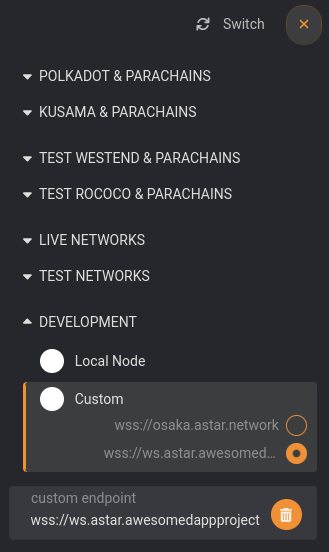

# Nginx Server

To access your archive node from outside, you need to install a server and setup a certificate.
In this guide, we will use the Nginx server as an example.

## Firewall

Your server will communicate through HTTP ports, you need to enable ports 80 (http) and 443 (https) in your firewall.

:::info
At the end of the configuration, you can close port 80 since only port 443 will be used to access the node. See the section below, *Self-signed certificate*.
:::

## Domain name

This guide assumes that you have a **domain name** and control over the **DNS**. In this case, you need to add the **A record** with the sub domain you will use and the IP address of your node into you DNS provider console.

:::info
If you don't have a domain name, you will have to generate a self-signed certificate and access your node through the raw ip address of your server.
:::

## Installation

:::info
In the following steps, don't forget to update \{SUB_DOMAIN\} with your full sub domain name.
Example: ws.astar.awesomedappproject.io
:::

First, install **Nginx** and **Certbot**:

```sh
sudo apt-get install nginx snapd
sudo snap install core; sudo snap refresh core
sudo snap install --classic certbot
sudo ln -s /snap/bin/certbot /usr/bin/certbot
```

Create and enable the site:

```sh
cd /etc/nginx/sites-available
sudo cp default {SUB_DOMAIN}
sudo ln -s /etc/nginx/sites-available/{SUB_DOMAIN} /etc/nginx/sites-enabled/
```

Edit the site file:

```sh
sudo nano {SUB_DOMAIN}
```

Change the `root` and `server_name` to get a file like this:

```
server {
    listen 80;
    listen [::]:80;

    root /var/www/{SUB_DOMAIN}/html;
    index index.html index.htm index.nginx-debian.html;

    server_name {SUB_DOMAIN};

    location / {
            try_files $uri $uri/ =404;
    }
}
```

## Generate SSL certificate

Issue the Certbot certificate:

```sh
sudo certbot certonly --nginx
```

Certbot will issue the SSL certificate into `/etc/letsencrypt/live`.

## Switch to https

Edit again the site file:

```sh
sudo nano {SUB_DOMAIN}
```

Delete the existing lines and set the content as below:

```
map $http_upgrade $connection_upgrade {
    default upgrade;
    '' close;
}

server {

    # SSL configuration
    #
    listen 443 ssl;
    listen [::]:443 ssl;

    root /var/www/{SUB_DOMAIN}/html;

    server_name {SUB_DOMAIN};
    ssl_certificate /etc/letsencrypt/live/{SUB_DOMAIN}/fullchain.pem; # managed by Certbot
    ssl_certificate_key /etc/letsencrypt/live/{SUB_DOMAIN}/privkey.pem; # managed by Certbot
    ssl_session_timeout 5m;
    ssl_protocols SSLv2 SSLv3 TLSv1 TLSv1.1 TLSv1.2;
    ssl_ciphers   HIGH:!aNULL:!MD5;
    ssl_prefer_server_ciphers on;

    location / {
        proxy_pass http://localhost:9944;
        proxy_pass_request_headers on;
        proxy_http_version 1.1;
        proxy_set_header Host $host;
        proxy_set_header X-Real-IP $remote_addr;
        proxy_set_header X-Forwarded-For $proxy_add_x_forwarded_for;
        proxy_set_header Upgrade $http_upgrade;
        proxy_set_header Connection $connection_upgrade;
    }

}

```
:::info
In the example above, note that port 9944 is used in proxy_pass. This is the WS port.
Change this to 9944 to pass the RPC port.
:::

Check and restart nginx:

```sh
sudo nginx -t
sudo systemctl restart nginx
```

## Usage

This is it, your arcive node is set and available from outside.

If you set a WS endpoint, you can explore the chain from the [Polkadot.js](https://polkadot.js.org/apps) portal using the format [wss://\{SUB_DOMAIN\}](wss://\{SUB_DOMAIN\})



If you set a **RPC endpoint**, you can it through [https://\{SUB_DOMAIN\}](https://\{SUB_DOMAIN\})

## Self-signed certificate

In case you do not have a domain name, you need to issue yourself a self-signed certificate:

```sh
sudo openssl req -x509 -nodes -days 365 -newkey rsa:2048 -keyout /etc/ssl/private/nginx-selfsigned.key -out /etc/ssl/certs/nginx-selfsigned.crt
sudo openssl dhparam -out /etc/ssl/certs/dhparam.pem 2048
```

Then in the https site config file, you will have to replace the following values:

```sh
ssl_certificate /etc/ssl/certs/nginx-selfsigned.crt;
ssl_certificate_key /etc/ssl/private/nginx-selfsigned.key;
ssl_dhparam /etc/ssl/certs/dhparam.pem;
```

In all steps, the \{SUB_DOMAIN\} value will be the node server ip address.
