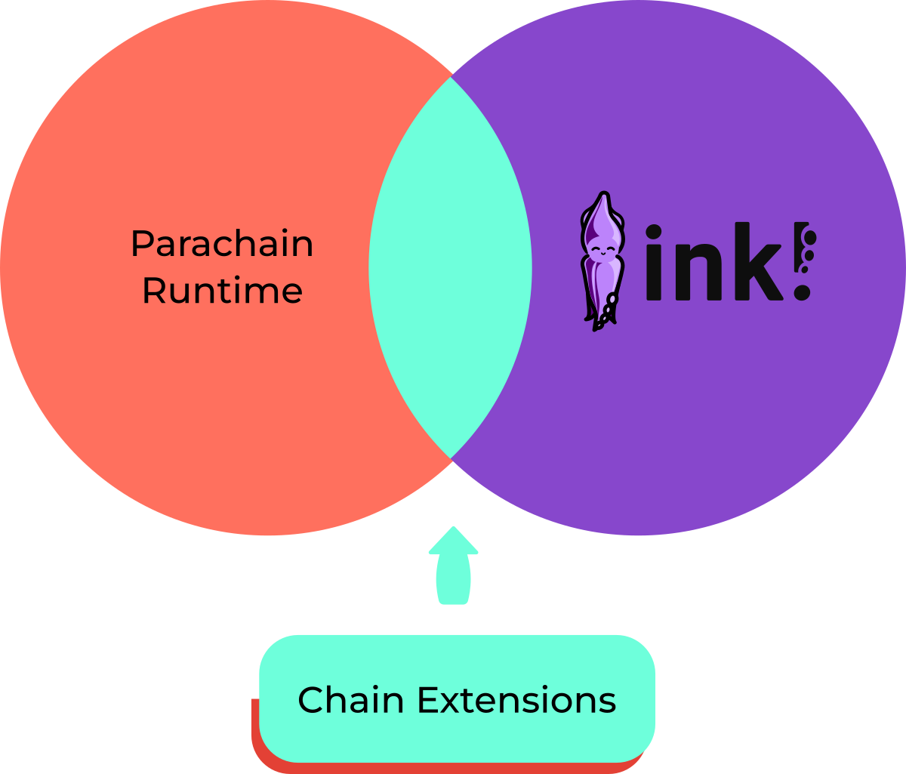

# Chain Extensions

Chain extension is a way to extend contracts API to add contracts to runtime pallet interaction. By default, contracts can only do cross-contract calls within their environment (pallet-contracts). Chain extension allows to add custom callable pallet functions.

### What chain extensions are available ?

#### XVM

This chain extension enables usage of XVM in your contracts. More info in the [ink! XVM SDK repo](https://github.com/AstarNetwork/ink-xvm-sdk).

#### DApp Staking

This chain extension adds call to `pallet_dapps_staking` so that you can use dApp Staking in your contracts. More info in the [chain-extensions contracts repo](https://github.com/swanky-dapps/chain-extension-contracts).

#### Assets

This chain extension adds call to `pallet_assets` so that you can use Assets in your contracts. More info in the [chain-extensions contracts repo](https://github.com/swanky-dapps/chain-extension-contracts).

### Availability in networks

| Chain extension | Swanky | Shibuya | Shiden | Astar |
|---|---|---|---|---|
| XVM | :white_large_square: | :white_check_mark: | :white_large_square: | :white_large_square: |
| Dapp Staking |  :white_check_mark:| :white_check_mark: | :white_large_square: | :white_large_square: |
| Assets | :white_check_mark: | :white_check_mark: | :white_large_square: | :white_large_square: |

### Implementations

There are two implementations: one in the runtime and one on the ink! side.  

#### Runtine

Implementation of the chain extension on runtime side is available on [astar-frame repository](https://github.com/AstarNetwork/astar-frame/), under `chain-extensions` folder

#### ink! implementation

On contract side the implementation is made using [ChainExtensionMethod](https://github.com/paritytech/ink/blob/db7a906522a7e97ed5057b193df1253b33e99ee4/crates/env/src/chain_extension.rs#L77) that uses a custom environment
(so it can be used with other libraries that use custom environment like OpenBrush). It is implemented as a crate that you can import in you contract. It can be found in [chain-extension contracts repository](https://github.com/swanky-dapps/chain-extension-contracts)

#### Contracts examples

- [PSP22 pallet-assets wrapper](https://github.com/swanky-dapps/chain-extension-contracts/tree/main/contracts/psp22_pallet_wrapper)
- [Asset Chain Extension](https://github.com/swanky-dapps/chain-extension-contracts/tree/main/examples/assets)
- [dApp Staking](https://github.com/swanky-dapps/chain-extension-contracts/tree/main/examples/dapps-staking)

#### Video tutorials

- dApp Staking Chain Extension on ink! Smart Contracts by @AstarNetwork on [Youtube](https://www.youtube.com/watch?v=-T-HKy_vFCo)
- Build a Scheduler Chain Extension by @Parity on [Youtube](https://www.youtube.com/watch?v=yykPQF0tkqk)