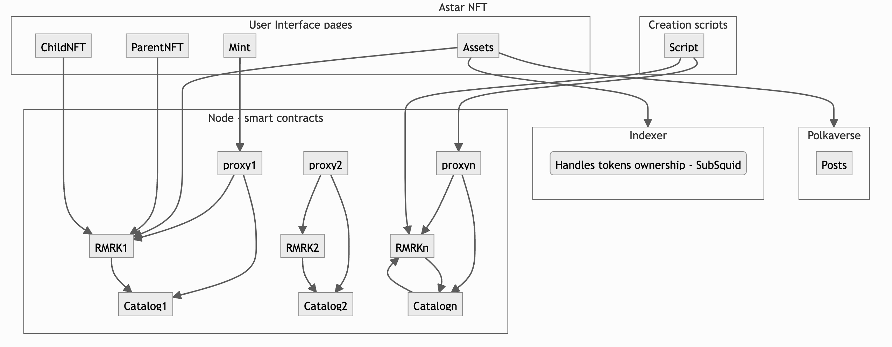
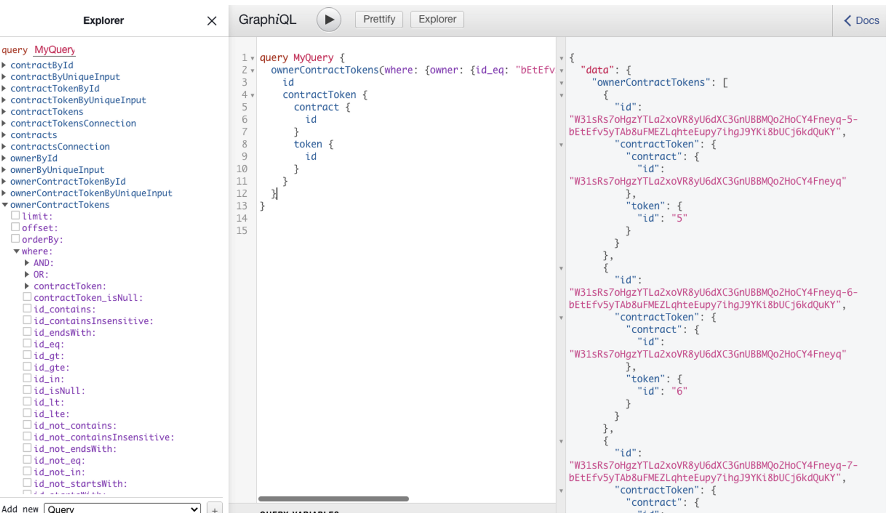
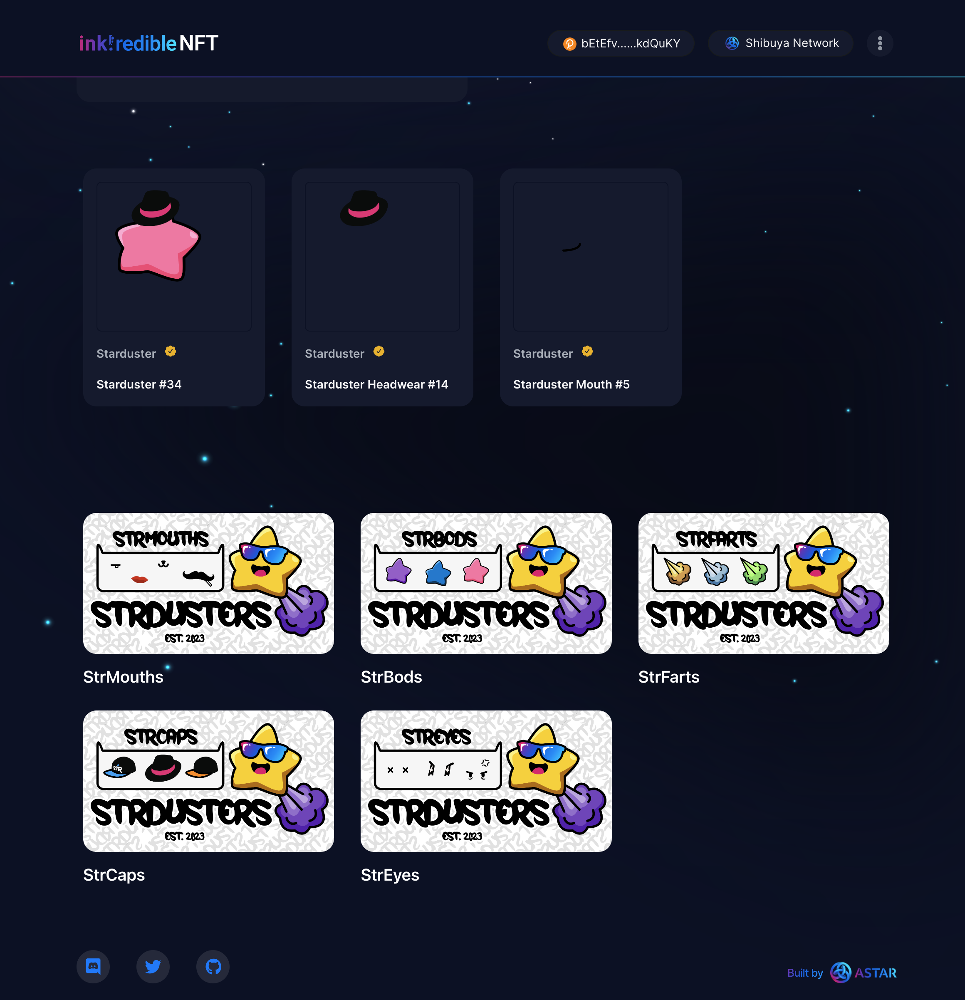
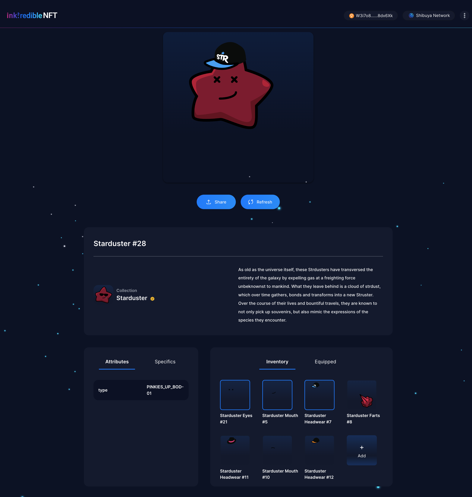
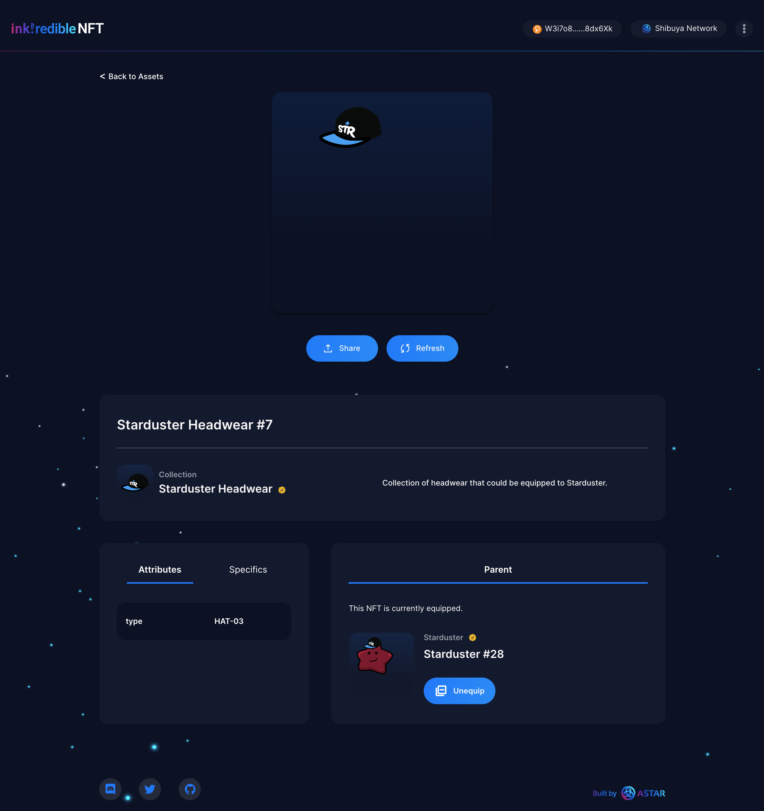
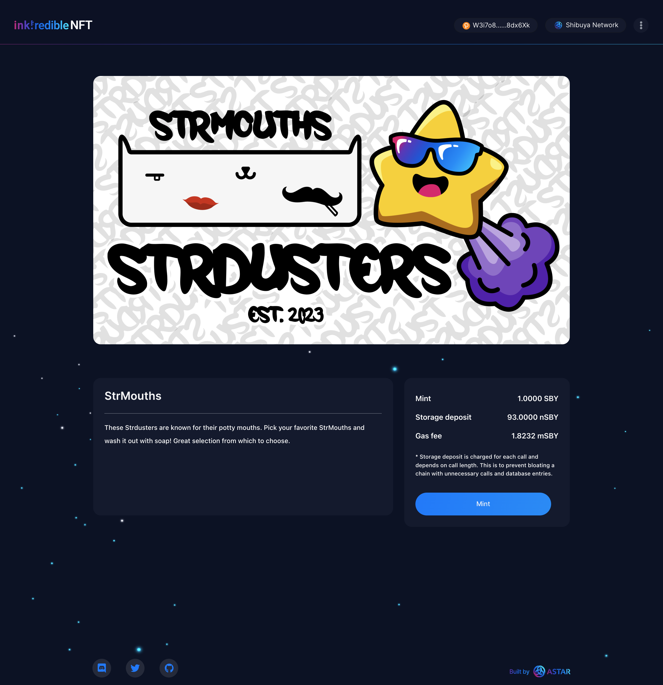

# ink!redible NFT architecture  

This guide will give a brief overview of the !inkredible NFT on Astar.

## What are ink!redible NFTs?

Astar brings you ink!redible NFTs - a new way for users and builders to engage with, and create, NFTs. Originally derived from the RMRK standard, ink!redible NFTs brings the latest in NFT technology to the Astar Network, and in the dedicated, more efficient, domain-specific language that is ink!
This document wil provide a brief overview of the system architecture, while details can be found by looking into [source code](https://github.com/AstarNetwork/ink-redible-nft)

This document will cover the following:
- NFT collection creation and deployment to a node.
- NFT token indexing used to track tokens ownership
- UI
  - A token minting
  - Adding to a parent's token inventory
  - Token equipping and unequipping

## Architecture

### Collection creation

The ink!redible NFT [repository](https://github.com/AstarNetwork/ink-redible-nft) also contains set of scripts that can be used to create a NFT collection and deploy it to a node. More details on how prepare a collection for deployment and use scripts can be found in [readme](https://github.com/AstarNetwork/ink-redible-nft/blob/main/scripts/README.md) file.

The scripts deployed the following contracts:

- [RMRK contract v0.6.0](https://github.com/rmrk-team/rmrk-ink/tree/main/examples/equippable-lazy). The main contract that hold tokens, enables token nesting and equipping
- [RMRK catalog contract v0.6.0](https://github.com/rmrk-team/rmrk-ink/tree/main/examples/catalog) The catalog contract contains all parts (graphics) that can be used as tokens assets.
- [RMRK minting proxy contract](https://github.com/swanky-dapps/rmrk-lazy-mint) used to enable RMRK lazy minting. The contract's `mint` function mints token, adds random asset to the token and transfers the token ownership to a caller.

### A collection indexing
The indexer was implemented using subsquid and uset to track token ownership. Compared to other indexing services, the development environment is faster, simpler, and works well without major bugs. Indexer source code is available [here](https://github.com/sirius651/sqd-nft-viewer)

To modify the indexer or create a new on you need to meet pre-requisites `Node.js, Subsquid CLI, Docker` and follow [subsquid document](https://docs.subsquid.io/quickstart/quickstart-substrate/).

In short do the following:
- Write down typeorm model like [this](https://github.com/sirius651/sqd-nft-viewer/tree/main/src/model/generated)
- Write down indexing script like [this](https://github.com/sirius651/sqd-nft-viewer/blob/main/src/processor.ts)
- Migrating db : `$ yarn db:migrate`
- Run building script : `$ yarn build`

To run the subsquid in local machine

- Open the docker container.
- by using subsquid-cli, it can run simply as command line
    `$ sqd down`
    `$ sqd codegen`
    `$ sqd build`
    `$ sqd up`
    `$ sqd process`

Finally, you can see the graphql query `$ sqd serve`

To deploy the indexing script to aquarium, which is hosted by subsquid team, just following to [this document](https://docs.subsquid.io/deploy-squid/quickstart/).

`$ sqd deploy .`

Once deploy has successful, browse to [aquarium console.](https://app.subsquid.io/) 

After status is available, we can query it where the endpoint is opened (like [this](https://squid.subsquid.io/sqd-nft-viewer/v/v1/graphql))

**Troubleshooting**

QueryFailedError: relation "owner" does not exist 

- Check this : https://docs.subsquid.io/basics/db-migrations/ , and running `$ sqd migration:generate`

Sometimes, when trying to update during deployment on aquarium console, do not reflect the update well. 

- Remove the existing squad and creates a new one. it works perfectly

### UI
**Assets**
Displays all tokens owner by a connected user. The information about token ownership comes from the indexer above. List of all mintable collections is fetched from Polkaverse.

**Parent page**
Shows inventory (children) for a selected token. The page also enables adding a new tokens to the inventory.

**Child page**
Shows details of selected inventory item with options to: equip, un-equip or bond (accept child) to a parent. All earlier mentioned operations are executed on a parent NFT RMRK contract.

**Minting page**
Minting page enables users to mint their tokens. Mint page is generic and works for any RMRK proxy contract address. Information about collection are fetched from a Polkaverse post.

