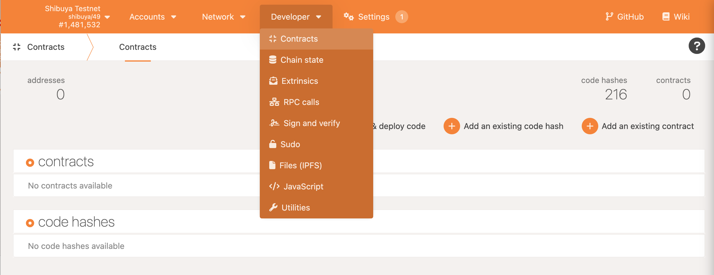
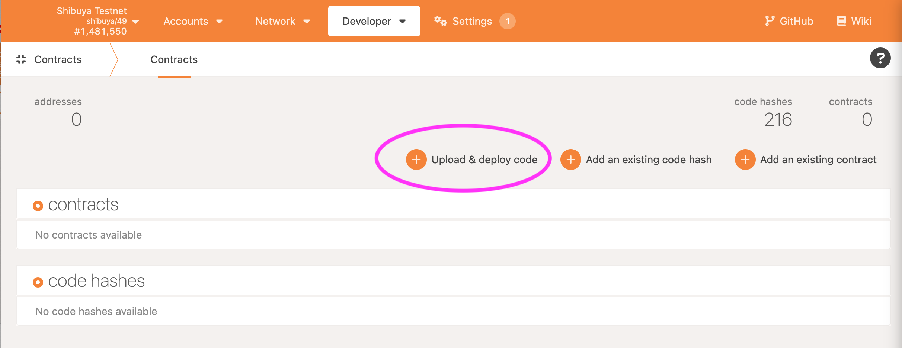
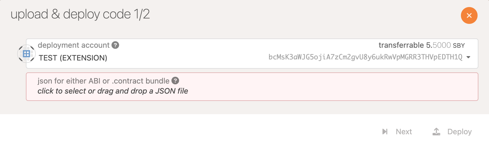
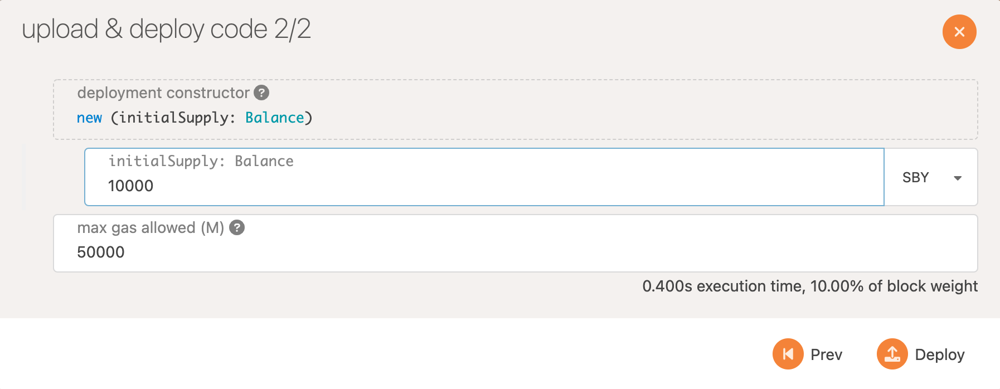
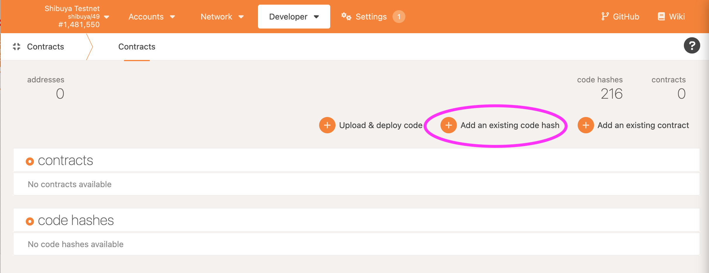
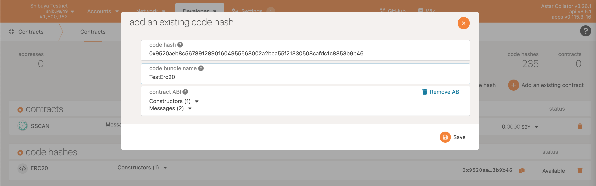
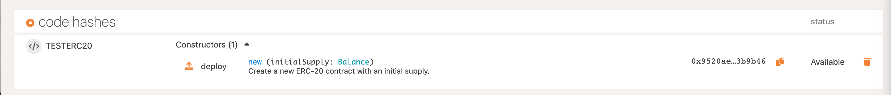

# Polkadot.js Apps UI

## Deploy a Wasm Smart Contract with Polkadot.js

This is a step by step tutorial that will demonstrate how to deploy a Wasm smart contract with Polkadot.js apps, onto Shibuya testnet.

You can deploy the Wasm blob separately from the metadata, but in this example we’ll use the `.contract` file which combines both Wasm and metadata files. If you used ink! and `cargo contract build` you will find the `.contract` file under:

`./target/ink/myProg.contract`

## Contract Page on Polkadot.js

First, we will deploy the contract:

1. Open PolkadotJS Apps in your browser and connect to Shibuya testnet. For connectivity instructions check the Integration chapter within this doc.
2. Go to page `Developers —> Contracts`

3. Upload the contract

4. From the pop-up window upload the `.contract` file:

5. Set values for the constructor and deploy the contract:

6. Now you can interact with the contract:

## Deploy a contract from an existing `code hash`

To deploy from an existing `code hash`, you will need to have the `code hash` on hand, then click `Add an existing code hash`.

