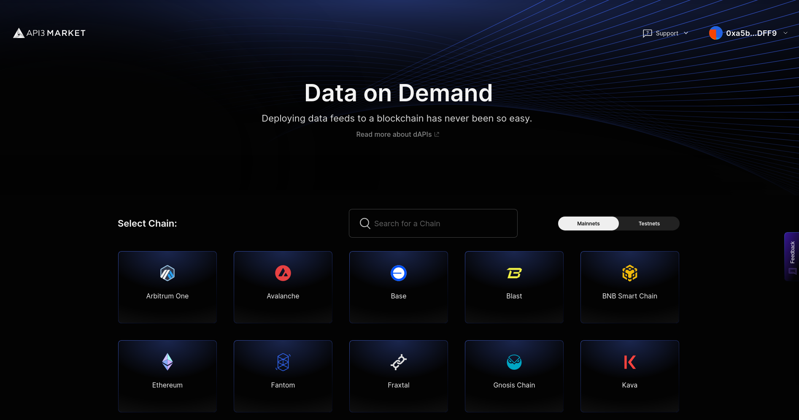
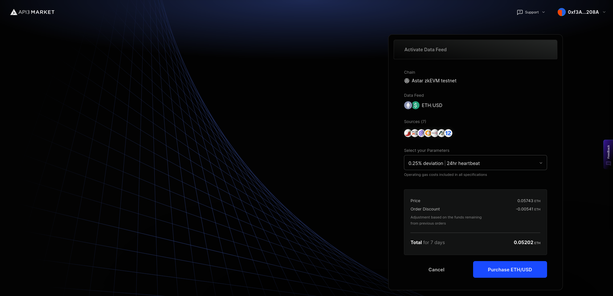
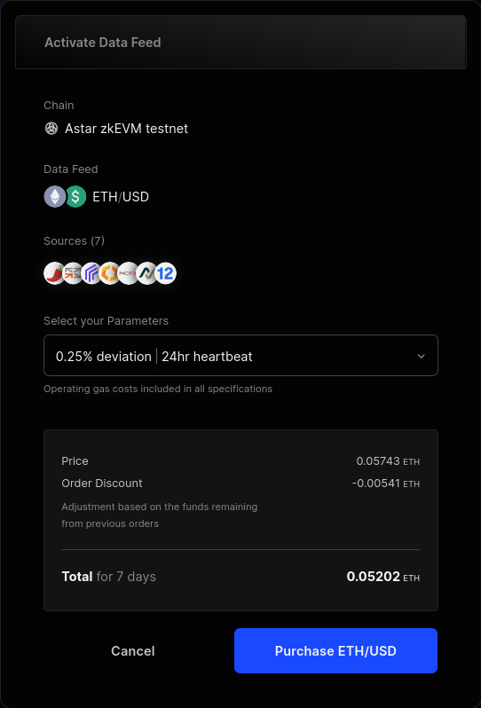
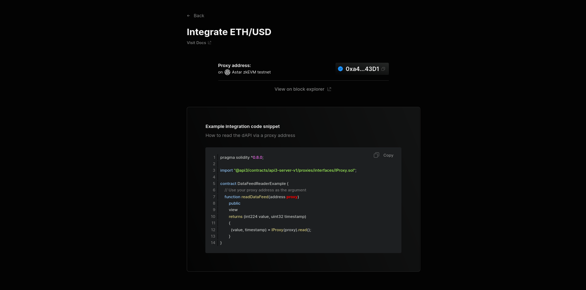

# API3

[API3]: https://api3.com/

## Overview

[API3](https://api3.org) is a collaborative project to **deliver traditional API services to smart contract platforms** in a decentralized and trust-minimized way. It is governed by a decentralized autonomous organization (DAO), namely the [API3 DAO](https://api3.org/dao).

## First-party oracles

An [Airnode](https://docs.api3.org/explore/airnode/what-is-airnode.html) is a **first-party oracle** that pushes off-chain API data to your on-chain contract. Airnode lets API providers easily run their own oracle nodes. That way, they can provide data to any on-chain dApp that's interested in their services, all without an intermediary.

## Using dAPIs - API3 Datafeeds

[dAPIs](https://docs.api3.org/reference/dapis/understand/) are continuously updated streams of off-chain data, such as the latest cryptocurrency, stock and commodity prices. They can power various decentralized applications such as DeFi lending, synthetic assets, stablecoins, derivatives, NFTs and more.

The data feeds are continuously updated by [first-party oracles](https://docs.api3.org/explore/introduction/first-party.html) using signed data. dApp owners can read the on-chain value of any dAPI in real-time.

Due to being composed of first-party data feeds, dAPIs offer security, transparency, cost-efficiency and scalability in a turn-key package.

Apart from relying on deviation threshold and heartbeat configuration updates, unlike traditional data feeds, [OEV Network](https://docs.api3.org/explore/introduction/oracle-extractable-value.html) enables dApps using dAPIs to auction off the right to update the data feeds to searcher bots. Searcher bots can bid for price updates through the OEV Network to update the data feeds. All the OEV proceeds go back to the dApp.

The [API3 Market](https://market.api3.org/) enables users to connect to a dAPI and access the associated data feed services.



[*To learn more about how dAPIs work, click here*](https://docs.api3.org/explore/dapis/what-are-dapis.html)

### Subscribing to dAPIs

The [API3 Market](https://market.api3.org/astar) lets users access dAPIs on both [Astar zkEVM Mainnet](https://market.api3.org/astar) and [Testnet](https://market.api3.org/astar-sepolia-testnet).

#### Exploring, selecting and configuring your dAPI

The [API3 Market](https://market.api3.org/astar) provides a list of all the dAPIs available across multiple chains including testnets. You can filter the list by mainnet or testnet chains. After selecting the chain, you can now search for a specific dAPI by name. Once selected, you will land on the details page (eg ETH/USD on Astar zkEVM Testnet) where you can find more information about the dAPI. 

The current supported configurations for dAPIs are:

| Deviation | Heartbeat |
| --------- | --------- |
| 0.25%     | 24 hours  |
| 0.5%      | 24 hours  |
| 1%        | 24 hours  |
| 5%        | 24 hours  |



#### Activating your dAPI

:::note
Note

If a dAPI is already activated, make sure to check the expiration date and update parameters. You can update the parameters and extend the subscription by purchasing a new configuration.
:::

After selecting the dAPI and the configuration, you will be presented with an option to purchase the dAPI and activate it. Make sure to check the time and amount of the subscription. If everything looks good, click on Purchase.



You can then connect your wallet and confirm the transaction. Once it's confirmed, you will be able to see the updated configuration for the dAPI.

#### Getting the proxy address

Once you are done configuring and activating the dAPI, you can now integrate it. To do so, click on the **Integrate** button on the dAPI details page.



You can now see the deployed proxy contract address. You can now use this to read from the configured dAPI.

### Reading from a dAPI

Here's an example of a basic contract that reads from a dAPI.

```solidity
// SPDX-License-Identifier: MIT
pragma solidity 0.8.17;

import "@openzeppelin/contracts@4.9.5/access/Ownable.sol";
import "@api3/contracts/api3-server-v1/proxies/interfaces/IProxy.sol";

contract DataFeedReaderExample is Ownable {
    // The proxy contract address obtained from the API3 Market UI.
    address public proxyAddress;

    // Updating the proxy contract address is a security-critical
    // action. In this example, only the owner is allowed to do so.
    function setProxyAddress(address _proxyAddress) public onlyOwner {
        proxyAddress = _proxyAddress;
    }

    function readDataFeed()
        external
        view
        returns (int224 value, uint256 timestamp)
    {
        // Use the IProxy interface to read a dAPI via its
        // proxy contract .
        (value, timestamp) = IProxy(proxyAddress).read();
        // If you have any assumptions about `value` and `timestamp`,
        // make sure to validate them after reading from the proxy.
    }
}

```

- `setProxyAddress()` is used to set the address of the dAPI Proxy Contract.

- `readDataFeed()` is a view function that returns the latest price of the set dAPI.

You can read more about dAPIs [here](https://docs.api3.org/guides/dapis/subscribing-to-dapis/).

### [Try deploying it on Remix!](https://remix.ethereum.org/#url=https://github.com/api3-ecosystem/remix-contracts/blob/master/contracts/DapiReader.sol&lang=en&optimize=false&runs=200&evmVersion=null&version=soljson-v0.8.18+commit.87f61d96.js)


## Additional Resources

Here are some additional developer resources

- [API3 Market](https://market.api3.org/astar)
- [API3 Docs](https://docs.api3.org/)
- [dAPI Docs](https://docs.api3.org/guides/dapis/)
- [Github](https://github.com/api3dao/)
- [Medium](https://medium.com/api3)