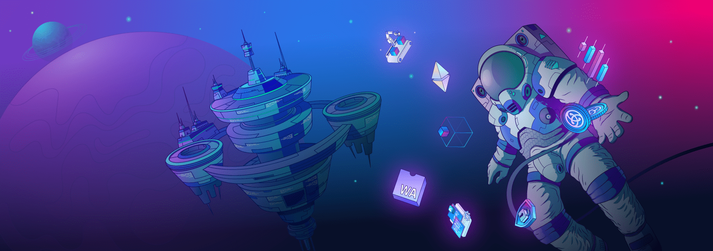

Astar zkEVM is the zero-knowledge scaling solution that is **fully equivalent to an EVM**. All existing smart contracts, developer toolings and wallets work seamlessly. Astar zkEVM harnesses the power of zero-knowledge proofs in order to reduce transaction costs and massively increase throughput, all while inheriting the security of Ethereum.

Building dApps on zkEVM is completely similar to Ethereum. Simply switch to the zkEVM RPC and start building on a network with much higher throughput and lower fees. Astar zkEVM provides a complete EVM-like experience for Developers and Users alike. So you do not need special toolings or new wallets for building or interacting with zkEVM.

:::info Reminder

You don't need special toolings or Wallets to build or interact with Astar zkEVM.

:::

Developers will be able to deploy their existing contracts to the zkEVM, and Users can deposit assets from Ethereum and transact off-chain. These transactions are grouped into batches with zero-knowledge proof attesting to the validity of each transaction.

## Connecting to zkEVM

In order to add the **Astar zkEVM** network to your wallet, you will need to enter the following details :

| Network | RPC URL | ChainID | Block Explorer URL | Currency |
| ------- | ------------------------------- | ---------------- | ---------------- | ----- |
| zkEVM Testnet | `https://zKatana.astar.network` | `9999` | `https://testnet-zkevm.Astarscan.com` | **ETH** |

<!-- You can **add zkEVM Network to your MetaMask wallet** instantly by clicking the **Add to Wallet** button in the Wallet Suite interface. -->

<!-- <video autoplay width="100%" height="100%" controls="true" >
  <source type="video/mp4" src="/img/add-zkevm-network.mp4"></source>
  
Your browser does not support the video element.

</video> -->

<!-- :::info Additional RPC Endpoints

If you want to launch your own RPC Endpoint for the Astar zkEVM network, check out third party services like [QuickNode](https://www.quicknode.com/chains/zkevm). ??? TODO

::: -->

The next step is to [bridge your assets](./bridge-to-zkevm.md) from Ethereum &rarr; Astar zkEVM. You can use the Astar's trustless [zKEVM Bridge](https://portal.astar.network) to bridge your assets.

<!-- You can also view all available public endpoints to connect to **Astar zkEVM** on [Alchemy's Chain Connect](https://www.alchemy.com/chain-connect/chain/Astar-zkevm) and [Chainlist](https://chainlist.org/?search=Astar+zkEVM). TODO ??? -->

## Deploying Smart Contracts

The development experience on zkEVM is seamless and identical to Ethereum Virtual Machine. Developers on zkEVM can use their existing code and toolings to deploy on zkEVM with much higher throughput and lower fees.

Here is a video tutorial on **how to add Astar zkEVM Testnet to MetaMask and deploy smart contracts**:

TODO record video

## zkEVM Support

If you need help with anything related to the Astar zkEVM, you can raise a question on the [Astar Discord server](https://discord.gg/astarnetwork). Instructions for raising a zkEVM support ticket are as follows:

1. Join the **Astar Discord** server [here](https://discord.gg/astarnetwork).
2. Accept the invite.
3. Take the **Member** role under **#roles**.
4. Navigate to the **Builder/#zkevm-support** channel.

You can now contact the zkEVM support staff with your questions and concerns. We will actively monitor for issues and work to resolve them as soon as possible.