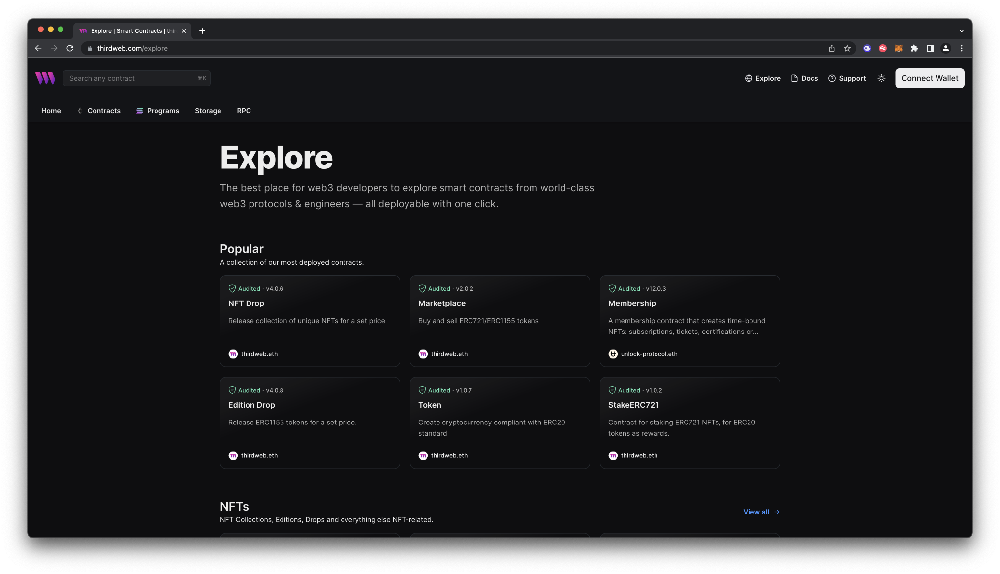

### Introduction

Thirdweb is a complete web3 development framework that provides everything you need to connect your apps and games to decentralized networks. Thirdweb supports smart contract development and deployment on Astar EVM-compatible networks, including Astar zkEVM.

:::caution
API keys are required for access to thirdweb infrastructure services.

In an effort to serve our growing developer community by providing more resilient, reliable, and robust infrastructure, we have instituted a new policy requiring users of our SDK’s, Storage, CLI and Smart Accounts to include an API key for use of the following thirdweb infrastructure services:

-   RPC Edge - RPC infrastructure for connecting to any EVM chain
-   Storage - Service for both uploading and downloading of data to decentralized storage
-   Smart Wallet Bundler/Paymaster (beta) - Our Bundler and Paymaster service for use with smart wallets (ERC-4337/6551)

For more details, FAQ and instructions on how you can get your API key and upgrade your app to work in advance of the August 1st deadline, please visit the [migration blog](https://blog.thirdweb.com/changelog/api-keys-to-access-thirdweb-infra/).
:::

### Prerequisites

1. Latest version of [Node.js](https://nodejs.org/) installed.
2. Astar network wallet set up with basic usage knowledge.
3. Sufficient funds in the wallet for contract deployment gas fees.
4. Basic knowledge of Solidity.

### Getting started

#### Creating contract

To create a new smart contract using thirdweb CLI, follow these steps:

1. In your CLI run the following command:

   ```
   npx thirdweb create contract
   ```

2. Input your preferences for the command line prompts:
   1. Give your project a name
   2. Choose your preferred framework: Hardhat or Foundry
   3. Name your smart contract
   4. Choose the type of base contract: Empty, [ERC20](https://portal.thirdweb.com/solidity/base-contracts/erc20base), [ERC721](https://portal.thirdweb.com/solidity/base-contracts/erc721base), or [ERC1155](https://portal.thirdweb.com/solidity/base-contracts/erc1155base)
   5. Add any desired [extensions](https://portal.thirdweb.com/solidity/extensions)
3. Once created, navigate to your project’s directory and open in your preferred code editor.
4. If you open the `contracts` folder, you will find your smart contract; this is your smart contract written in Solidity.

   The following is code for an ERC721Base contract without specified extensions. It implements all of the logic inside the [`ERC721Base.sol`](https://github.com/thirdweb-dev/contracts/blob/main/contracts/base/ERC721Base.sol) contract; which implements the [`ERC721A`](https://github.com/thirdweb-dev/contracts/blob/main/contracts/eip/ERC721A.sol) standard.

   ```bash
   // SPDX-License-Identifier: MIT
   pragma solidity ^0.8.0;

   import "@thirdweb-dev/contracts/base/ERC721Base.sol";

   contract Contract is ERC721Base {
       constructor(
           string memory _name,
           string memory _symbol,
           address _royaltyRecipient,
           uint128 _royaltyBps
       ) ERC721Base(_name, _symbol, _royaltyRecipient, _royaltyBps) {}
   }
   ```

   This contract inherits the functionality of ERC721Base through the following steps:

   - Importing the ERC721Base contract
   - Inheriting the contract by declaring that our contract is an ERC721Base contract
   - Implementing any required methods, such as the constructor.

5. After modifying your contract with your desired custom logic, you may deploy it to Astar using [Deploy](https://portal.thirdweb.com/deploy).

---

Alternatively, you can deploy a prebuilt contract for NFTs, tokens, or marketplace directly from the thirdweb Explore page:

1. Go to the thirdweb Explore page: https://thirdweb.com/explore

   

2. Choose the type of contract you want to deploy from the available options: NFTs, tokens, marketplace, and more.
3. Follow the on-screen prompts to configure and deploy your contract.

> For more information on different contracts available on Explore, check out [thirdweb’s documentation.](https://portal.thirdweb.com/pre-built-contracts)

#### Deploying contract

Deploy allows you to deploy a smart contract to any EVM compatible network without configuring RPC URLs, exposing your private keys, writing scripts, and other additional setup such as verifying your contract.

1. To deploy your smart contract using deploy, navigate to the root directory of your project and execute the following command:

   ```bash
   npx thirdweb deploy
   ```

   Executing this command will trigger the following actions:

   - Compiling all the contracts in the current directory.
   - Providing the option to select which contract(s) you wish to deploy.
   - Uploading your contract source code (ABI) to IPFS.

2. When it is completed, it will open a dashboard interface to finish filling out the parameters.
   - `_name`: contract name
   - `_symbol`: symbol or "ticker"
   - `_royaltyRecipient`: wallet address to receive royalties from secondary sales
   - `_royaltyBps`: basis points (bps) that will be given to the royalty recipient for each secondary sale, e.g. 500 = 5%
3. Select Astar as the network
4. Manage additional settings on your contract’s dashboard as needed such as uploading NFTs, configuring permissions, and more.

For additional information on Deploy, please reference [thirdweb’s documentation](https://portal.thirdweb.com/deploy).

### Learn more

If you have any further questions or encounter any issues during the process, please [reach out to thirdweb support](https://support.thirdweb.com).
