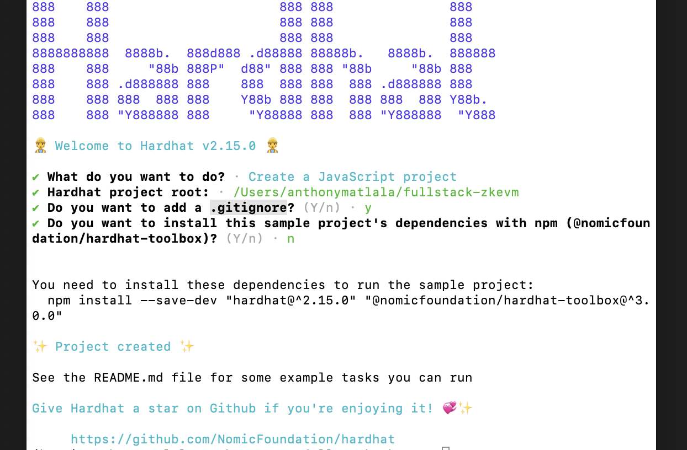

Hardhat is one of the popular smart contract development frameworks. It is the Astar zkEVM's preferred framework, and therefore used in the zkEVM as a default for deploying and automatically verifying smart contracts.

This document is a guide on how to deploy a smart contract on the Astar zkEVM network using Hardhat. Feel free to check out the tutorial video available [here](https://www.youtube.com/watch?v=GNBHDCGFxtw)

## Initial Setup

:::info

Before starting with this deployment, please ensure that your wallet is connected to the Astar zkEVM Testnet. See the demo [here](../develop.md#deploying-smart-contracts) for details on how to connect your wallet.

::: 

- Add the Astar zkEVM Testnet to your Metamask wallet and get some Testnet ETH from the [Astar Faucet](https://faucet.astar.network).

- Clone the repo using below command:

    ```bash
    git clone https://github.com/oceans404/fullstack-zkevm
    ```

- Install dependencies and start React app (you can copy all three lines in one go)

    ```bash
    cd fullstack-zkevm
    npm i
    npm start
    ```

    Correct installation opens up the Counter App at `localhost:3000`. You can test it by clicking on the `+1` button several times.  

- Back in the CLI, install dependencies:

    ```bash
    npm install ethers hardhat @nomiclabs/hardhat-waffle ethereum-waffle chai @nomiclabs/hardhat-ethers dotenv
    ```

- Populate the `.env.sample` file with your `ACCOUNT_PRIVATE_KEY`

<details>
<summary>How to get your Private Key in Metamask</summary>

- Click the vertical 3 dots in the upper-right corner of Metamask window

- Select **Account details** and then click **Export private key**

- Enter your Metamask password to reveal the private key

- Copy the private key and paste it into the `.env.sample` file.

</details>

- Copy the contents of the `.env.sample` file to the `.env` file,

    ```bash
    cp .env.sample .env
    ```

## Hardhat Smart Contract

Next is the initialization of a project using Hardhat. Hardhat cannot initialize a sample project if there is an existing README file. To avoid clashes, rename any existing `README.md` temporarily before initializing Hardhat.

```bash
mv README.md README-tutorial.md
```

- Initialize a project with Hardhat: ```npx hardhat```

- Next, (... *To avoid failure ... Please go slow with this CLi dialog*...),

    The aim here is to achieve the following outcome:

    

    So then, 

    - **Press** `<ENTER>` to set the project root 
    - **Press** `<ENTER>` again to accept addition of `.gitignore`
    - **Type** `n` to reject installing `sample project's dependencies` 

    The idea here is to postpone installing dependencies to later steps due to a possible version-related bug.

- Open the `hardhat.config.js` file and paste the below code:

    ```js
    require("dotenv").config();
    require("@nomicfoundation/hardhat-toolbox");

    /** @type import('hardhat/config').HardhatUserConfig */
    module.exports = {
    solidity: "0.8.9",
    paths: {
        artifacts: "./src",
    },
    networks: {
        zkEVM: {
        url: `https://rpc.public.zkevm-test.net`,
        accounts: [process.env.ACCOUNT_PRIVATE_KEY],
        },
    },
    };
    ```

    Note that a different path to artifacts is added so that the React app will be able to read the contract ABI within the `src` folder.

## Add Scripts

- Create a new file, in the contracts folder, named `Counter.sol`: ```touch contracts/Counter.sol```

- Copy the below code and paste it in the Counter contract code:

    ```solidity
    //SPDX-License-Identifier: MIT
    pragma solidity ^0.8.9;

    contract Counter {
    uint256 currentCount = 0;

        function increment() public {
            currentCount = currentCount + 1;
        }

        function retrieve() public view returns (uint256){
            return currentCount;
        }
    }
    ```

- Create a new file in the scripts folder `deploy-counter.js`: ```touch scripts/deploy-counter.js```

- Add the code below to the `deploy-counter.js` file:

    ```js
    const hre = require("hardhat");

    async function main() {
        const deployedContract = await hre.ethers.deployContract("Counter");
        await deployedContract.waitForDeployment();
        console.log(
            `Counter contract deployed to https://explorer.public.zkevm-test.net/address/${deployedContract.target}`
        );
    }

    main().catch((error) => {
        console.error(error);
        process.exitCode = 1;
    });
    ```

- Before compiling the contract, you need to install the toolbox. You may need to change directory to install outside the project. Use this command:

    ```bash
    npm install --save-dev @nomicfoundation/hardhat-toolbox
    ```

- Compile your contract code (i.e., go back to the project root in the CLI),

    ```bash
    npx hardhat compile
    ```

- Now run the scripts:

    ```bash
    npx hardhat run scripts/deploy-counter.js --network zkEVM
    ```

    ​Here's an output example:

    `Counter contract deployed to https://explorer.public.zkevm-test.net/address/0x5FbDB2315678afecb367f032d93F642f64180aa3`

## Update Frontend

The next step is to turn `Counter.sol` into a dApp by importing the `ethers` and the `Counter` file, as well as logging the contract's ABI.

- Include the below code in the `App.js` file:

    ```js
    import { ethers } from "ethers";
    import Counter from "./contracts/Counter.sol/Counter.json";
    const counterAddress = "your-contract-address"
    console.log(counterAddress, "Counter ABI: ", Counter.abi);
    ```

- Update the `counterAddress` to your deployed address.

    It is the hexadecimal number found at the tail-end of the output of the last `npx hardhat run ...` command and looks like this `0x5FbDB2315678afecb367f032d93F642f64180aa3`.

    It must be pasted in the `App.js` to replace `your-contract-address`. Be sure to use the deployed address from your own implementation!

- Update frontend counter to read from blockchain. Include the below code in the `App.js` file:

    ```js
    useEffect(() => {
        // declare the data fetching function
        const fetchCount = async () => {
        const data = await readCounterValue();
        return data;
        };

        fetchCount().catch(console.error);
    }, []);

    async function readCounterValue() {
        if (typeof window.ethereum !== "undefined") {
            const provider = new ethers.providers.Web3Provider(window.ethereum);

            console.log("provider", provider);

            const contract = new ethers.Contract(
                counterAddress,
                Counter.abi,
                provider
            );

            console.log("contract", contract);

            try {
                const data = await contract.retrieve();
                console.log(data);
                console.log("data: ", parseInt(data.toString()));
                setCount(parseInt(data.toString()));
            } catch (err) {
                console.log("Error: ", err);
                alert(
                    "Switch your MetaMask network to Astar zkEVM Testnet and refresh this page!"
                );
            }
        }
    }
    ```

- Also, to import `useEffect`, insert it like this

    ```js
    import { useState, useEffect } from "react";
    ```

- To be able to track a loader, add this to your state:

    ```js
    const [isLoading, setIsLoading] = useState(false);
    ```

    This is within the `App()` function.

- Let frontend counter write to the blockchain by adding the below `requestAccount` and `updateCounter` functions:

    ```js
    async function requestAccount() {
    await window.ethereum.request({ method: "eth_requestAccounts" });
    }

    async function updateCounter() {
    if (typeof window.ethereum !== "undefined") {
        await requestAccount();
        const provider = new ethers.providers.Web3Provider(window.ethereum);
        console.log({ provider });
        const signer = provider.getSigner();
        const contract = new ethers.Contract(counterAddress, Counter.abi, signer);
        const transaction = await contract.increment();
        setIsLoading(true);
        await transaction.wait();
        setIsLoading(false);
        readCounterValue();
    }
    }
    ```

    Place these two functions above the `readCounterValue()` function in the `App.js` file.

- Replace the `incrementCounter` function with this one:

    ```js
    const incrementCounter = async () => {
    await updateCounter();
    };
    ```

- Update the increment button code to:

    ```js
    <Button
    onClick={incrementCounter}
    variant="outlined"
    disabled={isLoading}
    >
    {isLoading ? "loading..." : "+1"}
    </Button>
    ```

Now, run the Counter dApp by simply using `npm start` in CLI at the project root. **Congratulations** for reaching this far. You have successfully deployed a dApp on the Astar zkEVM Testnet.
