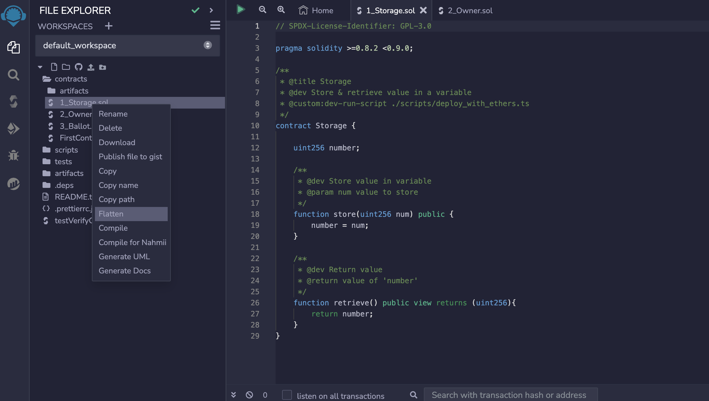

import Tabs from '@theme/Tabs';
import TabItem from '@theme/TabItem';
import jsoninput from '/docs/build/zkEVM/smart-contracts/figures/json.png';
import inputobject from '/docs/build/zkEVM/smart-contracts/figures/input-object.png';

Once a smart contract is deployed to zKatana testnet, it can be verified in various ways depending on the framework of deployment as well as the complexity of the contract. The aim here is to use examples to illustrate how you can manually verify a deployed smart contract. 

Ensure that your wallet is connected while following this guide. We will use Metamask wallet throughout this tutorial.

## Manual Verification

After successfully compiling a smart contract, follow the next steps to verify your smart contract.

1. Copy the **Address** to which the smart contract is deployed. 

2. Navigate to the [zKatana Explorer](https://zkatana.blockscout.com/) and paste the contract address into the Search box. This opens a window with a box labelled **Contract Details**.

3. Scroll down to the box with tabs labelled - **Transactions**, **Token transfers** **Internal txns**, **Coin Balance History**, and **Contract**.

4. Select the **Contract** tab and click the **Verify and Publish** button.

6. There are 3 options to provide the Contract's code. We will be diving into the following two options:
   1. Solidity, Flattened Source Code
   2. Solidity, Standard Input JSON

### Solidity, Flattened Source Code

1. Click **Next** after selecting the **via Flattened Source Code** option. 
2. In order to update the **Compiler** based on your contract's compiler version, 

    - Click the &#8595; for a list of compiler versions. 

    - Select the corresponding version. For example, select `v0.8.9+commit.e5eed63a` if your code has `pragma solidity ^0.8.9;`.
3. Select the Optimization option based on your contract's optimization settings.
4. Various frameworks have specific ways to flatten the source code. Our examples are **Hardhat**, **Remix** and **Foundry**. If you are using one file contract and it has no imports, you do not need to flatten the file.

<Tabs>
<TabItem value="hardhat" label="Hardhat" default>
In order to flatten the contract code with Hardhat, one needs to only run the following command:

```bash
npx hardhat flatten
```
The result will be printed to stdout. You can create a file with the flattened sources using the `>` redirection operator:
    
```bash
npx hardhat flatten > flattened.sol
```
Copy the contents of the new `flattened.sol` file and paste into the `Contract  code` field in the explorer.
</TabItem>

<TabItem value="remix" label="Remix">
In order to flatten the contract code with Remix, one needs to only right-click on the contract name and select **Flatten** option from the drop-down menu that appears. See the below figure for reference.



After selecting **Flatten**, a new `.sol` file with the suffix `_flatten.sol` is automatically created. Copy the contents of the new `<Original-Name>_flatten.sol` file and paste into the `Contract  code` field in the explorer.
</TabItem>

<TabItem value="foundry" label="Foundry">
In order to flatten the code using Foundry, the following command can be used: 

```bash
forge flatten src/<Contract-Name> -o <Any-Name-For-Flattened-Code>.sol
```

With this command, the flattened code gets saved in the `<Any-Name-For-Flattened-Code>.sol` file. Copy the contents of the new `<Any-Name-For-Flattened-Code>.sol` file and paste into the `Contract  code` field in the explorer.

Select the Compiler based on your contract's compiler version. For example, select `v0.8.9+commit.e5eed63a` if your code has `pragma solidity ^0.8.9;`.
Select the Optimization option based on your contract's optimization settings.
</TabItem>
</Tabs>

### Solidity, Standard JSON Input

Click **Next** after selecting the **via Standard JSON Input** option.

1. In order to update the **Compiler** based on your contract's compiler version, 

    - Click the &#8595; for a list of compiler versions. 

    - Select the corresponding version. For example, select `v0.8.9+commit.e5eed63a` if your code has `pragma solidity ^0.8.9;`.

2. Paste the **Standard Input JSON** file into the *Drop the standard input JSON file or Click here* field. You can find it in your local project folder.

<details>
<summary>Finding the Standard Input JSON file</summary>

1. For Hardhat project go to the `src/build-info` folder and open the `.json` file.

<div style={{textAlign: 'center'}}>
  
</div>

2. Find the `input` JSON object. Format the json file to make it more readable.

3. Copy the only `input` JSON object value into a new file

<div style={{textAlign: 'center'}}>
  
</div>

4. Drag and drop this new file into **Drop file or Click here** field.

</details>

3. Click on **Verify & Publish** button to verify your deployed smart contract.