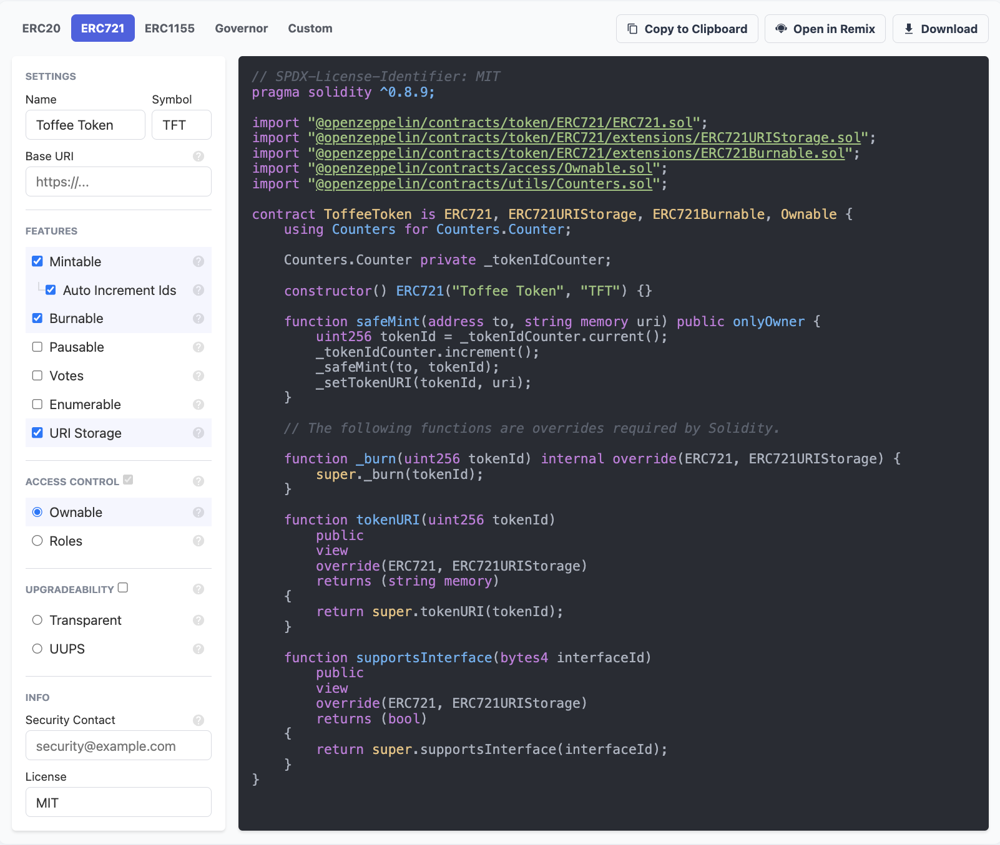

This document explains how to automatically write any smart contract using the OpenZeppelin Wizard. The resulting smart contract code can either be integrated with Remix by Clicking the **Open in Remix** button, or copied to clipboard and pasted in the user's intended IDE.

## Getting Started

Navigate to the [OpenZeppelin Wizard](https://wizard.openzeppelin.com) in your browser. First thing to notice is the **Solidity Wizard** and **Cairo Wizard** buttons.

One can choose any of the following tabs to begin creating an out-of-box smart contract code in either Solidity (for EVM chains) or Cairolang (useful for Starknet). These are:

* ERC20: for writing an ERC-20 token smart contract
* ERC721: for writing an NFT token smart contract
* ERC1155: for writing an ERC-1155 token smart contract
* Governor: for creating a DAO
* Custom: for writing a customized smart contract

## Writing An NFT Contract

For illustration purpose, we will be creating a NFT smart contract. Suppose you wanted to create a `Mintable`, `Burnable` `ERC721` token and specify an appropriate license for it.

1. Select the **ERC721** tab.

2. Give your NFT a name and a symbol by filling the `Name` and `Symbol` fields.

3. Use the check-boxes on the left to select features of your token

  - Put a tick on the `Mintable` check-box
  - Put a tick on the `Auto Increment Ids` check-box, this ensures uniqueness of each minted NFT
  - Put a tick on the `Burnable` check-box
  - Either leave the **default MIT license** or type the license of your choice

  Notice that new lines of code are automatically written each time a feature is selected.

## Voila! Contract Ready

With the resulting lines of code, you now have the NFT token contract written in Solidity. As mentioned above, this source code can now be ported to an IDE of your choice or opened directly in Remix.

The below figure depicts the auto-written NFT smart contract code.

