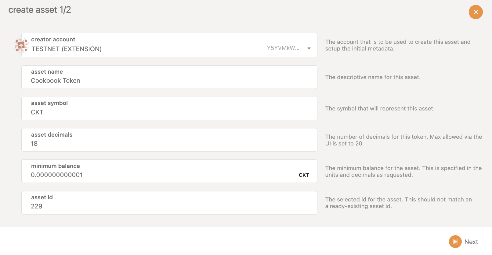

# How to create and interact with a mintable XC20 asset via Solidity smart contract

## TL;DR

XC-20 is an asset standard that enables users and developers to interact with them through a familiar [ERC-20 interface](https://github.com/PureStake/moonbeam/blob/master/precompiles/assets-erc20/ERC20.sol) via a precompile contract (Ethereum API) while having XCM cross-chain compatibility as native Substrate assets. Since ERC-20 assets can not be transferred via XCM in the Polkadot/Kusama ecosystem, you will need XC-20 if you want to build cross-chain compatible assets usable in EVM.

There are two types of XC20 assets, mintable XC20, and external XC20 assets. Mintable XC20 assets can be issued on Astar Network based on the owner’s implementation logic. And external XC20 assets are XC20 assets originally from other parachain/relaychain and transferred to Astar Network via XCM and issued by sovereign account. 

In this cookbook, we will guide you on how to create mintable XC-20 assets, how to send them to EVM, and how to interact with XC20 assets via Solidity smart contract.

---

## What is XC-20

XC-20 is an asset standard introduced by PureStake Technologies, which combines the power of Substrate assets (native cross-chain interoperability) but allows users and developers to interact with them through a familiar [ERC-20 interface](https://github.com/PureStake/moonbeam/blob/master/precompiles/assets-erc20/ERC20.sol) via a precompile contract (Ethereum API). With XC-20, developers will be able to create assets that are both EVM-usable and cross-chain compatible via XCM.

## What are mintable XC-20 and external XC-20

There are two types of XC20 assets, mintable XC20, and external XC20 assert. Mintable XC20 assets can be issued on Astar Network based on the owner’s implementation logic. And external XC20 assets are XC20 assets originally from other parachain/relaychain and transferred to Astar Network via XCM and issued by sovereign account. 

## What is XCM

**Cross-Consensus Message Format (XCM)** aims to be a language to communicate ideas between consensus systems. One of Polkadot's promises is interoperability, and XCM is the vehicle through which it will deliver this promise. Simply, it is a standard that allows protocol developers to define the data and origins that their chains can send and receive from, including cross-chain asset transfer between parachains.

---

## Register an XC-20 asset

Currently, the best way to create XC-20 asset is via Polkadot.js app. In this cookbook, we will create an XC-20 asset using Shibuya as a demo.

- Please visit Polkadot.js via [https://polkadot.js.org/apps/?rpc=wss%3A%2F%2Frpc.shibuya.astar.network#/explorer](https://polkadot.js.org/apps/?rpc=wss%3A%2F%2Frpc.shibuya.astar.network#/explorer)
- Go to `Network` → `Asset` → `Create`
- Please set the following parameters for your asset
    - `Creater Account`: The account that is to be used to create this asset and set up the initial metadata.
    - `Asset Name`: The descriptive name for this asset, e.g. Cookbook Token.
    - `Asset Symbol`: The descriptive name for this asset, e.g. CKT.
    - `Asset Decimals`: The number of decimals for this token. Max allowed via the UI is set to 20.
    - `Minimum Balance`: The minimum balance for the asset. This is specified in the units and decimals as requested.
        - Note: `Minimum Balance` is the same as the `Existential Deposit (ED)` of your asset. The ED exists so that accounts with very small balances, or completely empty, do not "bloat" the state of the blockchain in order to maintain high performance.
        - Note:  We suggest setting the `Minimum Balance` to `1 Pico`, which will only require 0.000000000001 unit of the asset.
    - `Asset ID`: The selected id for the asset. This should not match an already-existing asset id.



- Set managing addresses for the XC-20 asset
    - `Creator`: the account responsible for creating the asset.
    - `Issuer`: the designated account capable of issuing or minting tokens.
    - `Admin`: the designated account capable of burning tokens and unfreezing accounts and assets.
    - `Freezer`: the designated account capable of freezing accounts and assets.


---

## Mint the registered XC-20 asset

To mint the initial supply of the registered XC-20 asset, we need to open Polkadot.js with the issuer address.

- Go to `Network` → `Asset` → Find the asset that you just created → `Create`
- Set the minting amount and recipient address
    - `mint to address`: the recipient account for this minting operation.
    - `amount to issue`: the amount of assets to issue to the account.


---

## Transfer the owner, issuer, freezer, and admin access to a multi-sig account (suggested)

The owner of the XC20 asset has many high-level accesses. Thus, to ensure the security of mintable XC20 assets, we suggest transferring the owner, issuer, freezer, and admin to a multi-sig account after the creation and initial mint.

- Go to `Developer` → `Extrinsics`
- Choose `assets` extrinsics and `transferOwnership` method
- Enter the `asset ID` of the new asset (you may find it under `Network` → `Asset`)
- Choose `Id` for `target` and enter the address


- Go to `Developer` → `Extrinsics`
- Choose `assets` extrinsics and `setTeam` method
- Enter the `asset ID` of the new asset (you may find it under `Network` → `Asset`)
- Choose `Id` for `target` and enter the address


---

## Send the asset to EVM

Since Astar Network is building a multi-VM smart contract hub, we support both EVM and WASM with two different account systems, H160 and SS58 respectively.

In order to send the asset to an H160 address (address B) from the Substrate-native SS58 address (address A), we need to convert the H160 address to its mapped Substrate-native SS58 address (address B’) and send the asset directly from address A to address B’ via Polkadot.js.

Here are the full steps:

- Convert the destination H160 address to its mapped Substrate-native SS58 address using [https://hoonsubin.github.io/evm-substrate-address-converter/](https://hoonsubin.github.io/evm-substrate-address-converter/)
    
    
    
- Please visit Polkadot.js via [https://polkadot.js.org/apps](https://polkadot.js.org/apps)
- Go to `Developer` → `Extrinsics`
- Choose `assets` extrinsics and `transfer` method
- Enter the `asset ID` of the new asset (you may find it under `Network` → `Asset`)
- Choose `Id` for `target`
- Enter the new mapped Substrate-native SS58 address for `AccountId`
- Enter the amount that you hope to transfer for `Balance`
    - Please notice if the decimal is 18, `1000000000000000000` refers to 1 unit of the asset.
    - Call data for reference: `0x2405950300d6e68e3d545d18f2298dda31e70b63283a3ecc664f7bead5f174f6cc2f5df65d1b000000a1edccce1bc2d3`


---

## Confirm receiving the asset on EVM

In order to confirm receiving the asset on EVM, we need to add the specific asset to the Metamask wallet, which requires the asset address on EVM.

To generate the asset address on EVM, we need to use the asset ID with the following steps:

- Convert the `asset ID` from hexadecimal to decimal
- Add the prefix of `0xffffffff`
    - for example, our Cookbook Token, CKT, has `asset ID` of `229`. Following the step above, we will have the converted address of `0xffffffff000000000000000000000000000000E5`.


---

## Interact with XC20 assets via Solidity smart contract

In the following section, we will demonstrate how to interact with the Cookbook Token that we created via Solidity smart contract.

<aside>
💡 In order to make the mintable XC20 asset interactable via Solidity smart contract, `insufficient` needs to be set to `true`, and the EVM revert code needs to be registered. It may require technical support from the Astar Foundation team. Please submit the support request in Astar Discord ([https://discord.com/invite/Z3nC9U4](https://discord.com/invite/Z3nC9U4)) or DM @neutrino4 on Telegram.

</aside>

The Solidity Interface of Mintable XC20 on Astar includes IERC20 and IERC20Plus interfaces, which are declared in [https://github.com/AstarNetwork/astar-frame/blob/polkadot-v0.9.33/precompiles/assets-erc20/ERC20.sol](https://github.com/AstarNetwork/astar-frame/blob/polkadot-v0.9.33/precompiles/assets-erc20/ERC20.sol), and are as follows:

```python
interface IERC20 {
    function name() external view returns (string memory);
    function symbol() external view returns (string memory);
    function decimals() external view returns (uint8);
    function totalSupply() external view returns (uint256);
    function balanceOf(address who) external view returns (uint256);
    function allowance(address owner, address spender)
        external view returns (uint256);
    function transfer(address to, uint256 value) external returns (bool);
    function approve(address spender, uint256 value)
        external returns (bool);
    function transferFrom(address from, address to, uint256 value)
        external returns (bool);
    event Transfer(
        address indexed from,
        address indexed to,
        uint256 value
    );
    event Approval(
        address indexed owner,
        address indexed spender,
        uint256 value
    );
}

interface IERC20Plus is IERC20 {
    /**
     * @dev Returns minimum balance an account must have to exist
     */
    function minimumBalance() external view returns (uint256);

    /**
     * @dev Mints the specified amount of asset for the beneficiary.
     * This operation will increase the total supply.
     * Only usable by asset admin.
     */
    function mint(address beneficiary, uint256 amount) external returns (bool);

    /**
     * @dev Burns by up to the specified amount of asset from the target.
     * This operation will increase decrease the total supply.
     * Only usable by asset admin.
     */
    function burn(address who, uint256 amount) external returns (bool);
}
```

In this cookbook, we are building a simple faucet to demonstrate how to interact with the XC20 assets via Solidity smart contract. You can find the code below:

```python
pragma solidity >=0.8.3;

import './IERC20.sol';

contract CookbookFaucet {

    uint256 public amountAllowed = 1000000000000000000;
    address public tokenContract = 0xFFFFfFFf000000000000000000000000000000E5;
    mapping(address => bool) public requestedAddress;

    event SendToken(address indexed Receiver, uint256 indexed Amount);

    function requestTokens() external {
        require(requestedAddress[msg.sender] == false, "You have already claimed!");
        IERC20 cktToken = IERC20(tokenContract);
        require(cktToken.balanceOf(address(this)) >= amountAllowed, "Faucet is empty!");

        cktToken.transfer(msg.sender, amountAllowed);
        requestedAddress[msg.sender] = true;
        
        emit SendToken(msg.sender, amountAllowed);
    }
}
```

For the next step, we use Remix to deploy our code to the Shibuya testnet. You can find the tutorial about using Remix for Astar deployment at [https://docs.astar.network/docs/builder-guides/Use Astar Features/How to use Remix IDE to deploy an on-chain storage](https://docs.astar.network/docs/builder-guides/Use%20Astar%20Features/How%20to%20use%20Remix%20IDE%20to%20deploy%20an%20on-chain%20storage)


After sending the initial funding to the faucet contract via MetaMask, you can successfully request tokens from the faucet now!


---

## FAQ

Please feel free to our Discord at [https://discord.com/invite/Z3nC9U4](https://discord.com/invite/Z3nC9U4) for technical support.

## Reference

[https://github.com/AstarNetwork/astar-frame/blob/polkadot-v0.9.33/precompiles/assets-erc20/ERC20.sol](https://github.com/AstarNetwork/astar-frame/blob/polkadot-v0.9.33/precompiles/assets-erc20/ERC20.sol)