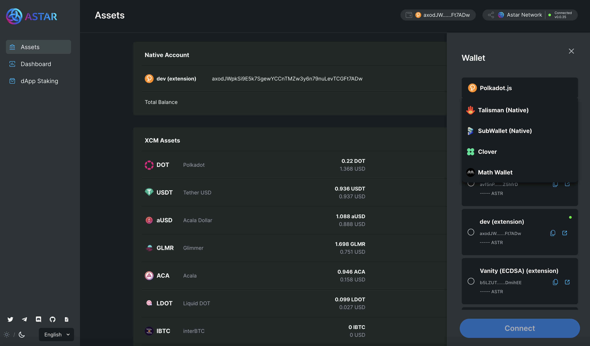

# Add wallets into Astar Portal

## Overview

Users can connect to Astar portal using both EVM and Substrate based wallets. Here’s what you need to know about the integration of the wallets into [Astar portal](https://portal.astar.network/#/astar/assets).

## How to integrate

Add the metadata for the wallets into [this](https://github.com/AstarNetwork/astar-apps/blob/main/src/config/wallets.ts) file.

## Requirement for creating a PR

1. Developers should have tested sending transactions(see below) from our portal.

   1. Substrate wallets (Such as [Polkadot.js](https://polkadot.js.org/))
      1. Native token transfer
      2. XCM assets transfer
      3. XCM transfer
         1. Deposit
         2. Withdrawal
      4. dApp staking transfer
         1. Stake
         2. Withdrawal
         3. Nomination Transfer)
   2. EVM wallets (Such as [MetaMask](https://metamask.io/))
      1. Native token transfer
      2. ERC20 token transfer
      3. XC20(XCM assets) token transfer
      4. XCM transfer
         1. Withdrawal

2. Submit the [Subscan](https://astar.subscan.io/) or [Blockscout](https://blockscout.com/astar/) links (both Astar and Shiden networks) for transaction details of the items listed above.
