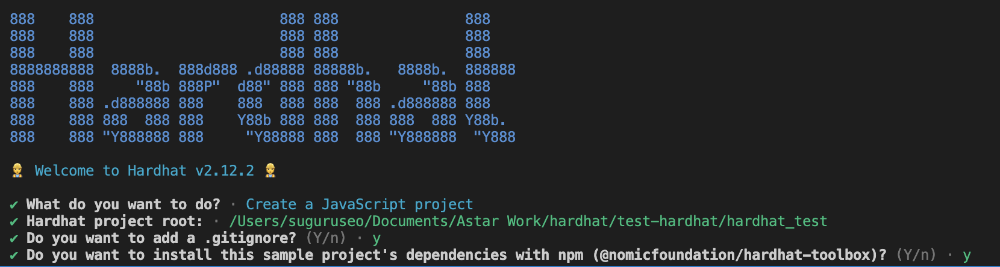
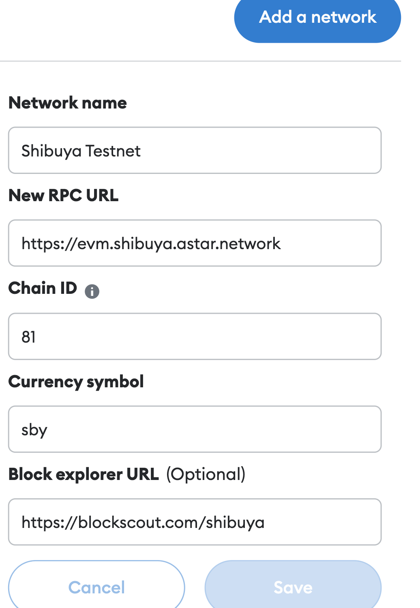
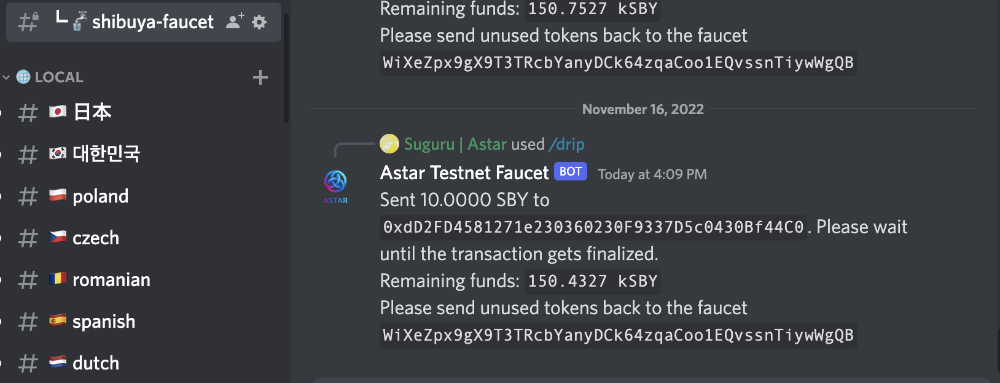
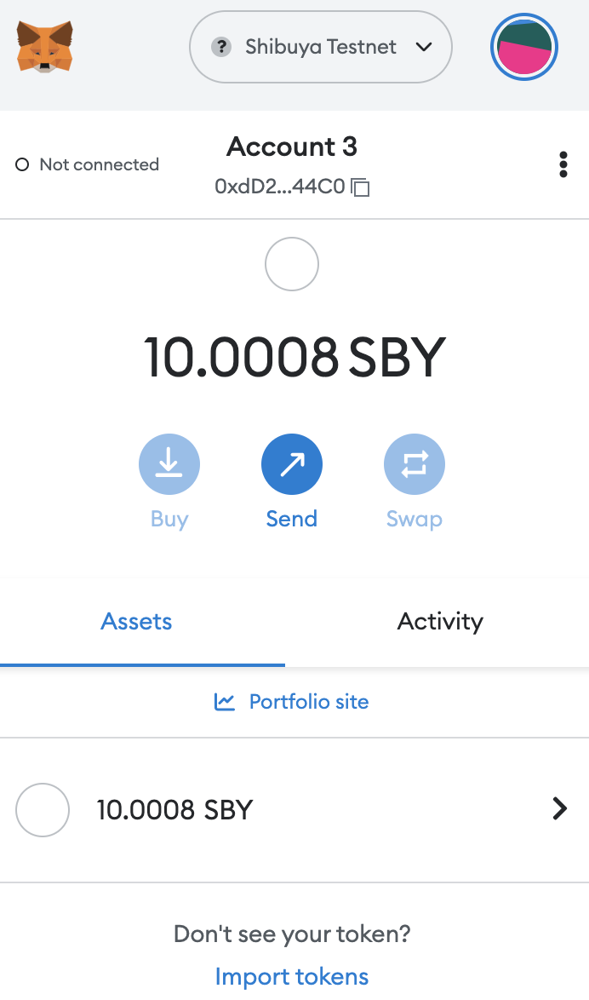
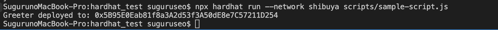
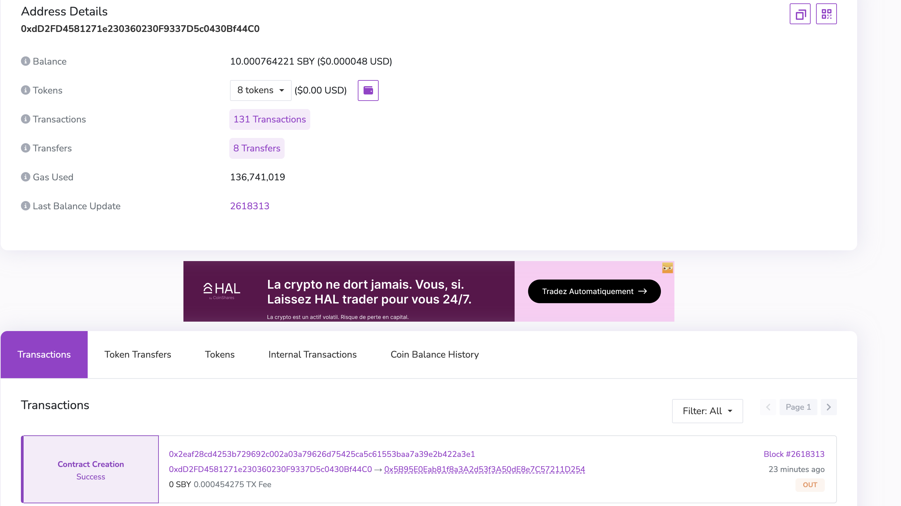

# How to use Hardhat to deploy on Shibuya

## TL;DR

Hardhat is an Ethereum (EVM) development environment that helps developers to manage and automate the recurring tasks inherent to the process of building smart contracts and dApps, which means compiling and testing at the very core. 

Since Astar Network is a multi-VM smart contract hub, we support both WASM and EVM smart contracts, which means you can use Ethereum dev tools including Hardhat to directly interact with Astar EVM’s API and deploy Solidity smart contracts on Astar.

In this cookbook, we will guide you on how to set up the environment for Astar EVM development, how to create and configure a Hardhat project for Astar EVM, and how to deploy a simple Solidity smart contract on Astar EVM via Hardhat.

---

## What is Astar EVM?

As a multi-VM smart contract hub, Astar Network supports both WASM and EVM smart contracts, which means both Solidity smart contracts and WASM-based smart contracts can be deployed on Astar Network. 

And for Solidity developers, you can directly use Ethereum dev tools including Hardhat, Remix, MetaMask to directly interact with Astar EVM’s API and deploy Solidity smart contracts on Astar EVM.

## What is Hardhat?

Hardhat is a development environment that helps developers in testing, compiling, deploying, and debugging smart contracts and dApps on Ethereum Virtual Machine (EVM). Hardhat smart contract development environment offers suitable tools to developers for managing the development workflow, and identifying causes for the failure of applications.

---
## Set up Node.js environment for Hardhat
Hardhat is built on top of Node.js, the JavaScript runtime built on Chrome's V8 JavaScript engine. As the first step for to set up Hardhat, we need to set up Node.js environment.

---
## Create a Hardhat project

First, let’s create a directory for this tutorial with the following command.

```bash
mkdir hardhat_test
cd hardhat_test
```


Then, let’s initialize npm environment.

```bash
npm init -y
```

After the command above, you will see the following return message.

```
Wrote to /Users/suguruseo/Documents/Astar Work/hardhat/test-hardhat/hardhat_test/package.json:{
  "name": "hardhat_test",
  "version": "1.0.0",
  "description": "",
  "main": "index.js",
  "scripts": {
    "test": "echo \"Error: no test specified\" && exit 1"
  },
  "keywords": [],
  "author": "",
  "license": "ISC"
}
```

At last, we install Hardhat and create a Hardhat project.

```bash
npm install hardhat
```




---
### Set up a private key

In this section, we will set up a private key.

```bash
touch private.json
vim private.json
```

Then, we add a private key for testing deployment here. PLEASE DON NOT USE IT IN PROD DEPLOYMENT.

```
{"privateKey":"0xde9be858da4a475276426320d5e9262ecfc3ba460bfac56360bfa6c4c28b4ee0"}
```

---
### Add Shibuya Network details to Hardhat project configuration file

Now, we need to add network settings in hardhat.config.js file like below.

```jsx
require("@nomicfoundation/hardhat-toolbox");

task("accounts", "Prints the list of accounts", async () => {
  const accounts = await ethers.getSigners();

  for (const account of accounts) {
    console.log(account.address);
  }
});

const { privateKey } = require('./private.json');

/** @type import('hardhat/config').HardhatUserConfig */
module.exports = {
  solidity: "0.8.17",
  networks: {
    localhost: {
        url:"http://localhost:8545",
        chainId:31337,
        accounts: [privateKey],
      },
    shibuya: {
      url:"https://evm.shibuya.astar.network",
      chainId:81,
      accounts: [privateKey],
    }
  }
};
```

---
### Add Shibuya testnet to MetaMask

Now, we can manually add Shibuya test net in MetaMask like below.



---
### Claim Shibuya testnet tokens from the Discord faucet

Now, we need gas fee to deploy smart contract.
For this purpose, we use our Shibuya faucet from our [discord](https://discord.gg/astarnetwork) like below.

We need to type something like below.

```jsx
/drip network: Your Shibuya Address
```



We can confirm we got some Shibuya token now.



---
### Deploy the smart contract on Shibuya

Finally, we deploy our smart contract by running the command below.

```bash
npx hardhat run --network shibuya scripts/sample-script.js
```

Thats’s it! We see smart contract is successfully deployed.



You can also confirm that the contract was deployed successfully by checking [Blackscout](https://blockscout.com/shibuya/).



Happy Hacking!
---
## Reference

Official Document for Hardhat: [https://hardhat.org/hardhat-runner/docs/getting-started#overview](https://hardhat.org/hardhat-runner/docs/getting-started#overview)
Astar Document for Hardhat: [https://docs.astar.network/docs/EVM/developer-tooling/#hardhat](https://docs.astar.network/docs/EVM/developer-tooling/#hardhat)