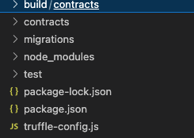

# How to use Truffle to deploy on Shibuya

## TL;DR

This cookbook gives you a basic idea of how to use Truffle and deploy a simple test smart contract on our Shibuya test net.

## What is Truffle?

Truffle is a popular development framework for Ethereum based blockchain. It offers a suite of tools that make it easier to develop and deploy smart contracts on the EVM(Ethereum Virtual Machine) blockchain. Some of the key features of Truffle include:

- A suite of development and testing tools, including a code compiler, a testing framework, and a debugger.
- Support for popular programming languages, including Solidity and JavaScript.
- Integration with popular Ethereum wallets, such as MetaMask and Ledger.
- Automated contract deployment and management tools.

Overall, Truffle is designed to make it easier for developers to build and deploy decentralized applications (dApps) on the EVM blockchain.

## Step 1 Project Setup

Let’s set up project folder first. We create a project directory and navigate into that directory.

```bash
mkdir truffleApp
```

```bash
cd truffleApp
```

If you have’t installed truffle yet, please do so by running the command below.

```bash
npm install -g truffle
```

Then, we initialize truffle to create our project.

```bash
truffle init
```

Now we see something like below to confirm the project is initialized.


Also, please make sure we install HDWalletProvider which we will use later by running the command below.

```bash
npm install @truffle/hdwallet-provider --save
```

## Step 2 Start Coding

Now, we would see a file structure of something like below.



From here, we create a file for smart contract called **HelloShibuya.sol** inside ****the **contracts** directory.

The code would be something like below.

```solidity
pragma solidity ^0.8.15;

contract HelloShibuya {
   string public greet = "Hello Shibuya!";
}
```

Then we would add a migration file called **1_deploy_contract.js** inside the **migrations** directory.

```jsx
var HelloShibuya = artifacts.require("HelloShibuya");

module.exports = function (deployer) {
    deployer.deploy(HelloShibuya);
};
```

## Step 3 Configure Settings

Now we add information for Shibuya test net in **truffle-config.js** like below. 

For the end point, please take a look and use one of Shibuya endpoints provided [here](https://docs.astar.network/docs/quickstart/endpoints/). 

```jsx
require('dotenv').config();
const mnemonic = process.env.MNEMONIC;
const HDWalletProvider = require('@truffle/hdwallet-provider');

module.exports = {

  networks: {
    shibuya: {
      provider: () => new HDWalletProvider(mnemonic, `https://shibuya.public.blastapi.io`),
      network_id: 81,
      confirmations: 10,
      timeoutBlocks: 200,
      skipDryRun: true,
      from: "0x(your Shibuya account address)"
    },
    
```

Please be aware that we need to declare mnemonic which is used by **HDWalletProvider** in the **truffle-config.js** file to verify the account supplying funds during contract deployment.

To set mnemonic variable, you would set it as an environment variable in **.env** file in the root directory like below.

```bash
npm i dotenv
```

```bash
MNEMONIC="(Your secret revoery phase)"
```

We can find our secret recovery phase for our account in the Metamask by going through **Settings**, **Security & Privacy**, and then **Reveal Secret Recovery Phrase**.

## Step 4 Deployment

Finally, we have everything ready and compile the smart contract we made by running the command below

```bash
truffle compile
```

Then, we run the command below to deploy on Shibuya testnet.

```bash
truffle migrate --network shibuya
```

We would see something like below to confirm you smart contract is deployed on Shibuya test net.


We can confirm this also by looking at our transaction history in [Subscan](https://shibuya.subscan.io/).


That’s a wrap!

If you have any questions, please feel free to ask us in our [official discord channel](https://discord.gg/GhTvWxsF6S).

## Reference

Official Document for Truffle: [https://trufflesuite.com/docs/](https://trufflesuite.com/docs/)

Astar Document for Hardhat: [https://docs.astar.network/docs/EVM/developer-tooling/#truffle](https://docs.astar.network/docs/EVM/developer-tooling/#truffle)