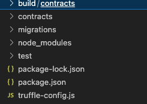
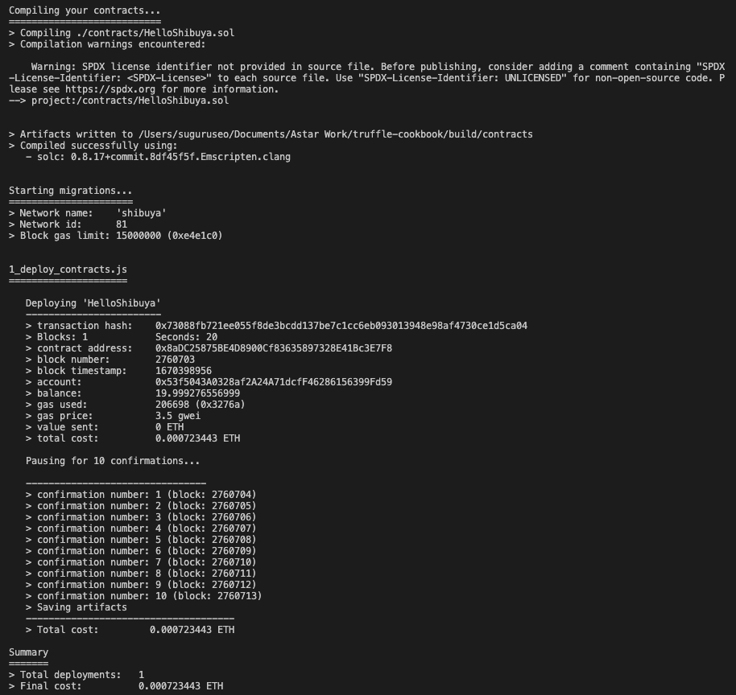
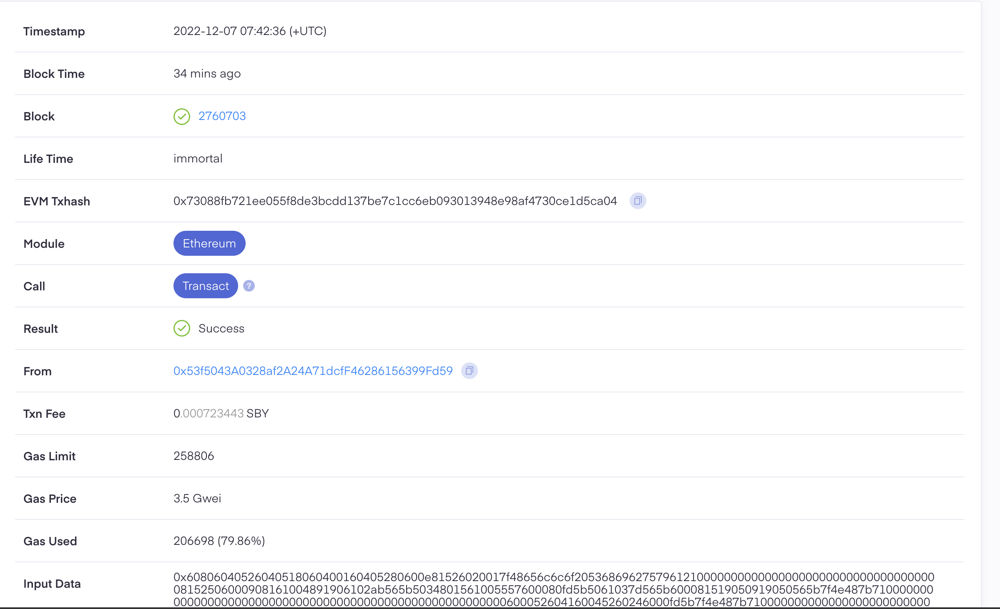

# How to use Truffle to deploy on Shibuya

## TL;DR

This cookbook gives you a basic idea of how to use Truffle and deploy a simple test smart contract on our Shibuya testnet.

## What is Truffle?

Truffle is a popular development framework for Ethereum based blockchain. It offers a suite of tools that make it easier to develop and deploy smart contracts on the EVM(Ethereum Virtual Machine) blockchain. Some of the key features of Truffle include:

- A suite of development and testing tools, including a code compiler, a testing framework, and a debugger.
- Support for popular programming languages, including Solidity and JavaScript.
- Integration with popular Ethereum wallets, such as MetaMask and Ledger.
- Automated contract deployment and management tools.

Overall, Truffle is designed to make it easier for developers to build and deploy decentralized applications (dApps) on the EVM blockchain.

## Builders Guide
### Step 1: Project Setup

Let’s set up a project folder first. We create a project directory and navigate into that directory:

```bash
mkdir truffleApp
```

```bash
cd truffleApp
```

If you haven’t installed Truffle yet, please do so by running the command below:

```bash
npm install -g truffle
```

We initialize Truffle to create our project:

```bash
truffle init
```

Now we see something like below to confirm the project is initialized:
<div style={{textAlign: 'center'}}>


</div>

Make sure you install HDWalletProvider which we will use later:

```bash
npm install @truffle/hdwallet-provider --save
```

---

### Step 2: Start Coding

Now, we would see the following file structure:
<div style={{textAlign: 'center'}}>


</div>

From here, we create a file for smart contract called **HelloShibuya.sol** inside the **contracts** directory:

```jsx
pragma solidity ^0.8.15;

contract HelloShibuya {
   string public greet = "Hello Shibuya!";
}
```

We need to add a migration file called **1_deploy_contract.js** inside the **migrations** directory:

```jsx
var HelloShibuya = artifacts.require("HelloShibuya");

module.exports = function (deployer) {
    deployer.deploy(HelloShibuya);
};
```

---

### Step 3: Configure Settings

Now we add information for the Shibuya testnet in **truffle-config.js**. 
For the endpoint, take a look and use one of Shibuya endpoints provided [here](https://docs.astar.network/docs/quickstart/endpoints/). 

```jsx
require('dotenv').config();
const mnemonic = process.env.MNEMONIC;
const HDWalletProvider = require('@truffle/hdwallet-provider');

module.exports = {

  networks: {
    shibuya: {
      provider: () => new HDWalletProvider(mnemonic, `https://shibuya.public.blastapi.io`),
      network_id: 81,
      confirmations: 10,
      timeoutBlocks: 200,
      skipDryRun: true,
      from: "0x(your Shibuya account address)"
    },
    
```

Be aware that we need to declare mnemonic which is used by **HDWalletProvider** in the **truffle-config.js** file to verify the account supplying funds during contract deployment. To set mnemonic variable, you would set it as an environment variable in **.env** file in the root directory.

```bash
npm i dotenv
```

```bash
MNEMONIC="(Your secret recovery phase)"
```

We can find our secret recovery phase for our account in the Metamask by going through **Settings**, **Security & Privacy**, and then **Reveal Secret Recovery Phrase**.

---

### Step 4: Deployment

Finally, we have everything ready and we can compile the smart contract we made:

```bash
truffle compile
```

```bash
truffle migrate --network shibuya
```

We would see something like below to confirm our smart contract is deployed on Shibuya testnet.
<div style={{textAlign: 'center'}}>


</div>
We can confirm this also by looking at the explorer [Subscan](https://shibuya.subscan.io/).
<div style={{textAlign: 'center'}}>


</div>

If you have any questions, please feel free to ask us in our [official discord channel](https://discord.gg/GhTvWxsF6S).

---

## Reference

- [Official Document for Truffle](https://trufflesuite.com/docs/)
- [Astar Document for Truffle](https://docs.astar.network/docs/EVM/developer-tooling/#truffle)