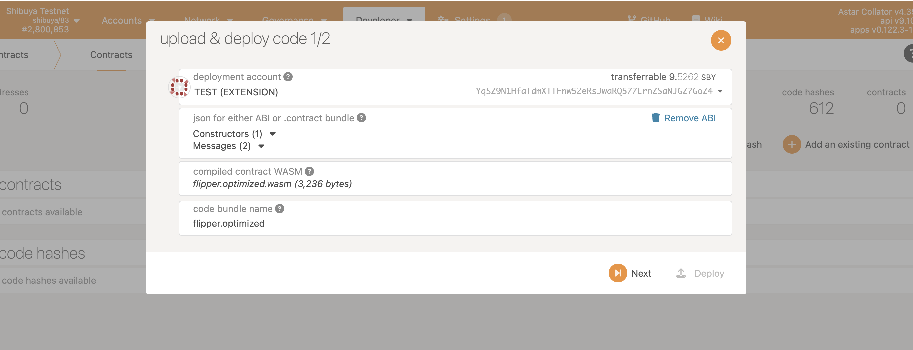

# How to set up and deploy a simple Ask! contract

## TL;DR

This cookbook guides you to set up your local environment and deploy a simple Ask! contract on our test net.

## What is Ask!?

Ask! is a framework for AssemblyScript developers to write Wasm smart contracts for `pallet-contracts`. Its syntax is similar to TypeScript. [This project](https://polkadot.polkassembly.io/post/949) is funded by Polkadot treasury. Please keep in mind that Ask! is still under development and no release is available at the moment.

## Ask! Environment Setup

We run a command below. 

```bash
git clone https://github.com/ask-lang/ask-template.git
cd ask-template
```

The command above sets you a simple Ask! contract in `flipper.ts`.


Then, we run the command below which build the template contract.

```bash
# Install dependencies and Build the template contract
yarn && yarn build flipper.ts
```

The above command will generate WASM code and metadata file of the contract in `metadata.json` and `flipper.opstimized.wasm` resepectively.



Now we will deploy this smart contract on our testnet.

We will access to [polkadot.js](https://polkadot.js.org/apps/) and deploy the smart contract.

We pick Shibuya test-net and pick `metadata.json` for “json for either ABI or .contract bundle” section and pick `flipper.opstimized.wasm` for “compiled contract WASM” section.


We follow the step above. Finally we can confirm that the contract is deployed on Shibuya-test net.


That’s a wrap!

If you have any questions, please feel free to ask us in our [official discord channel](https://discord.gg/GhTvWxsF6S).

## Reference

- [Official document for Ask!](https://github.com/ask-lang/ask)