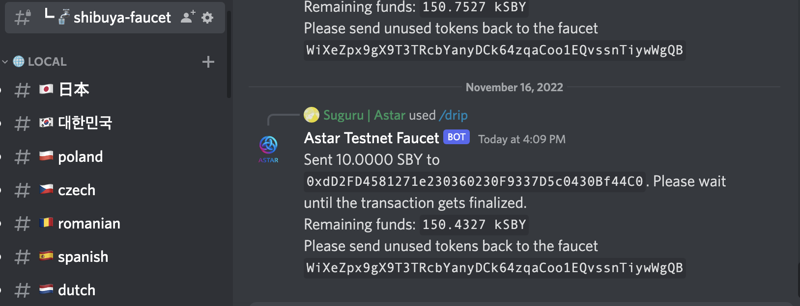
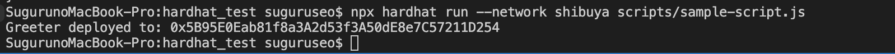

# How to use Hardhat to deploy on Shibuya

## TL;DR

Hardhat is an Ethereum (EVM) development environment that helps developers to manage and automate the recurring tasks inherent to the process of building smart contracts and dApps. At the very core that means *compiling* and *testing*.

Since Astar Network is a multi-VM network, we support both WASM and EVM smart contracts. You can use Ethereum tooling to directly interact with Astar EVM’s API and deploy Solidity smart contracts on Astar.

In this cookbook, we will guide you on:

- How to set up the environment for Astar EVM development.
- How to create and configure a Hardhat project for Astar EVM.
- How to deploy a simple Solidity smart contract on Astar EVM with Hardhat.

---

## What is Astar EVM?

Astar Network supports both Wasm and EVM virtual machines, which means both Solidity and WASM-based smart contracts can be deployed on Astar Network.

Solidity developers can use Ethereum dev tools, including Hardhat, Remix, and MetaMask, to directly interact with Astar EVM’s API and deploy Solidity smart contracts on Astar EVM.

In this guide we will use Shibuya Network, the testnet for Astar and Shiden.

## What is Hardhat?

Hardhat is a development environment that helps developers in testing, compiling, deploying, and debugging smart contracts and dApps on Ethereum Virtual Machine (EVM). Hardhat smart contract development environment offers suitable tools to developers for managing the development workflow and identifying causes for the failure of applications.

---
## Set up Node.js environment for Hardhat
Hardhat is built on top of Node.js, the JavaScript runtime built on Chrome's V8 JavaScript engine. The first step to start using Hardhat is to set up Node.js environment.

---
## Create a Hardhat project

First, let’s create a directory for this tutorial with the following command.

```bash
mkdir hardhat_test
cd hardhat_test
```


Then, let’s initialize npm environment.

```bash
npm init -y
```

After the command above, you will see the following return message.

```
Wrote to /Users/suguruseo/Documents/Astar Work/hardhat/test-hardhat/hardhat_test/package.json:{
  "name": "hardhat_test",
  "version": "1.0.0",
  "description": "",
  "main": "index.js",
  "scripts": {
    "test": "echo \"Error: no test specified\" && exit 1"
  },
  "keywords": [],
  "author": "",
  "license": "ISC"
}
```

Now, we will install Hardhat so that we can create a Hardhat project.

```bash
npm install hardhat
```


---
### Set up a private key

In this section, we will set up a private key with the following code.

```bash
touch private.json
vim private.json
```

Then, we add a private key for testing deployment here. PLEASE **DO NOT** USE IT IN PROD DEPLOYMENT.

```
{"privateKey":"0xde9be858da4a475276426320d5e9262ecfc3ba460bfac56360bfa6c4c28b4ee0"}
```

---
### Add Shibuya Network details to Hardhat project configuration file

Now, we need to add network settings in hardhat.config.js file. See below.

```jsx
require("@nomicfoundation/hardhat-toolbox");

task("accounts", "Prints the list of accounts", async () => {
  const accounts = await ethers.getSigners();

  for (const account of accounts) {
    console.log(account.address);
  }
});

const { privateKey } = require('./private.json');

/** @type import('hardhat/config').HardhatUserConfig */
module.exports = {
  solidity: "0.8.17",
  networks: {
    localhost: {
        url:"http://localhost:8545",
        chainId:31337,
        accounts: [privateKey],
      },
    shibuya: {
      url:"https://evm.shibuya.astar.network",
      chainId:81,
      accounts: [privateKey],
    }
  }
};
```

---
### Add Shibuya testnet to MetaMask

Now, we can manually add Shibuya testnet in MetaMask with the following information.


---
### Claim Shibuya testnet tokens from the Discord faucet

Now, we need gas fee to deploy smart contract.

Here we use the Shibuya faucet from our [discord](https://discord.gg/astarnetwork). Type the following with your address.

```jsx
/drip network: Your Shibuya Address
```



Confirm that you received Shibuya tokens.


---
### Deploy the smart contract on Shibuya

Finally, let's deploy our smart contract by running the command below.

```bash
npx hardhat run --network shibuya scripts/sample-script.js
```

Thats’s it! We can see that the smart contract is successfully deployed.



You can also confirm that the contract was deployed successfully by checking [Blockscout](https://blockscout.com/shibuya/).


Happy Hacking!

---

## FAQ

Please feel free to visit our Discord at [https://discord.com/invite/Z3nC9U4](https://discord.com/invite/Z3nC9U4) for technical support.

---
## Reference

- Official Document for Hardhat: [https://hardhat.org/hardhat-runner/docs/getting-started#overview](https://hardhat.org/hardhat-runner/docs/getting-started#overview)
- Astar Document for Hardhat: [https://docs.astar.network/docs/EVM/developer-tooling/#hardhat](https://docs.astar.network/docs/EVM/developer-tooling/#hardhat)