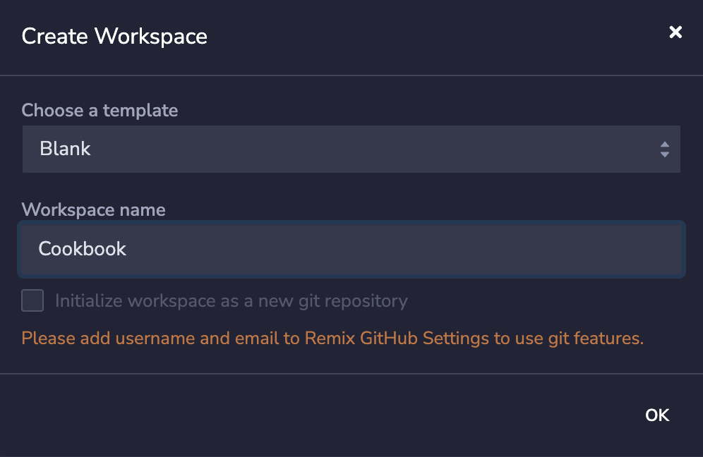

# How to use Remix IDE to deploy an on-chain storage contract on Shibuya

## TL;DR

Remix is a powerful open-source toolset for developing, deploying, debugging, and testing EVM-compatible smart contracts. Remix IDE is part of the Remix Project, which includes the Remix Plugin Engine and Remix Libraries. These are low-level tools for wider use.

Since Astar Network is a multi-VM network, we support both Wasm and EVM smart contracts. You can use Ethereum tooling, including Remix, to directly interact with Astar EVM’s API and deploy Solidity smart contracts on Astar.

In this cookbook, we will guide you through:

- Creating a Solidity-based on-chain storage smart contract with Remix Online IDE.
- Compiling and deploying the contract to the Shibuya testnet.
- Interacting with the contract to write the value on our blockchain and retrieve the value.

---

## What is Astar EVM?

Astar Network supports both Wasm and EVM virtual machines, which means both Solidity and WASM-based smart contracts can be deployed on Astar Network.

Solidity developers can use Ethereum dev tools, including Hardhat, Remix, and MetaMask, to directly interact with Astar EVM’s API and deploy Solidity smart contracts on Astar EVM.

In this guide we will use Shibuya Network, the testnet for Astar and Shiden.

---

## Create a Solidity contract with Remix IDE

- Visit [https://remix.ethereum.org/](https://remix.ethereum.org/) for online Remix IDE
    - or install the Remix IDE Desktop from [https://github.com/ethereum/remix-**desktop**/releases](https://github.com/ethereum/remix-desktop/releases).
- Create a new workspace by clicking the “+” beside “Workspace” and choose a “Blank” template.



- Add a new file named “storage.sol” with the following contract code provided. This is a simple example contract with two methods to `store()` and `retrieve()` value in a variable deployed on-chain.

    ```
    // SPDX-License-Identifier: GPL-3.0
    
    pragma solidity >=0.7.0 <0.9.0;
    
    /**
     * @title Storage
     * @dev Store & retrieve value in a variable
     * @custom:dev-run-script ./scripts/deploy_with_ethers.ts
     */
    contract Storage {
    
        uint256 number;
    
        /**
         * @dev Store value in variable
         * @param num value to store
         */
        function store(uint256 num) public {
            number = num;
        }
    
        /**
         * @dev Return value 
         * @return value of 'number'
         */
        function retrieve() public view returns (uint256){
            return number;
        }
    }
    ```
    


---

## Compile the Solidity contract for deployment

Before smart contracts can be deployed, the Solidity code must be compiled to bytecode for the EVM, which will eventually be deployed to the blockchain. The compilation also generates an ABI (Application Binary Interface), an interface between operating systems and user programs.

- Clicking the Solidity icon in the icon panel brings you to the Solidity Compiler.


- Compile our Solidity storage contract by clicking “Compile storage.sol”.


- After the compilation, you will be able to check the contract ABI and bytecode in the “ABI” and “Bytecode” sections under the “Compilation Details”. You will also find the “Storage.json” file in your workspace, which may be useful to verify your contract on block explorers.

---

## Deploy the Solidity contract to Shibuya testnet

- Before the deployment on the Shibuya testnet:
    - Please ensure that you have added Shibuya Network to your MetaMask wallet with the following configuration [https://docs.astar.network/docs/quickstart/endpoints/#public-endpoints](https://docs.astar.network/docs/quickstart/endpoints/#public-endpoints).
        - Network name: Shibuya Network
        - New RPC URL: [https://evm.shibuya.astar.network](https://evm.shibuya.astar.network/)
        - Chain ID: 81
    - Please claim SBY testnet tokens from the Shibuya faucet following the guide here [https://docs.astar.network/docs/quickstart/faucet/](https://docs.astar.network/docs/quickstart/faucet/)
- Click the EVM icon on the left sidebar (the fourth icon) and visit the “DEPLOY & RUN TRANSACTIONS” page.
- Switch the “ENVIRONMENT” to “Injected Provider - MetaMask” and ensure you have the right wallet address connected in MetaMask.


- Click “Deploy” and confirm the transaction in your MetaMask.


- Now, your first Solidity contract on the Shibuya testnet is deployed! Please feel free to copy the deployed contract address from “Deployed Contracts” and view it in the block explorer: [https://blockscout.com/shibuya](https://blockscout.com/shibuya)


---

## Interact with the deployed Solidity contract via Remix

You will also be able to interact with the contract that you just deployed on Shibuya via Remix IDE.

- Scroll down the contract details. Under the “Deployed Contracts” section on the “DEPLOY & RUN TRANSACTIONS” page you will have two options:


- You will be able to call the methods in the deployed contract:
    - `store()`: to store a value in a variable deployed on-chain.
    - `retrieve()`: read-only, to retrieve a value in a variable deployed on-chain.


---

## FAQ

Please feel free to visit our Discord at [https://discord.com/invite/Z3nC9U4](https://discord.com/invite/Z3nC9U4) for technical support.

## Reference

[https://remix-ide.readthedocs.io/en/latest/index.html](https://remix-ide.readthedocs.io/en/latest/index.html)

[https://docs.astar.network/](https://docs.astar.network/)
