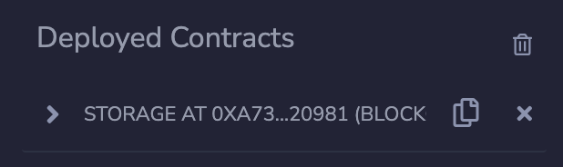

# How to verify a Solidity smart contract on Blockscout

## TL;DR

Blockscout is the primary block explorer for Astar EVM. Verifying a smart contract on Blockscout makes the contract source code publicly available and verifiable, which creates transparency and trust in the community. Also, contract verification on Blockscout is mandatory for any project to be eligible to earn the basic income through our dApp staking program.

In this guide, we will walk you through the process of verifying a smart contract on Blockscout, covering general smart contracts and special cases with OpenZepplin smart contracts.

Below we demonstrate how to verify smart contracts with and without OpenZepplin-related source contracts

---

## What is Blockscout

Blockscout is a block explorer that provides a comprehensive, easy-to-use interface for users to search transactions and view accounts and balances. It's also a tool for developers to verify smart contracts and inspect transactions on EVM (Ethereum Virtual Machine).

Blockscout is the primary block explorer for Astar EVM.

---

## Examples

:::tip
In another section, we go through the process of using Remix IDE to deploy a smart contract on Astar EVM. Before continuing this guide, we recommended that you become familiar with:

[How to use Remix IDE to deploy an on-chain storage contract on Astar EVM | Astar Docs](https://docs.astar.network/docs/builder-guides/astar_features/use_remix/)
:::

### Example 1: verifying smart contracts without OpenZepplin-related source contracts

Due to compiler constraints, contracts **with** OpenZeppelin-related source contracts have different verification methods when compared to contracts **without** OpenZeppelin-related source contracts.

In this section, we will go through the process of verifying a smart contract **without OpenZeppelin-related source contracts.**

Copy the deployed contract address under the `Deployed Contracts` section

Search for the contract on Blockscout and click `Verify and Publish` under the `Code` page

    
Choose `Via standard input JSON`
    

    
Fill in the contract name and Solidity compiler version. Upload the standard input JSON file.

- You can find the standard input JSON file under contracts/artifacts/build-info. Only use the `input` object in the JSON file.
- You can also find the Solidity compiler version in the same JSON file under `solcVersion`
    
    
    
- Click “Verify & Publish”, then you are all set!
    
    
    

---

### Example 2: verifying smart contracts with OpenZepplin-related source contracts

In this section, we will go through the process of verifying a smart contract **with OpenZeppelin-related source contracts**.

In this example, we have already deployed an ERC20 token contract using OpenZepplin library import, and will demonstrate how to verify it on Blockscout using **Flattener** plugin in Remix IDE.

- Install **Flattener** plugin in the `plugin manager`.
    

- Use **Flattener** plugin to flatten the ERC20 contract deployed.
    

- On the verification page of Blockscout choose the `Via flattened source code` method.
    

- Paste the copied flattened source code from **Flattener** into the `Enter the Solidity Contract Code`”` field and click `“`Verify & Publish`. That's it!
    

---

## Reference

- [Astar Documentation](https://docs.blockscout.com/for-users/verifying-a-smart-contract)
