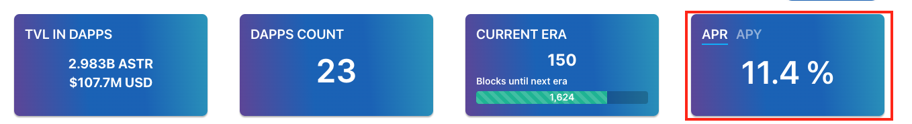

# Per gli Stakers

## Panoramica

Ti piace lo stake? Oppure vuoi supportare il tuo progetto preferito mettendo in stake sulla loro dApp? È possibile reperire informazioni per voi, leggendo attentamente la documentazione. Nel caso in cui aveste domande, venite e unitevi al nostro canale Discord.

Si prega di prendere in considerazione i seguenti parametri:

- L’importo **minimo** per lo staking per singolo utente è **50 SDN o 500 ASTR.**
- **Devi fare il claim delle tue reward, ti consigliamo di richiedere le tue reward da staking una volta alla settimana.**
- C'è un periodo di bonding di circa 5 giorni su Shiden e 10 giorni su Astar. Si prega di notare che questo si basa su una perfetta produzione di blocchi di 12s. In caso di ritardo, il vostro periodo di unbonding può essere un po' più lungo.
- Le reward per lo staking sono mostrate in APY per impostazione predefinita. L'opzione APY è disponibile per gli staker che hanno permesso il compounding cliccando 'Re-stake dopo aver reclamato". D'altra parte, l'opzione APR è disponibile per i staker che non hanno abilitato il compounding. La differenza è che APR rappresenta il tasso annuale semplice guadagnato dal vostro staking, mentre l' APY prende in considerazione il compounding delle reward.



Altre pagine che possono essere interessanti:

```mdx-code-block
import DocCardList from '@theme/DocCardList';
import {useCurrentSidebarCategory} from '@docusaurus/theme-common';

<DocCardList items={useCurrentSidebarCategory().items}/>
```
