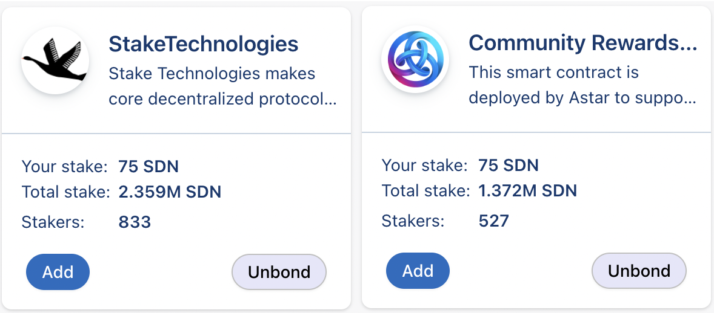

# Nomination Transfer

Nomination Transfer allows stakers to move the entirety or portions of their nominations to other projects while skipping the unbonding period. This way, stakers don't have to sacrifice staking rewards in the unbonding period to support a project you are interested in.

DApp staking is designed to support the projects and developers in our ecosystem. Staking through dApp Staking is giving your vote to the project you want to support. Your vote (stake) will impact their earnings with the protocol.

## Instructions

When you go to our [dApp staking page](https://portal.astar.network/#/dapp-staking/discover), you will find all the dApps listed in our dApp Staking mechanism. The instructions written down are the same in all Astar networks.

This function is only available for stakers who are already staking in a dApp. If this is the first time staking in our dApp Staking mechanism, you can find a step-by-step guide [here](staking)

## Example use-case

I staked 150 SDN on *Stake Technologies* and want to transfer a portion to the *Community Rewards* dApp because I want to support them with my vote by staking on their dApp.

You open the transfer window by clicking on the **Stake** button on the dApp you wish to support. You can select what funds you would like to use, funds that are transferable and in your wallet, or use it from another dApp you are staking on. In this case, I want to transfer some funds from *Stake Technologies* to the *Community Rewards* program. Enter the amount you wish to transfer (in the case of Shiden, the minimum is 50 SDN) and click on **Stake**. At the end of the process, you finalize by signing the transaction.

Now you see that you transferred a part of your staked amount to the new dApp without having to unbond your tokens.

