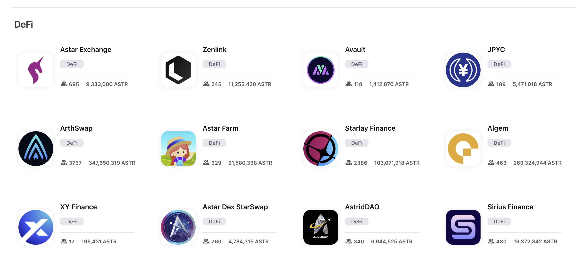
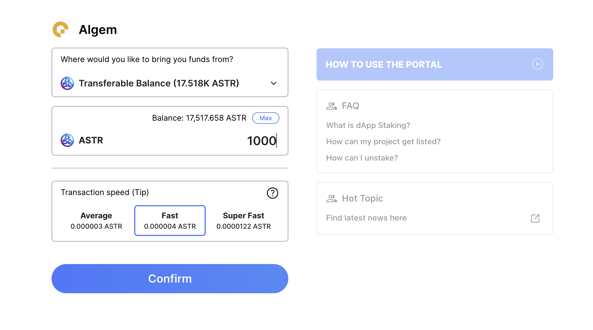
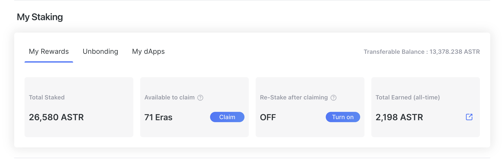
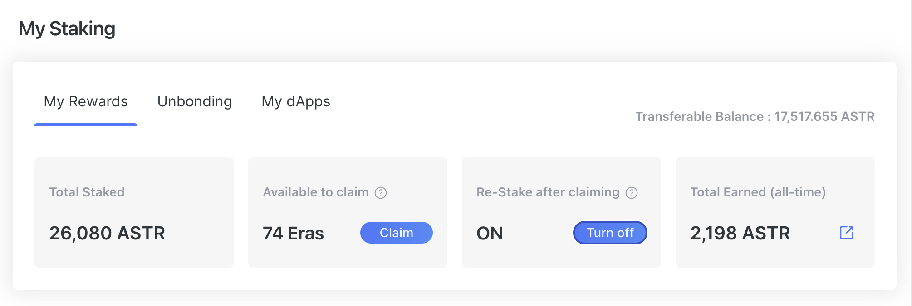
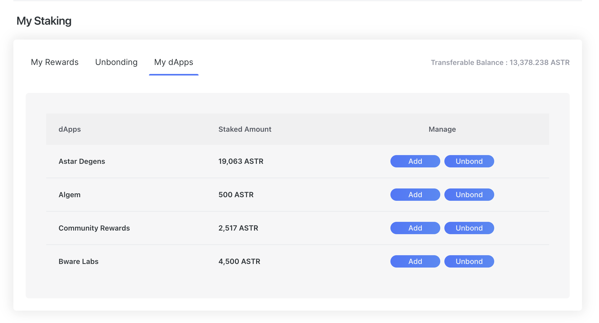

# Staking on dApps

## How to stake

### Connect to network

Go to our portal:  and click on 'Staking'.

:::tip
Make sure you are connected to the correct network.
- **Shibuya Network**: testnet
- **Shiden Network**: mainnet on Kusama
- **Astar Network**: mainnet for Polkadot
:::

### Stake

Look for your favorite project. Staking on-chain TVL is available on top page, click project cards to get more information, go to their communities or check the team accounts. Another great resource is looking in our [forum](https://forum.astar.network/), check [DefilLama](../../integrations/dapp-listing/defillama.md) or [DappRadar](../../integrations/dapp-listing/dappradar.md).

To add your staking amount, just press Stake button and go to Staking page.

- You can either use your funds from Transferable Balance or other projects you have staked with (Nomination Transfer)
- Place the amount you wish to stake and confirm.

### Manage dApp Staking

Once you have staked, new options to manage your dApp staking will appear on “My Staking Panel”.

**My Rewards Panel**

My Rewards Panel where you can see your status of your rewards : 

**Total Staked**: Total amount of ASTR tokens you have staked.

**Available to claim**: The unclaimed eras - It is recommended to claim friquently around once a week.

**Re-Stake after claiming**: When turn this feature on, your rewards will automatically re-staked after you claim the unclaimed eras(so you would have to claim by yourself).

**Total Earned(all-time)**: This is total rewards you have received from staking.

**Unbonding Panel**

Unbonding Panel is where you can see the progress of unbonding and withdraw.

Once it’s unbonding we cannot know which dApp you have unbonded from but remain as Chunks. There is unbonding period apply, 10eras and Shiden for 5eras, after you unstaked and when those era pass, you will be able to withdraw.

**My dApps Panel**

My dApps Panel is where you can see all dApps you have staked with and manage the assets.

**Add**: you can add more tokens in dApp staking.
**Unbond**: here you can select how many tokens you want to unbond from your staked amount. Remember you cannot leave less than minimum amount.

