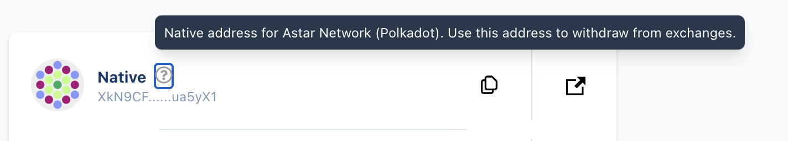
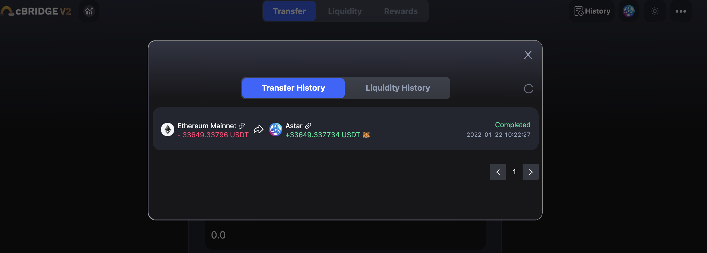

# Celer cBridge

## Overview

A guide on how to transfer assets from Ethereum & Binance Smart Chain to the Astar ecosystem. Make sure you have some ASTR to pay gas fees before bridging. You can buy ASTR token on exchanges.

<https://www.coingecko.com/en/coins/astar>

## Product Page

<https://cbridge.celer.network/#/transfer>


## Contracts

Token contract adresses on Astar:

```json
USDT: 0x3795C36e7D12A8c252A20C5a7B455f7c57b60283
USDC: 0x6a2d262D56735DbA19Dd70682B39F6bE9a931D98
DAI: 0x6De33698e9e9b787e09d3Bd7771ef63557E148bb
WETH: 0x81ECac0D6Be0550A00FF064a4f9dd2400585FE9c
BNB: 0x7f27352D5F83Db87a5A3E00f4B07Cc2138D8ee52
BUSD: 0x4Bf769b05E832FCdc9053fFFBC78Ca889aCb5E1E
WSDN: 0x75364D4F779d0Bd0facD9a218c67f87dD9Aff3b4
MATIC: 0xdd90E5E87A2081Dcf0391920868eBc2FFB81a1aF
AAVE: 0xfcDe4A87b8b6FA58326BB462882f1778158B02F1
CRV: 0x7756a83563f0f56937A6FdF668E7D9F387c0D199
```

## How to withdraw ASTR from Exchanges

First, visit [Astar Portal](https://portal.astar.network/balance/wallet) with Polkadot.js. If you don't have Polkadot.js extension, you can get it [here](https://polkadot.js.org/extension/).


Click your **Native address**. Once you click ?, you will see the comment below.



This is the address that you should use when you withdraw ASTR tokens from exchanges.

## How to bridge assets from Ethereum to Astar EVM

In this tutorial we will demonstrate how to bridge USDC from Ethereum to Astar. By doing so, you will be adding liquidity to our network, which benefits the ecosystem overall, and for which we convey our deepest gratitude.

Visit cBridge <https://cbridge.celer.network/#/transfer> and input a currency you would like to transfer.


After the transaction, you will see:



and you will receive some tokens in your MetaMask, on the destination network.

## The difference betweeen USDT vs. bridgedUSDT

When Tether USD on Astar comes through Statemint, it will be the native USDT token in the Astar ecosystem.

ceUSDT on Astar is a wrapped version of Ethereum USDT, supported by Celer cBridge and liquidity network. Due to this, <strong>ceUSDT is not as versatile as native USDT.</strong> For example, native USDT registered as XC20 can be used for both Wasm and EVM projects in the Astar ecosystem, but bridged (ce)USDT cannot be used for Wasm projects.

## Support

If you have any questions, feel free to join any of our communities and our Ambassadors will assist you. And remember that Astar team or Ambassadors will never message or DM you first! 
