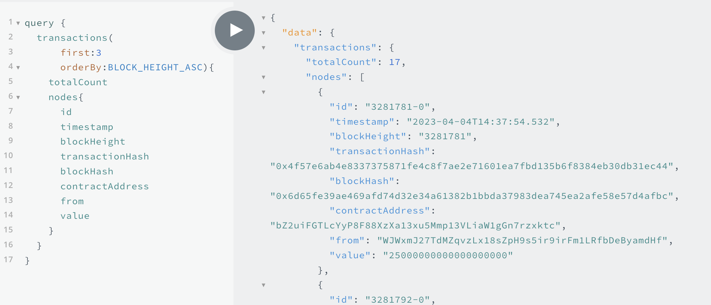

# SubQuery

## What is SubQuery?

SubQuery is an open-source and universal blockchain data indexer for developers that provides fast, flexible, reliable, and decentralised APIs to power leading multi-chain apps. Our goal is to save developers time and money by eliminating the need of building their own indexing solution and instead, fully focus on developing their applications. 

SubQuery's superior indexing capabilities support Astar native, EVM and WASM-based smart contracts all out of the box. (In reality a Docker container!) Starter projects are provided allowing developers to get up and running and index blockchain data in minutes. 

Another one of SubQuery's competitive advantages is the ability to aggregate data not only within a chain but across blockchains all within a single project. This allows the creation of feature-rich dashboard analytics or multi-chain block scanners.

Other advantages include superior performance with multiple RPC endpoint configurations, multi-worker capabilities and a configurable caching architecture. To find out more, visit our [documentation](https://academy.subquery).

## Prerequisites

[Docker](https://docs.docker.com/get-docker/): Containerization platform for software solutions.

Subquery CLI: Command line tool for creating SubQuery projects. Install this by running the following:

```bash
npm install -g @subql/cli
```

## Getting started

This quick start guide introduces SubQuery's Substrate WASM support by using an example project in Astar's Network. The example project indexes all Transactions and Approvals from the [Astar Wasm based lottery contract](https://astar.subscan.io/account/bZ2uiFGTLcYyP8F88XzXa13xu5Mmp13VLiaW1gGn7rzxktc), as well as dApp staking events from [Astar's dApp Staking](https://docs.astar.network/docs/dapp-staking/) functions.

This project is unique, as it indexes data from both Astar's Substrate execution layer (native Astar pallets and runtime), and with smart contract data from Astar's WASM smart contract layer, within the same SubQuery project and into the same dataset. A very similar approach can be taken with indexing Astar's EVM layer too.

Initialise the SubQuery Starter Project with `subql init` and then choose `Substrate` as the network family, `Astar` as the network and then select astar-wasm-starter for the purposes of this guide.

```bash
~$ subql init astar-demo
? Select a network family Substrate
? Select a network Astar
? Select a template project (Use arrow keys or type to search)
❯ astar-evm-starter      Astar EVM project template tutorial 
  astar-wasm-starter     Astar WASM project template tutorial 
  astar-starter          Starter project for Astar 
  Other                  Enter a custom git endpoint 
```

Continue with the set-up by following the prompt and customising the parameters or accepting the defaults. 

Visit the [SubQuery quick start guide](https://academy.subquery.network/quickstart/quickstart.html) for more details.

## Customizing the project in 3 simple steps
There are 3 important files that need to be modified. These are:

1. The GraphQL Schema in schema.graphql
2. The Project Manifest in project.yaml
3. The Mapping functions in src/mappings/ directory

### 1. Customize the schema file

The `schema.graphql` file determines the shape of your data from SubQuery due to the mechanism of the GraphQL query language. Hence, updating the GraphQL Schema file is the perfect place to start. It allows you to define your end goal right at the start.

The Astar-wasm-starter project has four entities. Transaction, Approval, DApp, and DAppReward (which has a [foreign key](https://academy.subquery.network/build/graphql.html#one-to-many-relationships) to Dapp). These index basic block data such as the timestamp, height and hash along with from and contract addresses and the value.

```graphql
type Transaction @entity {
  id: ID! # Transaction hash
  transactionHash: String
  blockHeight: BigInt
  blockHash: String
  timestamp: Date
  value: BigInt
  from: String!
  to: String!
  contractAddress: String!
}

type Approval @entity {
  id: ID! # Transaction hash
  blockHeight: BigInt
  value: BigInt
  hash: String
  owner: String!
  spender: String!
  contractAddress: String!
}

type DApp @entity {
  id: ID! #EVM is a required field
  accountID: String!
  totalStake: BigInt!
}

type DAppReward @entity {
  id: ID!
  dApp: DApp!
  accountID: String!
  eraIndex: Int!
  balanceOf: BigInt!
}
```

When you make any changes to the schema file, please ensure that you regenerate your types directory via `yarn codegen` or `npm run-script codegen`

You will find the generated models in the `/src/types/models` directory.

Check out the [GraphQL Schema](https://academy.subquery.network/build/graphql.html) documentation to get in-depth information on `schema.graphql` file.

### 2. The project manifest file
The Project Manifest (`project.yaml`) file works as an entry point to your project. It defines most of the details on how SubQuery will index and transform the chain data. For Substrate/Polkadot chains, there are three types of mapping handlers:

- [BlockHanders](https://academy.subquery.network/build/manifest/polkadot.html#mapping-handlers-and-filters): On each and every block, run a mapping function
- [EventHandlers](https://academy.subquery.network/build/manifest/polkadot.html#mapping-handlers-and-filters): On each and every Event that matches optional filter criteria, run a mapping function
- [CallHanders](https://academy.subquery.network/build/manifest/polkadot.html#mapping-handlers-and-filters): On each and every extrinsic call that matches optional filter criteria, run a mapping function

For [EVM](https://academy.subquery.network/build/substrate-evm.html) and [WASM](https://academy.subquery.network/build/substrate-wasm.html) data processors on Substrate/Polkadot chains, there are only two types of mapping handlers:

- [EventHandlers](https://academy.subquery.network/build/substrate-wasm.html#event-handlers): On each and every Event that matches optional filter criteria, run a mapping function
- [CallHanders](https://academy.subquery.network/build/substrate-wasm.html#call-handlers): On each and every extrinsic call that matches optional filter criteria, run a mapping function

### Substrate Manifest section

**Since we are planning to index all Polkadot transfers, we need to update the `datasources` section as follows:**

```yaml
dataSources:
  - kind: substrate/Runtime
    # This is the datasource for Astar's Native Substrate processor
    startBlock: 1
    mapping:
      file: ./dist/index.js
      handlers:
        - handler: handleNewContract
          kind: substrate/EventHandler
          filter:
            module: dappsStaking
            method: NewContract
        - handler: handleBondAndStake
          kind: substrate/EventHandler
          filter:
            module: dappsStaking
            method: BondAndStake
        - handler: handleUnbondAndUnstake
          kind: substrate/EventHandler
          filter:
            module: dappsStaking
            method: UnbondAndUnstake
        - handler: handleReward
          kind: substrate/EventHandler
          filter:
            module: dappsStaking
            method: Reward
```

This indicates that you will be running a `handleNewContract` mapping function whenever there is an event emitted from the `NewContract` method on the `dappsStaking` pallet. Similarly we will run other mapping functions for the three other events being emitted from the `dappsStaking` to other mapping functions. This covers most interactions with the dApp staking feature that we are interested in.

Check out our [Manifest File](https://academy.subquery.network/build/manifest/polkadot.html) documentation to get more information about the Project Manifest (`project.yaml`) file.

### WASM Manifest Section

If you're not using the [WASM starter template](https://github.com/subquery/subql-starter/tree/main/Astar/astar-wasm-starter) then please add the Wasm Datasource as a dependency using `yarn add @subql/substrate-wasm-processor`.

Here we are indexing all transfers and approve contract call events from the Astar contract `bZ2uiFGTLcYyP8F88XzXa13xu5Mmp13VLiaW1gGn7rzxktc`. First you will need to import the contract ABI defintion. You can copy the entire JSON and save as a file `./erc20Metadata.json` in the `abis` directory.

This section in the Project Manifest now imports all the correct definitions and lists the triggers that we look for on the blockchain when indexing. We add another section the datasource beneath the above [substrate manifest section](#substrate-manifest-section).

```yaml
dataSources:
  - kind: substrate/Runtime
    # This is the datasource for Astar's Native Substrate processor
    ...
  - kind: substrate/Wasm
    # This is the datasource for Astar's Wasm processor
    startBlock: 3281780
    processor:
      file: ./node_modules/@subql/substrate-wasm-processor/dist/bundle.js
      options:
        abi: erc20
        # contract: "a6Yrf6jAPUwjoi5YvvoTE4ES5vYAMpV55ZCsFHtwMFPDx7H" # Shibuya
        contract: "bZ2uiFGTLcYyP8F88XzXa13xu5Mmp13VLiaW1gGn7rzxktc" # Mainnet
    assets:
      erc20:
        file: ./abis/erc20Metadata.json
    mapping:
      file: ./dist/index.js
      handlers:
        - handler: handleWasmEvent
          kind: substrate/WasmEvent
          filter:
            # contract: "a6Yrf6jAPUwjoi5YvvoTE4ES5vYAMpV55ZCsFHtwMFPDx7H" # Shibuya
            contract: "bZ2uiFGTLcYyP8F88XzXa13xu5Mmp13VLiaW1gGn7rzxktc" # Mainnet
            identifier: "Transfer"
        - handler: handleWasmCall
          kind: substrate/WasmCall
          filter:
            selector: "0x681266a0"
            method: "approve"
```

The above code indicates that you will be running a `handleWasmEvent` mapping function whenever there is an `Transfer` event on any transaction from the Astar contract. Similarly, we will run the `handleWasmCall` mapping function whenever there is a `approve` log on the same contract

Check out our [Substrate Wasm](https://academy.subquery.network/build/substrate-wasm.html) documentation to get more information about the Project Manifest (`project.yaml`) file for Substrate WASM contracts.

### 3. Customize the mapping file

Mapping functions define how chain data is transformed into the optimised GraphQL entities that we previously defined in the `schema.graphql` file.

Navigate to the default mapping function in the `src/mappings` directory. There are multiple exported functions: `handleWasmCall`, `handleWasmEvent`, `handleNewContract`, `handleBondAndStake`, `handleUnbondAndUnstake`, and `handleReward`. We wont go into all here but you should be able to figure out what each is doing.

```ts
type ApproveCallArgs = [AccountId, Balance];

export async function handleWasmCall(
  call: WasmCall<ApproveCallArgs>
): Promise<void> {
  logger.info(`Processing WASM Call at ${call.blockNumber}`);
  const approval = new Approval(`${call.blockNumber}-${call.idx}`);
  approval.hash = call.hash;
  approval.owner = call.from.toString();
  approval.contractAddress = call.dest.toString();
  if (typeof call.data !== "string") {
    const [spender, value] = call.data.args;
    approval.spender = spender.toString();
    approval.value = value.toBigInt();
  } else {
    logger.info(`Decode call failed ${call.hash}`);
  }
  await approval.save();
}
```

The `handleWasmCall` function receives event data from the WASM execution environment whenever an call matches the filters that was specified previously in the `project.yaml`. It instantiates a new `Approval` entity and populates the fields with data from the Wasm Call payload. Then the `.save()` function is used to save the new entity (_SubQuery will automatically save this to the database_).

```ts
export async function handleBondAndStake(event: SubstrateEvent): Promise<void> {
  logger.info(
    `Processing new Dapp Staking Bond and Stake event at ${event.block.block.header.number}`
  );
  const {
    event: {
      data: [accountId, smartContract, balanceOf],
    },
  } = event;
  // Retrieve the dapp by its ID
  let dapp: DApp = await DApp.get(smartContract.toString());
  if (!dapp) {
    dapp = DApp.create({
      id: smartContract.toString(),
      accountID: accountId.toString(),
      totalStake: BigInt(0),
    });
  }

  dapp.totalStake += (balanceOf as Balance).toBigInt();
  await dapp.save();
}
```

The `handleBondAndStake` function receives Substrate event data from the native Substrate environment whenever an event matches the filters that was specified previously in the `project.yaml`. It extracts the various data from the event payload (in Substrate it's stored as a array of Codecs), then checks if an existing DApp record exists. If none exists (e.g. it's a new dApp), then it instantiates a new one and then updates the total stake to reflect the new staking mount. Then the `.save()` function is used to save the new/updated entity (_SubQuery will automatically save this to the database_).

Check out our mappings documentation for [Substrate](https://academy.subquery.network/build/mapping/polkadot.html) and for the [Substrate WASM data processor](https://academy.subquery.network/build/substrate-wasm.html) to get detailed information on mapping functions for each type.

## Build Your Project

Next, build your work to run your new SubQuery project. Run the build command from the project's root directory `yarn build` or `npm run-script build`. Note, whenever you make changes to your mapping functions, make sure to rebuild your project.


## Run Your Project Locally with Docker

SubQuery provides a Docker container to run projects very quickly and easily for development purposes.

The docker-compose.yml file defines all the configurations that control how a SubQuery node runs. For a new project, which you have just initialised, you won't need to change anything.

Run the following command under the project directory: `yarn start:docker` or `npm run-script start:docker`. It may take a few minutes to download the required images and start the various nodes and Postgres databases.

Visit [Running SubQuery Locally](https://academy.subquery.network/run_publish/run.html) to get more information on the file and the settings.

## Query Your Project

Once the container is running, navigate to http://localhost:3000 in your browser and run the sample GraphQL command provided in the README file. Below is an example query from the Astar-wasm-starter project.

```graphql
query {
  transactions(first: 3, orderBy: BLOCK_HEIGHT_ASC) {
    totalCount
    nodes {
      id
      timestamp
      blockHeight
      transactionHash
      blockHash
      contractAddress
      from
      value
    }
  }
}
```

Note: 
There is a _Docs_ tab on the right side of the playground which should open a documentation drawer. This documentation is automatically generated and helps you find what entities and methods you can query. To learn more about the GraphQL Query language [here](https://academy.subquery.network/run_publish/graphql.html).

You should see results similar to those below:

```json
{
  "data": {
    "transactions": {
      "totalCount": 17,
      "nodes": [
        {
          "id": "3281781-0",
          "timestamp": "2023-04-04T14:37:54.532",
          "blockHeight": "3281781",
          "transactionHash": "0x4f57e6ab4e8337375871fe4c8f7ae2e71601ea7fbd135b6f8384eb30db31ec44",
          "blockHash": "0x6d65fe39ae469afd74d32e34a61382b1bbda37983dea745ea2afe58e57d4afbc",
          "contractAddress": "bZ2uiFGTLcYyP8F88XzXa13xu5Mmp13VLiaW1gGn7rzxktc",
          "from": "WJWxmJ27TdMZqvzLx18sZpH9s5ir9irFm1LRfbDeByamdHf",
          "value": "25000000000000000000"
        },
        {
          "id": "3281792-0",
          "timestamp": "2023-04-04T14:40:06.386",
          "blockHeight": "3281792",
          "transactionHash": "0xbe8d6f09a96ff44e732315fbeff2862e9bdeb8353612a0bfab10632c410d8135",
          "blockHash": "0xaa09e8060068931a58a162c150ccb73e0b4de528185f1da92b049ab31c299e5a",
          "contractAddress": "bZ2uiFGTLcYyP8F88XzXa13xu5Mmp13VLiaW1gGn7rzxktc",
          "from": "aFNoZEM64m1ifrHAwEPEuhfRM5L7kjnPhmtYjZaQHX2zb6y",
          "value": "32000000000000000000"
        },
        {
          "id": "3281797-1",
          "timestamp": "2023-04-04T14:41:06.786",
          "blockHeight": "3281797",
          "transactionHash": "0xfdb111a314ee4e4460a3f2ab06221d5985c50e8f5cbae5a12f4f73b222d5954c",
          "blockHash": "0xeb4e49463e174fc993417e852f499ddc6e3c4a15f355a576a74772604f2132e5",
          "contractAddress": "bZ2uiFGTLcYyP8F88XzXa13xu5Mmp13VLiaW1gGn7rzxktc",
          "from": "aFNoZEM64m1ifrHAwEPEuhfRM5L7kjnPhmtYjZaQHX2zb6y",
          "value": "57000000000000000000"
        }
      ]
    }
  }
}
```



## Next steps

SubQuery's indexing experience is designed to be as fast and as simple as possible allowing developers to index data from the blockchain in minutes with the help of the starter project and a docker environment. 

It is also flexible to enable indexing across different chains and filtering only the data relevant to your application making it lightweight, fast and efficient. 

We are excited to help you on your indexing journey so please reach out to us at the various links below to see how we can help further. 

## Resources
* [SubQuery Network](https://subquery.network/)
* [SubQuery Documentation](https://academy.subquery.network/)
* [SubQuery Discord](https://discord.com/invite/subquery)
* [SubQuery Twitter](https://twitter.com/SubQueryNetwork)
* [SubQuery Blog](https://blog.subquery.network/)
