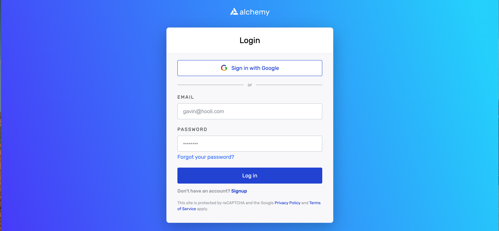
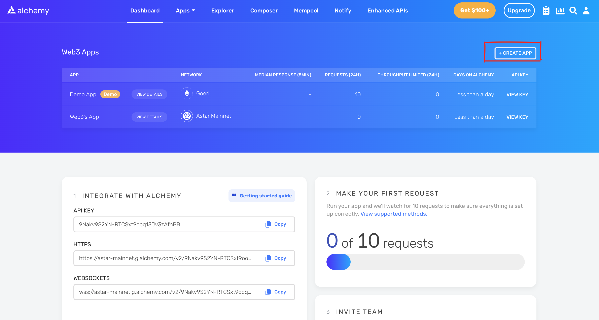
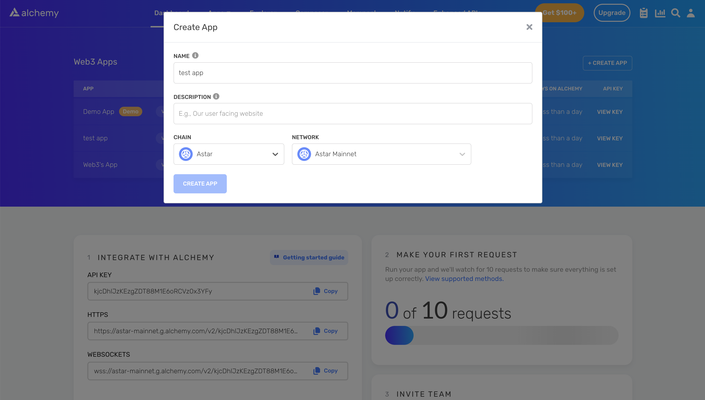
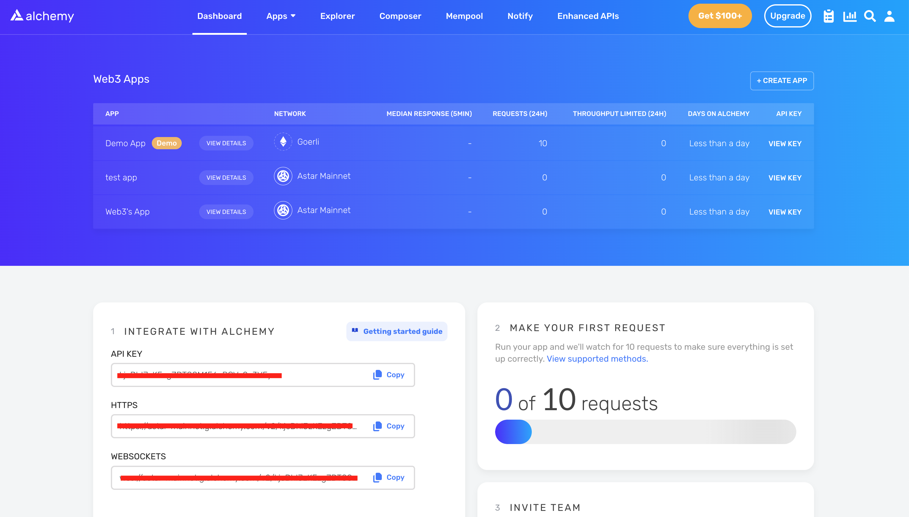

# Alchemy
[Alchemy] is a developer platform that helps companies to build scalable and reliable decentralized applications without the difficulty of managing blockchain infrastructure in-house.

- Alchemy Supernode offers the most reliable, scalable and accurate way to connect and build on the Astar blockchain.
- Alchemy SDK gives Astar developers the easiest way to connect their dApp to the blockchain with just two lines of code.
- Websockets & Webhooks allows to subscribe and get notified for any address activity events as well as mined and dropped transactions.

## Overview

### Step 1　
Log in or sign up to your Alchemy account via [the link](https://auth.alchemyapi.io/?redirectUrl=https%3A%2F%2Fdashboard.alchemyapi.io%2Fsignup%2F).

### Step 2
Click <strong>+ Create App</strong> button.

### Step 3
Select Chain and Network.

### Step 4
Congrats! Now endpoint is generated as well as URL and API key.

[Alchemy]: https://www.alchemy.com/