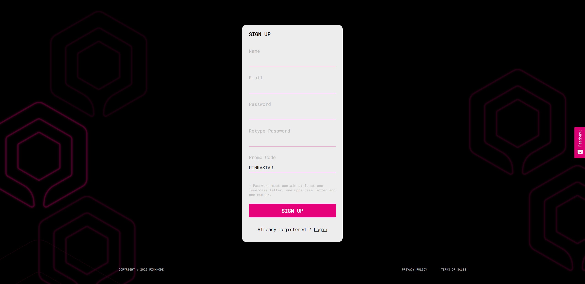
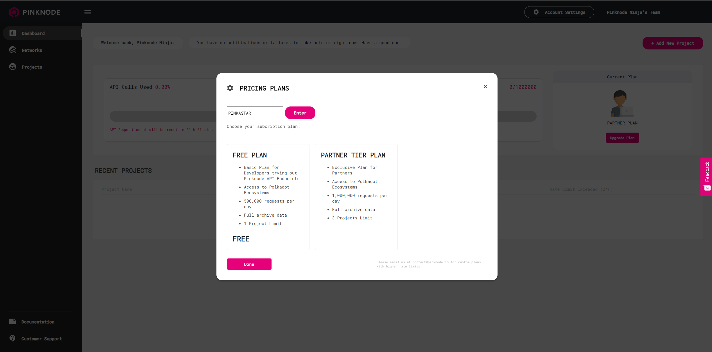

# Pinknode

## Overview

Pinknode is a Polkadot-focused Infrastructure-as-a-Service platform offering RPC service through globally distributed node architecture coupled with Kubernetes clustering and geo-location routing for increased reliability and reduced latency. You will be able to integrate into the Astar ecosystem with Pinknode API services within minutes.

Pinknode provides RPC and WSS endpoints for the Astar ecosystem. You will be able to connect via

- Public endpoints (May be subjected to increased rate limits during high network load)
- Custom API endpoints on ​

## Public Endpoints

| Network | RPC Endpoint | WSS Endpoint|
|----|----|---|
| Astar | <https://public-rpc.pinknode.io/astar> | wss://public-rpc.pinknode.io/astar |
| Shiden | <https://public-rpc.pinknode.io/shiden> | wss://public-rpc.pinknode.io/shiden |
| Shibuya | <https://public-rpc.pinknode.io/shibuya> | wss://public-rpc.pinknode.io/shibuya |

## Instructions

### Step 1

Log in or sign up via [Pinknode Portal](https://pinknode.io/login) with the Astar partnership promo code for a free upgrade to the partnership tier plan.

Astar promo code: PINKASTAR

- 500,000 --> 1,000,000 requests limit per day
- 15 --> 50 requests per second
- 1 --> 3 projects limit

For new sign-ups, enter PINKASTAR on the sign-up page to activate the partnership tier plan.

For an existing account, click on the upgrade plan on the dashboard and enter PINKASTAR to activate the partnership tier plan.

### Step 2

Create a new project.

### Step 3

Select your network with the dropdown.

